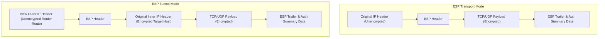

Up next in our consolidated question bank is **Question 10**, the fifth item under the *Moderately Repeated Part B & C* list: **IPsec Architecture (AH vs. ESP Modes)**.

---

# Question 10: IPsec Architecture - AH vs. ESP (15-Mark Master Blueprint)

## 1. Core Concept (The "Why")

The Internet Protocol (IP) was originally designed without built-in security, meaning packets moving across the public internet can be intercepted, read, or modified. **IPsec (Internet Protocol Security)** is a suite of protocols that operates at the Network Layer (Layer 3) of the OSI model to secure IP traffic.

Instead of protecting individual applications, IPsec transparently secures all data moving between two points (like two corporate offices) by wrapping standard IP packets inside cryptographically protected containers.

---

## 2. Operational Protocols: AH vs. ESP

IPsec uses two distinct protocols to handle packet protection depending on the security requirements of the connection:

### A. Authentication Header (AH)

* **What it does:** Provides data integrity, data origin authentication, and anti-replay protection.
* **The Catch:** **AH does not provide encryption (confidentiality).** If a hacker intercepts an AH packet, they can read the data payload in plain text.
* **Key Feature:** AH authenticates the entire packet, including the outer IP header (source and destination IP addresses). Because it locks the IP addresses mathematically, **AH breaks Network Address Translation (NAT)**.

### B. Encapsulating Security Payload (ESP)

* **What it does:** Provides complete data confidentiality (encryption), data origin authentication, integrity, and anti-replay protection.
* **Key Feature:** ESP encrypts the payload of the packet. It adds an ESP Header to the front of the data and an ESP Trailer/Auth section to the back.
* **Key Advantage:** ESP does not protect the outer IP header from modification. Because of this flexibility, **ESP works seamlessly with NAT** and is the standard choice for modern corporate VPNs.

---

## 3. Deployment Modes: Transport vs. Tunnel

Both AH and ESP can be executed in two different physical deployment configurations:

### 1. Transport Mode

* **Where it is used:** Used for end-to-end communications directly between two host computers (e.g., a workstation connecting to a specific server).
* **Mechanism:** The original outer IP header is kept intact. IPsec simply inserts its security header (AH or ESP) right between the original IP header and the payload (TCP/UDP layer).
* **Packet Visual:** `[Original IP Header] -> [IPsec Header] -> [Encrypted/Protected Data Payload]`

### 2. Tunnel Mode

* **Where it is used:** Used for gateway-to-gateway configurations, such as connecting a branch office router to a main corporate headquarters firewall over the public internet.
* **Mechanism:** The entire original IP packet (including its original inner IP header) is completely encrypted or sealed. The IPsec device then slaps a brand-new, outer IP header onto the very front of the packet to mask the true origin and destination across the public web.
* **Packet Visual:** `[New Outer IP Header] -> [IPsec Header] -> [Encrypted Original Inner IP Header + Original Payload]`

---

## 4. Packet Structure Transformation Diagrams

### ESP Transport Mode vs. ESP Tunnel Mode Structural Differences

---

## 5. Summary Evaluation Matrix

| Security Feature | Authentication Header (AH) | Encapsulating Security Payload (ESP) |
| --- | --- | --- |
| **Confidentiality (Encryption)** | No | **Yes** |
| **Integrity & Authentication** | Yes | Yes |
| **Protects Outer IP Header?** | Yes | No |
| **NAT Traversal Compatible?** | No (Breaks connections) | **Yes** (Standard VPN behavior) |
| **Primary Use Case** | Legacy internal integrity verification | Secure public internet tunnels & VPNs |

---

# Exam Note: IPsec Architecture Core Blueprint

## 1. Protocol Layering Focus

* **OSI Layer:** Operates strictly at Layer 3 (Network Layer).
* **Advantage:** Higher layers (Layer 4 TCP/UDP and Layer 7 Applications) do not need any code changes to run securely over an IPsec connection.

## 2. Key Takeaways

* **Transport Mode:** Protects payload data but keeps the original endpoint host IP addresses visible.
* **Tunnel Mode:** Completely hides the internal network topology by wrapping the entire original packet inside a new public outer routing envelope.

---

Say **"Next"** whenever you are ready to proceed to the next long-answer topic in the sequence: **Kerberos Authentication Protocol**.