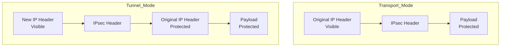

# IPsec Architecture: AH vs ESP

## Overview

Internet Protocol (IP) was designed without built-in security. Any packet traveling through the public internet can potentially be:

* Read by unauthorized users
* Modified during transmission
* Forged by attackers
* Replayed multiple times

**IPsec (Internet Protocol Security)** is a collection of protocols that secures communication at the **Network Layer (OSI Layer 3)**.

Instead of securing individual applications, IPsec secures all IP traffic transparently.

> [!important]
> IPsec is commonly used to build secure VPN connections over the public internet.

---

## Security Services Provided by IPsec

IPsec offers four major security services:

1. **Confidentiality** → Prevents unauthorized users from reading data
2. **Integrity** → Detects whether data was modified
3. **Authentication** → Verifies the sender's identity
4. **Anti-replay protection** → Prevents attackers from resending old packets

---

## AH vs ESP

IPsec uses two protocols:

* Authentication Header (AH)
* Encapsulating Security Payload (ESP)

---

## Authentication Header (AH)

AH ensures:

* Data integrity
* Data origin authentication
* Anti-replay protection

AH does **not** encrypt data.

### Analogy

Imagine sending a transparent box with a tamper-proof seal.

* Everyone can see the contents
* Nobody can modify the contents without detection

### Features

✅ Authentication

✅ Integrity

✅ Anti-replay protection

❌ Confidentiality

---

## Encapsulating Security Payload (ESP)

ESP provides:

* Encryption
* Authentication
* Integrity
* Anti-replay protection

### Analogy

Imagine placing the message inside a locked box.

* Outsiders cannot read it
* Tampering is detected
* The sender is verified

### Features

✅ Confidentiality

✅ Authentication

✅ Integrity

✅ Anti-replay protection

> [!tip]
> ESP is the standard choice for modern VPNs.

---

## Why AH Does Not Work with NAT

Network Address Translation (NAT) changes IP addresses during packet forwarding.

Example:

```text
Original IP Address: 192.168.1.10
Translated IP Address: 49.36.x.x
```

AH protects the IP header itself.

When NAT modifies the source or destination address, AH detects the change and rejects the packet.


Therefore:

* AH ❌ NAT compatible
* ESP ✅ NAT compatible

---

## IPsec Modes

Both AH and ESP can operate in two modes:

1. Transport Mode
2. Tunnel Mode

---

## Transport Mode

Only the payload is protected.

The original IP header remains visible.

### Packet Structure

```text
[Original IP Header][IPsec Header][Protected Payload]
```

### Visible Information

* Source IP address
* Destination IP address

### Protected Information

* Application data

### Use Cases

* Host-to-host communication
* Server-to-server communication

### Analogy

A letter is locked inside a box, but the shipping label remains visible.

---

## Tunnel Mode

The entire original IP packet is protected.

A new IP header is added.

### Packet Structure

```text
[New IP Header][IPsec Header][Original IP Header][Payload]
```

### Visible Information

* VPN gateway addresses

### Protected Information

* Original source IP address
* Original destination IP address
* Application data

### Use Cases

* Site-to-site VPNs
* Branch office connectivity
* Remote access VPNs

### Analogy

A sealed package is placed inside another package with a new shipping label.

---

## Transport Mode vs Tunnel Mode



---

## AH vs ESP Comparison

| Feature                  | AH       | ESP   |
| ------------------------ | -------- | ----- |
| Encryption               | ❌ No     | ✅ Yes |
| Authentication           | ✅ Yes    | ✅ Yes |
| Integrity                | ✅ Yes    | ✅ Yes |
| Anti-replay Protection   | ✅ Yes    | ✅ Yes |
| Protects Outer IP Header | ✅ Yes    | ❌ No  |
| NAT Compatible           | ❌ No     | ✅ Yes |
| Commonly Used Today      | ❌ Rarely | ✅ Yes |

---

## Transport Mode vs Tunnel Mode Comparison

| Feature                         | Transport Mode | Tunnel Mode        |
| ------------------------------- | -------------- | ------------------ |
| Protects Only Payload           | ✅ Yes          | ❌ No               |
| Protects Entire Original Packet | ❌ No           | ✅ Yes              |
| Original IP Header Visible      | ✅ Yes          | ❌ No               |
| Adds New IP Header              | ❌ No           | ✅ Yes              |
| Typical Use                     | Host-to-host   | Gateway-to-gateway |

---

## Working of IPsec


> [!note]
> IPsec operates at the Network Layer, so applications do not need modification.

---

## Memory Shortcuts

```text
AH = Authenticate only

ESP = Encrypt + Secure Packet

Transport Mode = Protect data

Tunnel Mode = Protect entire packet
```

---

## Exam Points

* IPsec operates at OSI Layer 3.
* AH provides authentication and integrity without encryption.
* ESP provides encryption, authentication, and integrity.
* AH protects the IP header and therefore fails with NAT.
* ESP works with NAT and is widely used in VPNs.
* Transport mode protects only the payload.
* Tunnel mode protects the entire original packet.

> [!success]
> Real-world VPN deployments almost always use ESP in Tunnel Mode.

---

## One-Line Summary

> IPsec secures IP communication using AH or ESP protocols, operating in either Transport Mode or Tunnel Mode to provide authentication, integrity, confidentiality, and anti-replay protection.
