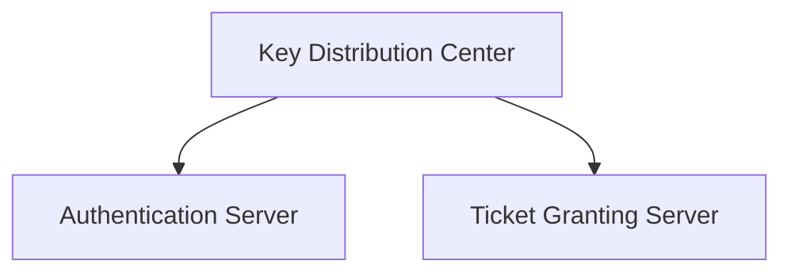
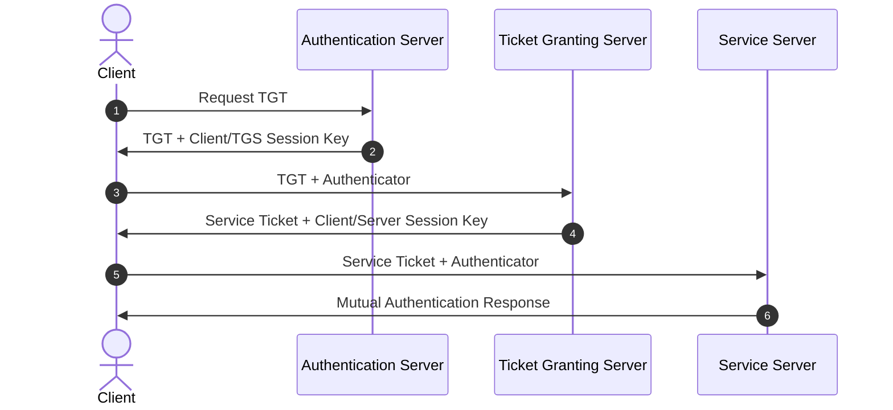
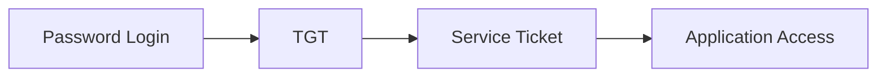
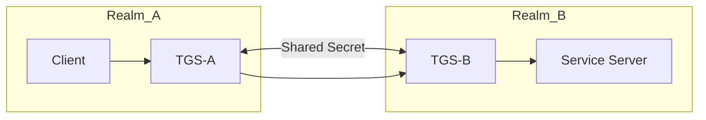

---

## topic: Kerberos

# Kerberos Authentication Protocol

## Why Does Kerberos Exist?

Imagine working in a company where you use:

* Email
* File servers
* Printers
* Internal websites
* Databases

Without Kerberos, you would have to:

* Send your password to every server
* Log in separately to every service

This creates two problems:

1. Passwords travel repeatedly across the network.
2. Users must authenticate multiple times.

Kerberos solves this using **Single Sign-On (SSO).**

You authenticate once and receive temporary tickets that prove your identity to other services.

> [!important]
> Kerberos never sends the user's password across the network.

---

## Real-World Analogy

Think of an airport.

| Kerberos Component           | Airport Equivalent |
| ---------------------------- | ------------------ |
| User                         | Passenger          |
| Password                     | Passport           |
| Authentication Server (AS)   | Check-in Counter   |
| Ticket Granting Ticket (TGT) | Boarding Pass      |
| Ticket Granting Server (TGS) | Gate Agent         |
| Service Ticket               | Flight Ticket      |
| Application Server           | Airplane           |

You show your passport only once.

After verification, you receive tickets.

The tickets give access to different services.

---

## What Is a Ticket?

A ticket is an encrypted proof of identity.

It contains:

* User identity
* Session key
* Validity period
* Timestamp

Only trusted Kerberos servers can create valid tickets.

Application servers trust these tickets instead of asking for passwords.

---

## Main Components

### Client (C)

The user requesting access.

Examples:

* Laptop
* Desktop
* Mobile device

---

### Key Distribution Center (KDC)

The trusted central authority.

It contains two services:

1. Authentication Server (AS)
2. Ticket Granting Server (TGS)



---

### Authentication Server (AS)

Responsibilities:

* Verifies user credentials
* Issues Ticket Granting Tickets

The AS is used only during login.

---

### Ticket Granting Server (TGS)

Responsibilities:

* Validates TGTs
* Issues service tickets

The TGS prevents users from repeatedly entering passwords.

---

### Service Server (S)

The target application.

Examples:

* Mail server
* File server
* Database server
* Printer server

---

## Why Are AS and TGS Separate?

Without a TGS:

* The user must enter their password for every service.

With a TGS:

* The user enters the password only once.
* The TGT acts as a reusable identity proof.

```text id="jhzfj7"
Password → TGT → Service Tickets
```

Instead of:

```text id="u74j52"
Password → Every Server
```

---

## Kerberos Workflow



---

## Step-by-Step Authentication Process

### Step 1: Client Requests a TGT

The user logs in.

The client sends:

```text id="8amjrz"
Username
```

to the Authentication Server.

The password is not transmitted.

---

### Step 2: AS Returns a TGT

The AS verifies the user.

If successful, it sends:

* Ticket Granting Ticket (TGT)
* Client-TGS session key

The response is encrypted using a key derived from the user's password.

Only the legitimate user can decrypt it.

---

### Step 3: Client Requests a Service Ticket

The client decrypts the AS response.

The client sends to the TGS:

* TGT
* Authenticator (timestamp)

The authenticator proves:

```text id="n3l2rd"
I am the same person who owns this TGT.
```

---

### Step 4: TGS Returns a Service Ticket

The TGS verifies:

* TGT validity
* Timestamp freshness

The TGS sends:

* Service ticket
* Client-server session key

---

### Step 5: Client Contacts the Server

The client sends:

* Service ticket
* New authenticator

to the application server.

---

### Step 6: Mutual Authentication

The server verifies the ticket.

The server returns a modified timestamp.

This proves:

```text id="x9td1z"
The server is genuine.
```

Both sides now trust each other.

---

## Complete Ticket Flow



---

## Replay Attack Protection

Kerberos prevents replay attacks using:

* Timestamps
* Short ticket lifetimes
* Session keys

An attacker cannot reuse old tickets because they quickly expire.

---

## Time Synchronization Requirement

All systems must maintain synchronized clocks.

Typically:

```text id="oqg07w"
Maximum allowed clock difference = 5 minutes
```

Network Time Protocol (NTP) is commonly used.

> [!warning]
> Large clock differences cause authentication failures.

---

## Cross-Realm Authentication

Sometimes a user in one organization needs access to services in another organization.

Example:

```text id="ctywk4"
REALM-A → REALM-B
```

Instead of sharing all user passwords, the two realms establish trust.

---

## Inter-Realm Secret Key

Realm administrators create a shared secret between their TGS servers.



The process:

1. Client gets a local TGT.
2. Local TGS issues a cross-realm ticket.
3. Client presents it to the remote TGS.
4. Remote TGS issues the final service ticket.
5. Client accesses the remote server.

> [!note]
> Inter-realm secret keys eliminate the need to duplicate user databases across organizations.

---

## Advantages

* Single Sign-On (SSO)
* Passwords never travel across the network
* Mutual authentication
* Replay attack protection
* Centralized authentication management

---

## Limitations

* KDC is a single point of failure
* Requires strict clock synchronization
* KDC becomes a high-value target
* Initial setup is complex

---

## Memory Shortcuts

```text id="2d2l4u"
AS → Issues TGT

TGS → Issues Service Tickets
```

```text id="fvl63k"
Login Once → Access Many Services
```

```text id="z6l1jz"
Password → TGT → Service Ticket
```

Remember:

```text id="lw7vlu"
AS = Who are you?

TGS = What do you want to access?
```

---

## Exam Points

* Kerberos is a ticket-based authentication protocol.
* Kerberos provides Single Sign-On.
* KDC contains AS and TGS.
* AS issues Ticket Granting Tickets.
* TGS issues Service Tickets.
* Kerberos supports mutual authentication.
* Passwords are never transmitted across the network.
* Timestamps prevent replay attacks.
* Cross-realm authentication requires inter-realm secret keys.

---

## One-Line Summary

> Kerberos is a centralized, ticket-based authentication protocol that provides secure Single Sign-On using a Key Distribution Center containing an Authentication Server and a Ticket Granting Server.
