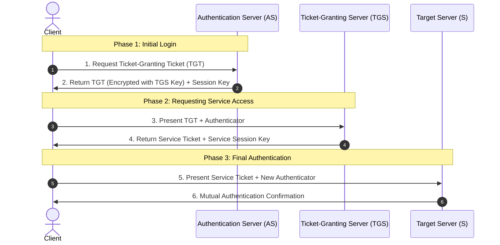
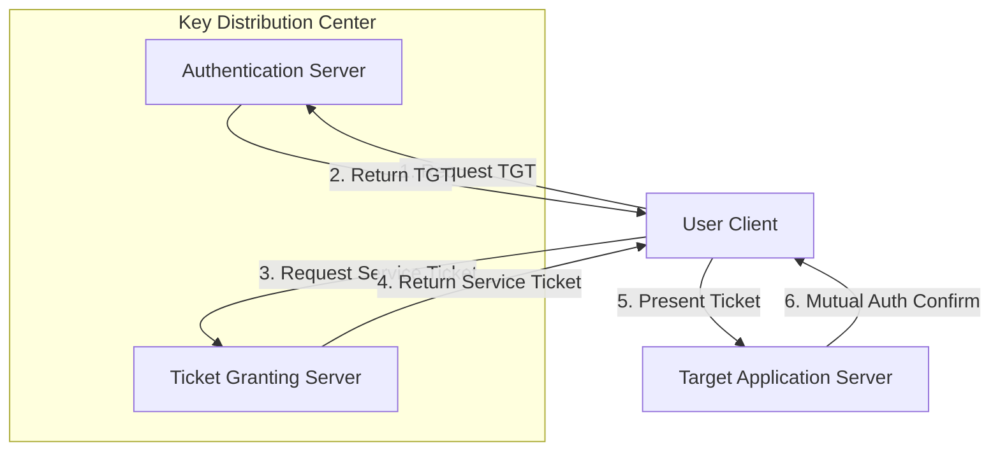
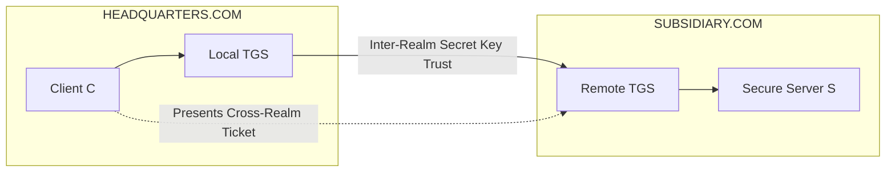

Up next in our Highest Repeated sequence is **Kerberos Authentication Architecture & Protocols**.

---

# Question 3: Kerberos Authentication Architecture & Protocols

## 1. The Core "Why" & "When"

* **Why:** In a classic distributed network, when a user wants to access multiple network services (like email servers, databases, or file shares), sending their raw password over the network to each machine is a massive risk. If an attacker intercepts it once, they gain full access. Kerberos solves this by introducing a trusted central authority. Instead of exposing your password, you prove your identity to the central authority *once* per day. In return, it hands you a set of temporary encrypted "tickets" that act like single-use security passes for specific network services.
* **When:** Kerberos is the default industry standard for centralized enterprise domain management. It forms the backbone of **Microsoft Active Directory** and is used whenever an enterprise needs a robust **Single Sign-On (SSO)** framework across an internal corporate network.

---

## 2. Core Principles & Architecture

Kerberos relies on a centralized **Key Distribution Center (KDC)**  which knows the master password/secret key of every user and server on the network. The KDC contains two distinct structural sub-services:

1. **Authentication Server (AS):** Verifies who you are during your initial morning login.
2. **Ticket-Granting Server (TGS):** Issues specific connection passes when you want to talk to a particular service.

---

## 3. Step-by-Step Single-Realm Operation (How It Works)

When a user client ($C$) wants to connect to a service server ($S$) within the same network domain (realm), a three-phase, 6-step handshake takes place:



### Phase 1: Authentication Service Exchange (Initial Login)

* **Step 1 ($C \rightarrow AS$):** The user types in their username. The client machine sends a plain text message to the AS stating: *"I am user $C$ and I want to access the network."*
* **Step 2 ($AS \rightarrow C$):** The AS verifies that $C$ is a valid user in its database. It generates a temporary **Client/TGS Session Key** and a **Ticket-Granting Ticket (TGT)**.
* The TGT is encrypted using the *TGS's secret master key* (the client cannot read it).
* The AS packages this together and encrypts the entire response using a key derived from the *user's password*. The client machine decrypts this using the user's password, obtaining the session key and the intact, encrypted TGT.


### Phase 2: Ticket-Granting Service Exchange (Getting a Service Pass)

* **Step 3 ($C \rightarrow TGS$):** The user now wants to print a file or access server $S$. The client sends a request to the TGS containing the encrypted TGT along with an **Authenticator** (a message containing the client ID and a fresh timestamp, encrypted using the Client/TGS session key).
* **Step 4 ($TGS \rightarrow C$):** The TGS decrypts the TGT using its own master key. It uses the session key found inside the TGT to decrypt the Authenticator. If the timestamps match within a 5-minute window, it proves the request is fresh. The TGS then generates a **Service Ticket** (encrypted with the *Target Server's master key*) and a **Client/Server Session Key**, sending them back to the client.

### Phase 3: Client-Server Authentication Exchange (Accessing the App)

* **Step 5 ($C \rightarrow S$):** The client sends the Service Ticket along with a fresh Authenticator (encrypted with the Client/Server session key) straight to the target server $S$.
* **Step 6 ($S \rightarrow C$):** The server $S$ decrypts the ticket using its own master key, extracts the session key, and decrypts the client's authenticator. To complete **mutual authentication**, the server increments the client's timestamp, encrypts it with the session key, and sends it back. The client verifies it, confirming the server is legitimate.

---

## 4. Multi-Realm / Inter-Realm Operations

In modern corporate environments, an organization might have two separate networks (e.g., `HEADQUARTERS.COM` and `SUBSIDIARY.COM`). If a user in Realm A needs to talk to a secure server in Realm B, Kerberos uses an **Inter-Realm Trust** pipeline.

Step-by-Step Inter-Realm Procedure 

1. The client $C$ contacts their local Authentication Server in Realm A to get a local TGT.
2. Instead of asking for a normal service ticket, the client asks their local TGS for a ticket to access the **Remote Ticket-Granting Server in Realm B**.


3. The local TGS encrypts this special cross-realm ticket using a shared **Inter-Realm Secret Key** that was previously established between the administrators of both realms.


4. The client takes this cross-realm ticket and presents it directly to the TGS of Realm B.


5. Because the TGS of Realm B knows the shared inter-realm key, it successfully decrypts the ticket, trusts the user's identity, and issues a final Service Ticket for the secure server $S$ inside Realm B.


Justification for Inter-Realm Secret Keys 

Without inter-realm secret keys, cross-realm authentication would completely fall apart. The TGS in Realm B would have no secure, mathematical way to read or verify tickets generated by Realm A's infrastructure. These keys allow distinct administrative domains to safely vouch for their users across organizational boundaries without forcing them to merge their master user databases.

---

5. Critical Assessment: Strengths & Weaknesses 

Strengths 

* **Single Sign-On (SSO):** Users only authenticate once at startup. They never have to type their credentials again when moving between network applications.
* **No Plaintext Passwords on the Wire:** Passwords are never sent across the raw network cables, which neutralizes packet-sniffing exploits.
* **Protection Against Replay Attacks:** Every transaction relies on short-lived authenticators bound to strict timestamps, meaning recorded packets become completely useless within minutes.
* **Mutual Authentication:** Both the user and the server prove their identities to each other before any communication channel opens.

Weaknesses 

* **Single Point of Failure:** If the centralized KDC goes offline, no user can log into any service across the entire enterprise. (Mitigated in production using clustered KDC replication).
* **Strict Clock Synchronization:** Kerberos relies heavily on timestamps to block replays. If a server's physical clock drifts away from the KDC's clock by more than 5 minutes, all authentication requests will be systematically rejected.
* **Master Key Vulnerability:** If a hacker breaches the physical KDC host, they compromise the master keys for every user and server in the ecosystem, giving them full control over the realm.

---

## 6. The "Exam-Ready" Answer Layout

To maximize your points on this high-frequency prompt:

1. **Draw a neat sequence flowchart:** Replicate the 3-phase, 6-step communication chain precisely.
2. **Define the abbreviations immediately:** Clearly state what AS, TGS, KDC, and TGT stand for right at the beginning of your response.
3. **Emphasize the Timestamps:** Explicitly mention the standard 5-minute clock sync requirement when discussing replay protections to show the examiner you understand the underlying mechanics.

---

Here is your comprehensive study module formatted as an integrated Obsidian markdown block.

```obsidian
# Library Note: Kerberos v5 Authentication Framework

## 1. Architectural Map
* [cite_start]**KDC (Key Distribution Center):** Houses the identity database[cite: 87].
* **AS (Authentication Server):** Issues the initial TGT.
* **TGS (Ticket-Granting Server):** Issues the application service tickets.



---

## [cite_start]2. Cross-Realm Structural Trust Alignment [cite: 32]


---

## [cite_start]3. Operational Risk Log [cite: 29]
* **Systemic Dependency:** Strict **NTP Clock Sync** ($\le 300\text{ seconds}$). Failure breaks authenticator validation loops.
* **Blast Radius:** KDC database compromise yields unconditional token forge capabilities across the active administrative namespace.
* [cite_start]**Inter-Realm Imperative:** Shared keys eliminate the need to synchronize user identity state tables globally across distributed infrastructure groups[cite: 33].

```

---

Say **"Next"** whenever you are ready to proceed to the final Highest Repeated long-answer question: **Firewall Architectures & Deployment Strategies**.