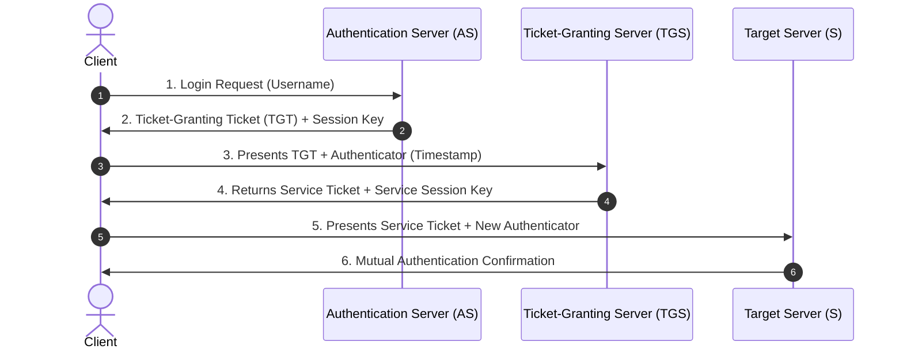
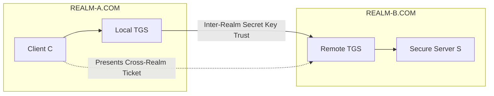
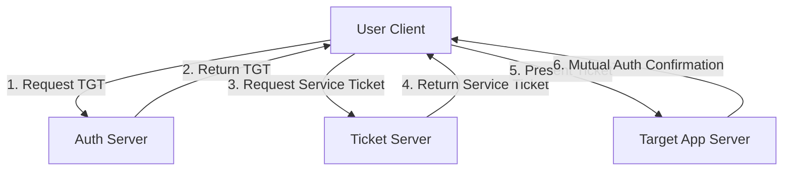
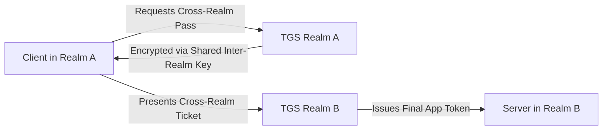

To hit maximum marks on a **15-mark Part B/C long answer** without writing an exhausting, wordy essay, university evaluators look for a clear, structured blueprint. You need to provide direct definitions, a clear architectural diagram, explicit operational steps, and a practical scenario.

Here is the recalibrated, highly concise, yet high-scoring 15-mark answer for **Kerberos**.

---

# Question 3: Kerberos Authentication Architecture & Protocols

## 1. Core Concept (The "Why")

In distributed networks, transmitting raw user passwords to multiple services creates massive interception risks. Kerberos solves this by using a trusted central authority. Instead of exposing passwords, a user proves their identity **once** a day to a central server and receives temporary, encrypted **tickets** to seamlessly access specific network services (Single Sign-On).

---

## 2. Architecture & Components

Kerberos relies on a centralized **Key Distribution Center (KDC)** which contains two core sub-services:

1. **Authentication Server (AS):** Verifies the user’s identity during initial morning login.
2. **Ticket-Granting Server (TGS):** Issues short-lived access tickets for specific network applications.

---

## 3. Step-by-Step Single-Realm Operation (The 6 Handshake Steps)

1. **Step 1 ($C \rightarrow AS$):** The user sends their plain text identity to the AS.
2. **Step 2 ($AS \rightarrow C$):** The AS verifies the username, generates a **Ticket-Granting Ticket (TGT)** (encrypted with the TGS's master key), and sends it back encrypted with the user's password hash.
3. **Step 3 ($C \rightarrow TGS$):** The client decrypts the package, extracts the TGT, and forwards it to the TGS along with a fresh **Authenticator** (encrypted timestamp).
4. **Step 4 ($TGS \rightarrow C$):** The TGS decrypts the TGT, verifies the timestamp, and responds with a **Service Ticket** (encrypted with the Target Server's master key) and a Client/Server session key.
5. **Step 5 ($C \rightarrow S$):** The client sends the Service Ticket and a fresh Authenticator straight to the target application server ($S$).
6. **Step 6 ($S \rightarrow C$):** The server decrypts the ticket, reads the authenticator, increments the timestamp, and sends it back to prove its own identity (**Mutual Authentication**).

---

## 4. Inter-Realm Cross-Domain Deployment Scenario

When Client $C$ in `REALM-A.COM` needs to access a secure Server $S$ in `REALM-B.COM`, Kerberos utilizes a structured cross-realm trust pipeline:

* **The Mechanism:** The administrators of both networks manually exchange a shared **Inter-Realm Secret Key**.
* **The Process:** The local TGS in Realm A uses this shared key to encrypt a special cross-realm ticket for the user. The client takes this ticket and presents it directly to the TGS in Realm B. Because Realm B's server knows the shared key, it decrypts the ticket, trusts the identity vouch, and issues the final service access token.
* **Justification:** This eliminates the need to duplicate or synchronize massive user password databases across different distinct corporate entities.

---

## 5. Summary Analysis (Strengths & Weaknesses)

### Strengths (Why it succeeds)

* **Single Sign-On (SSO):** Users type credentials once; background tokens handle the rest.
* **No Passwords on the Wire:** Raw passwords are never transmitted across open network cables.
* **Replay Protection:** Short-lived authenticators tied to tight timestamps expire rapidly, rendering intercepted data useless.

### Weaknesses (System Vulnerabilities)

* **Single Point of Failure:** If the central KDC goes down, the entire network identity framework freezes.
* **Strict Clock Synchronization:** If system clocks drift apart by more than **5 minutes**, all authentication tickets fail.

---

Here is the clean, consolidated code block ready for your Obsidian notes.

# Exam Note: Kerberos v5 Architecture Blueprint

## 1. Key Component Mapping
* **KDC:** Master security authority containment framework.
* **AS:** Handshakes initial user identity verification $\rightarrow$ Issues TGT.
* **TGS:** Validates active TGT tokens $\rightarrow$ Issues specific App Service Tickets.
* **Operational Constraint:** Enforces rigid time synchronization ($\le 300$ seconds) via NTP to prevent token replay cycles.

## 2. Multi-Realm Trust Architecture

---

Say **"Next"** whenever you are ready to tackle the final Highest Repeated long answer topic: **Firewall Architectures & Deployment Strategies**.