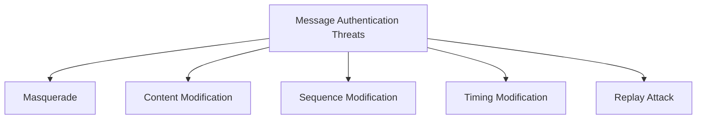

# Message Authentication Threats

## Why Is Message Authentication Needed?

Encryption alone provides confidentiality.

It does not guarantee:

* Who sent the message
* Whether the message was modified
* Whether the message is fresh

Message authentication ensures:

* Integrity
* Origin authentication
* Freshness

---

## Security Goals

| Goal            | Meaning                    |
| --------------- | -------------------------- |
| Integrity       | Message was not modified   |
| Authentication  | Sender is genuine          |
| Freshness       | Message is recent          |
| Non-repudiation | Sender cannot deny sending |

---

## Common Threats



---

## 1. Masquerade Attack

An attacker pretends to be a legitimate user.

Example:

```text
Mallory sends a message claiming to be Alice.
```

Goal:

```text
Break sender authentication
```

Countermeasures:

* MACs
* Digital signatures
* Strong authentication

---

## 2. Content Modification

The attacker changes message contents.

Example:

```text
Transfer ₹1,000
```

becomes:

```text
Transfer ₹100,000
```

Goal:

```text
Break message integrity
```

Countermeasures:

* Hash functions
* HMAC
* Digital signatures

---

## 3. Sequence Modification

The attacker changes the order of messages.

Example:

Original sequence:

```text
M1 → M2 → M3
```

Modified sequence:

```text
M3 → M1 → M2
```

Goal:

```text
Disrupt protocol logic
```

Countermeasures:

* Sequence numbers
* Session identifiers

---

## 4. Timing Modification

The attacker delays or accelerates message delivery.

Example:

A valid transaction approval is intentionally delayed.

Countermeasures:

* Timestamps
* Expiration periods

---

## 5. Replay Attack

The attacker captures a valid message and retransmits it later.

Example:

```text
Capture: "Transfer ₹5,000"

Replay: "Transfer ₹5,000"
```

Countermeasures:

* Nonces
* Timestamps
* Challenge-response protocols

---

## Message Authentication Mechanisms

| Mechanism          | Provides                                     |
| ------------------ | -------------------------------------------- |
| Hash Functions     | Integrity                                    |
| MAC                | Integrity + Authentication                   |
| HMAC               | Integrity + Authentication                   |
| Digital Signatures | Integrity + Authentication + Non-repudiation |

---

## Threats vs Countermeasures

| Threat          | Countermeasure     |
| --------------- | ------------------ |
| Masquerade      | Digital Signatures |
| Modification    | HMAC               |
| Sequence Attack | Sequence Numbers   |
| Timing Attack   | Timestamps         |
| Replay Attack   | Nonces             |

---

## Exam Points

* Encryption alone does not provide authentication.
* Message authentication ensures integrity and origin verification.
* Replay attacks reuse valid messages.
* Nonces and timestamps prevent replay.
* Digital signatures provide non-repudiation.

---

## One-Line Summary

> Message authentication protects communication against masquerade, modification, replay, sequence, and timing attacks using mechanisms such as MACs, HMACs, timestamps, and digital signatures.
