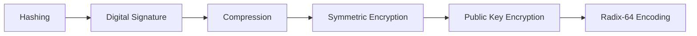
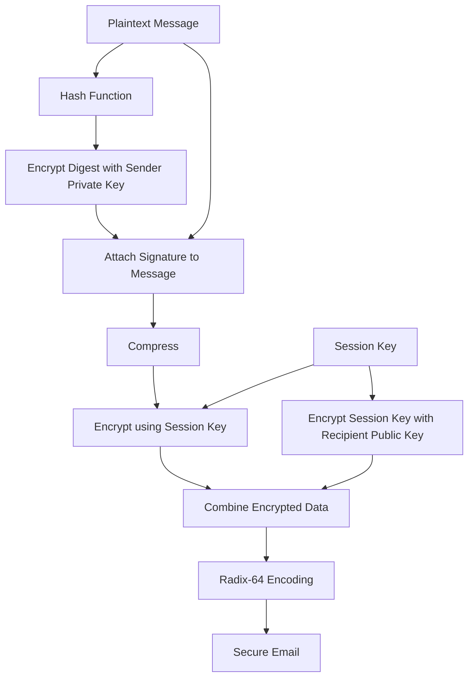
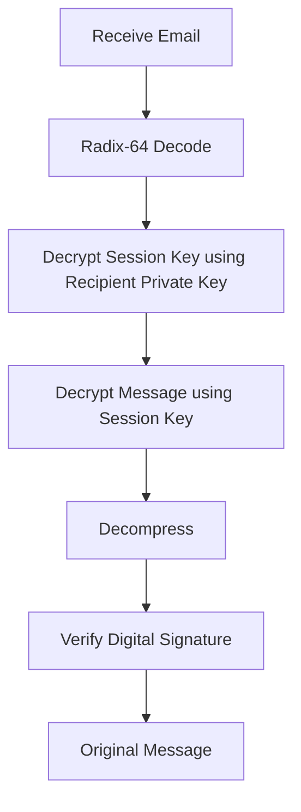
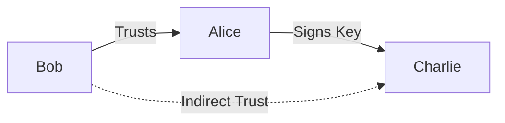

# Pretty Good Privacy (PGP) Architecture

## Why Does PGP Exist?

Traditional email protocols such as SMTP were designed without security.

Standard email messages can be:

* Read by attackers
* Modified during transmission
* Forged by impersonators

PGP solves these problems.

It provides:

* Confidentiality
* Integrity
* Authentication
* Non-repudiation

> [!important]
> PGP is an application-layer security framework designed primarily for secure email communication.

---

## Real-World Analogy

Imagine sending a confidential document.

You:

1. Sign the document.
2. Compress it into a ZIP file.
3. Lock the ZIP file with a temporary password.
4. Lock the password inside another box using the recipient's public key.
5. Convert everything into a format accepted by the postal service.

That is exactly how PGP works.

---

## Security Services Provided by PGP

| Security Goal       | Mechanism            |
| ------------------- | -------------------- |
| Confidentiality     | Symmetric encryption |
| Integrity           | Hash functions       |
| Authentication      | Digital signatures   |
| Non-repudiation     | Sender's private key |
| Efficiency          | Compression          |
| Email Compatibility | Radix-64 encoding    |

---

## The Big Idea Behind PGP

PGP combines multiple cryptographic techniques.



---

## PGP Workflow

Remember the sequence:

```text id="v63t3r"
Sign → Compress → Encrypt → Encode
```

---

## Step 1: Digital Signature

The sender creates a message digest.

```text id="m1n2gt"
Digest = Hash(Message)
```

The digest is encrypted using the sender's private key.

```text id="xajxcs"
Signature = Encrypt(Digest, Sender Private Key)
```

The signature is attached to the message.

### Purpose

* Authentication
* Integrity
* Non-repudiation

---

## Step 2: Compression

The message and signature are compressed.

Common algorithms:

* ZIP
* Deflate

### Why Compress?

* Reduces message size
* Saves bandwidth
* Removes repetitive patterns

Compression occurs before encryption because encrypted data cannot be compressed effectively.

---

## Step 3: Generate Session Key

PGP creates a one-time symmetric key.

This is called the:

```text id="v3l0m8"
Session Key
```

The session key is used only once.

---

## Step 4: Encrypt the Message

The compressed data is encrypted using the session key.

Common algorithms:

* AES
* CAST-128
* 3DES
* IDEA

```text id="czp6gh"
Ciphertext = Encrypt(Data, Session Key)
```

> [!note]
> Symmetric encryption is fast and suitable for large amounts of data.

---

## Step 5: Encrypt the Session Key

The session key is encrypted using the recipient's public key.

```text id="g91vv9"
Encrypted Session Key =
Encrypt(Session Key, Recipient Public Key)
```

Only the recipient's private key can recover the session key.

---

## Step 6: Radix-64 Encoding

Encrypted data contains binary values.

Traditional email systems support only ASCII text.

PGP converts binary data into text using:

```text id="ycj7sn"
Radix-64 (Base64)
```

### Purpose

* Email compatibility
* Prevent transmission errors

---

## Complete PGP Sending Process



---

## PGP Receiving Process



---

## Digital Signature Verification

The receiver:

1. Decrypts the signature using the sender's public key.
2. Computes a new hash of the received message.
3. Compares both hashes.

If the hashes match:

```text id="bkgzpw"
Message is authentic and unchanged
```

---

## Why Hybrid Encryption Is Used

Public-key encryption is slow.

Symmetric encryption is fast.

PGP combines both.

```text id="rj2lww"
Public Key Encryption → Protect Session Key

Symmetric Encryption → Protect Message
```

This is called:

```text id="j5dyl4"
Hybrid Cryptography
```

---

## Web of Trust

Unlike X.509, PGP does not rely on centralized Certificate Authorities.

PGP uses a decentralized trust model called:

```text id="iybqgg"
Web of Trust
```

Users sign each other's public keys.

Trust spreads through recommendations.

Example:

```text id="97r9oj"
Bob trusts Alice.

Alice trusts Charlie.

Bob may trust Charlie.
```

---

## Web of Trust Architecture



---

## Key Rings in PGP

PGP maintains two key databases.

### Private Key Ring

Stores:

* User's private keys
* User's public keys

### Public Key Ring

Stores:

* Other users' public keys
* Trust information

---

## PGP vs X.509

| Feature        | PGP             | X.509                 |
| -------------- | --------------- | --------------------- |
| Trust Model    | Web of Trust    | Certificate Authority |
| Control        | Decentralized   | Centralized           |
| Primary Use    | Secure Email    | HTTPS, VPNs           |
| Key Validation | User Signatures | CA Signatures         |

---

## Advantages

* Strong email security
* Efficient hybrid encryption
* No central authority required
* Provides authentication and confidentiality

---

## Limitations

* Complex key management
* Trust decisions are subjective
* Difficult for non-technical users
* Public key verification can be challenging

---

## Memory Shortcuts

Remember the order:

```text id="30kggg"
Sign → Compress → Encrypt → Encode
```

Remember:

```text id="zq4l59"
Private Key → Sign

Public Key → Verify
```

```text id="r4n0d6"
Session Key → Encrypt Message

Recipient Public Key → Encrypt Session Key
```

---

## Exam Points

* PGP is designed primarily for secure email.
* PGP uses hybrid cryptography.
* Digital signatures provide authentication and integrity.
* Compression occurs before encryption.
* Radix-64 converts binary data into ASCII.
* PGP uses a Web of Trust model.
* Session keys are generated for each message.

---

## One-Line Summary

> Pretty Good Privacy is a hybrid cryptographic framework that secures email using digital signatures, compression, symmetric encryption, public-key encryption, Radix-64 encoding, and a decentralized Web of Trust.
