# Digital Signature Implementations

## What is a Digital Signature?

A digital signature is a cryptographic mechanism that provides:

* Authentication
* Integrity
* Non-repudiation

It proves:

1. Who sent the message
2. The message was not modified
3. The sender cannot deny sending it

> Digital signatures use the sender's **private key** for signing and the sender's **public key** for verification.

## Working Process

1. Sender computes the hash of the message.
2. Sender encrypts the hash using their private key.
3. The encrypted hash becomes the digital signature.
4. Receiver decrypts the signature using the sender's public key.
5. Receiver computes a new hash of the received message.
6. If both hashes match, the signature is valid.

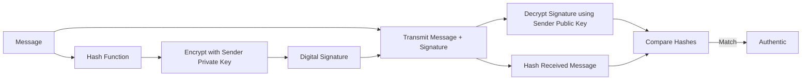

## Example

Alice sends:

```text
Transfer ₹5000
```

Hash:

```text
H = SHA-256(Message)
```

Alice signs:

```text
Signature = Encrypt(H, Alice Private Key)
```

Bob verifies using Alice's public key.

---

# Blockchain Block Structures

## Typical Block Components

A blockchain block consists of:

1. Block Header
2. Transaction Data

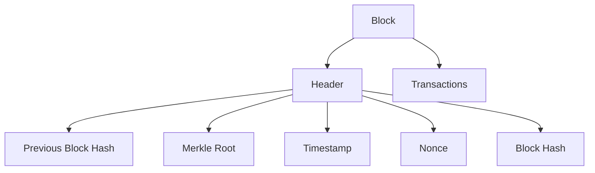

## Block Header Fields

| Field             | Purpose                 |
| ----------------- | ----------------------- |
| Version           | Block format            |
| Previous Hash     | Links blocks together   |
| Merkle Root       | Summary of transactions |
| Timestamp         | Block creation time     |
| Difficulty Target | Mining difficulty       |
| Nonce             | Value used in mining    |

## Merkle Root

* Computed from all transactions
* Detects transaction tampering efficiently

## Key Properties

* Immutability
* Transparency
* Decentralization
* Integrity

---

# Cloud Security (SecaaS)

## What is SecaaS?

Security as a Service provides security functions through cloud providers.

Organizations consume security services on demand.

## Major SecaaS Categories

| Service                        | Example                      |
| ------------------------------ | ---------------------------- |
| Identity and Access Management | Single Sign-On               |
| Data Loss Prevention           | Prevent data leakage         |
| Email Security                 | Spam filtering               |
| Web Security                   | Secure web gateways          |
| Security Assessment            | Vulnerability scanning       |
| Intrusion Management           | IDS/IPS                      |
| Encryption                     | Cloud key management         |
| SIEM                           | Log monitoring               |
| Business Continuity            | Backup and disaster recovery |

## Architecture

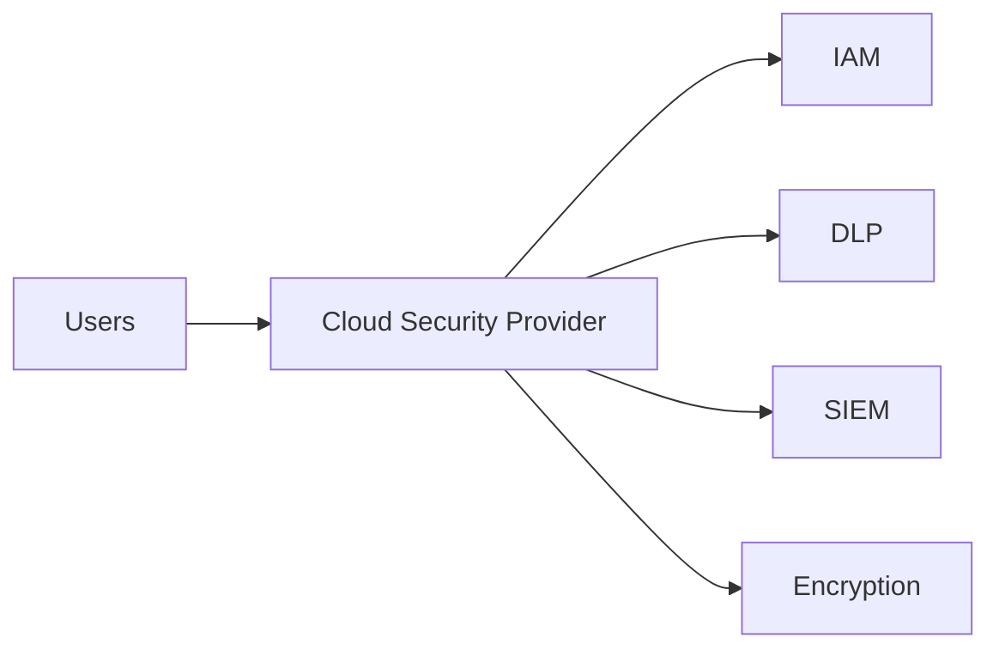

## Advantages

* Lower cost
* Scalability
* Centralized management

## Challenges

* Vendor lock-in
* Privacy concerns
* Compliance requirements

---

# Internet of Things (IoT) Security

## IoT Security Layers

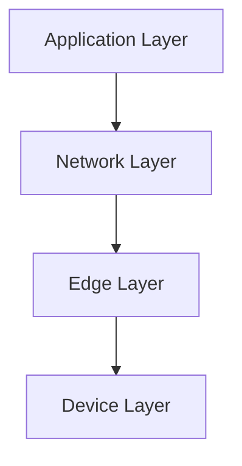

## Device Layer

Protects:

* Sensors
* Actuators
* Embedded devices

Mechanisms:

* Secure boot
* Device authentication

## Edge Layer

Protects:

* Gateways
* Edge computing nodes

Mechanisms:

* Access control
* Firmware updates

## Network Layer

Protects communication.

Mechanisms:

* TLS/DTLS
* VPN
* Firewalls

## Application Layer

Protects:

* Cloud applications
* APIs

Mechanisms:

* Authentication
* Encryption
* Monitoring

## Common Threats

* Weak passwords
* Insecure firmware
* Device hijacking
* Botnets

---

# Web Security and SSL Functions

## What is SSL?

Secure Sockets Layer (SSL) secures communication between:

* Browser
* Web server

Modern systems use TLS, the successor to SSL.

## Security Services

* Confidentiality
* Integrity
* Authentication

## SSL Architecture

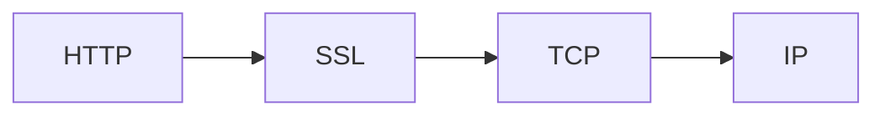

## SSL Handshake

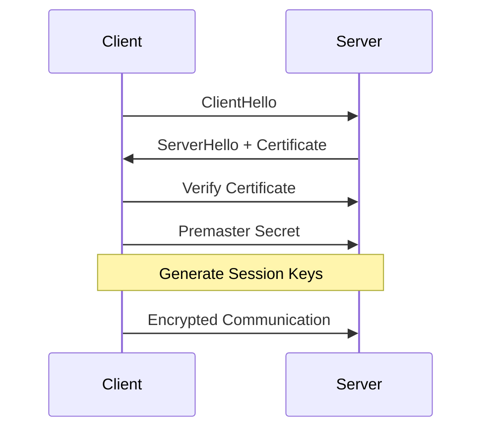

## Handshake Steps

1. ClientHello
2. ServerHello
3. Certificate exchange
4. Key exchange
5. Session key generation
6. Secure communication

---

# Secure Electronic Transaction (SET)

## Purpose

SET secures online credit card transactions.

## Components

* Cardholder
* Merchant
* Payment Gateway
* Certificate Authority
* Issuing Bank

## Architecture

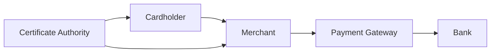

## Features

* Confidentiality
* Authentication
* Integrity

## Working

1. Customer places order.
2. Merchant verifies certificate.
3. Payment gateway processes payment.
4. Bank authorizes transaction.

---

# IPSec Mechanics (ESP)

## Transport Mode

Protects:

* Payload only

Original IP header remains visible.

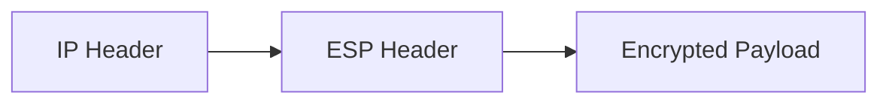

### Usage

* Host-to-host communication

---

## Tunnel Mode

Protects:

* Entire original IP packet

Adds a new IP header.

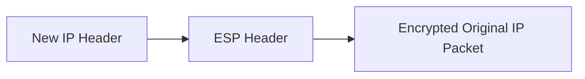

### Usage

* VPNs
* Gateway-to-gateway communication

## ESP Services

* Confidentiality
* Integrity
* Authentication
* Anti-replay protection

---

# Secure Shell (SSH) Internals

## What is SSH?

SSH provides secure remote access over insecure networks.

Default port:

```text
22
```

## SSH Architecture

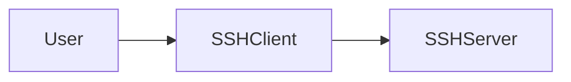

## SSH Protocol Layers

1. Transport Layer Protocol
2. User Authentication Protocol
3. Connection Protocol

## SSH Process

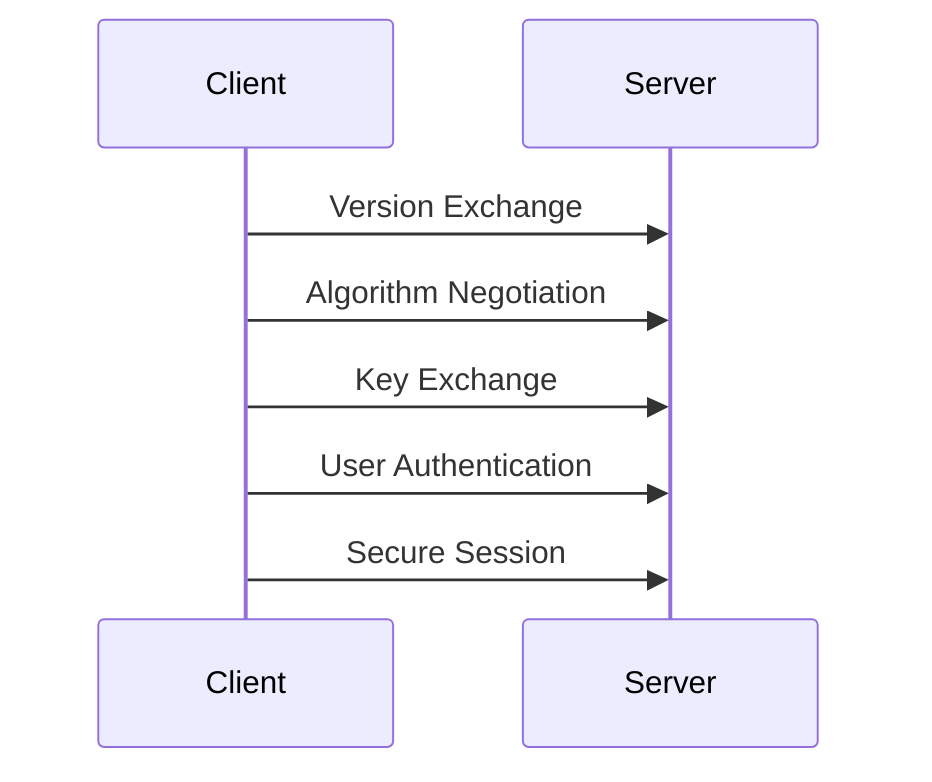

## Authentication Methods

* Password authentication
* Public key authentication
* Multi-factor authentication

## Applications

* Remote login
* Secure file transfer (SCP/SFTP)
* Remote command execution
* Port forwarding

## Security Features

* Encryption
* Integrity
* Authentication
* Compression

---

# Quick Revision Table

| Topic             | Key Idea                               |
| ----------------- | -------------------------------------- |
| Digital Signature | Private key signs, public key verifies |
| Blockchain        | Blocks linked by hashes                |
| SecaaS            | Cloud-delivered security services      |
| IoT Security      | Multi-layer device protection          |
| SSL/TLS           | Secure web communication               |
| SET               | Secure card transactions               |
| IPSec ESP         | Encrypts IP traffic                    |
| SSH               | Secure remote access                   |
