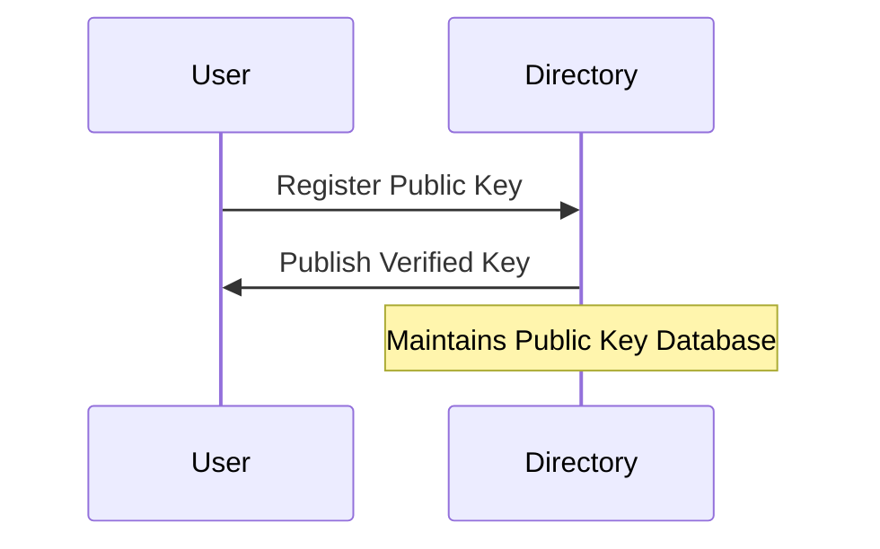
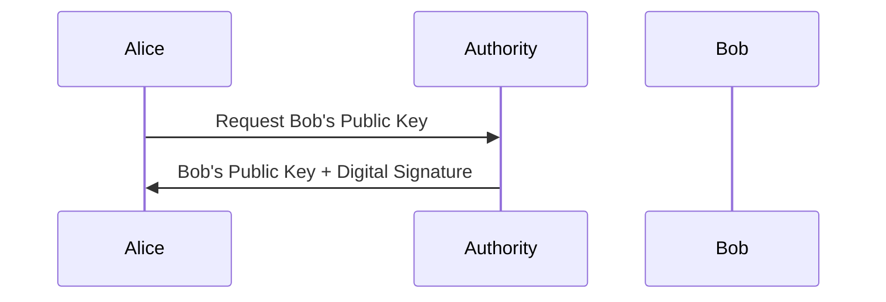
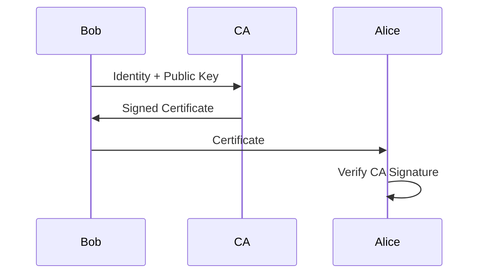

---

## topic: Public Key Distribution

# Public Key Distribution Schemes

## Why Do We Need Public Key Distribution?

Public-key cryptography depends on trust.

Before Alice can securely communicate with Bob, she must obtain Bob's authentic public key.

If an attacker replaces Bob's public key with a fake key:

```text id="sh3gdi"
Alice → Encrypts with Attacker's Key
```

The attacker can:

* Decrypt the message
* Read or modify the contents
* Re-encrypt and forward the message

This creates a Man-in-the-Middle (MITM) attack.

Therefore, a secure mechanism is required to distribute public keys.

---

## Real-World Analogy

Imagine Bob publishes his phone number online.

How does Alice know the number actually belongs to Bob?

Possible methods:

* Bob tells Alice personally
* Alice checks a trusted directory
* A trusted authority verifies Bob's identity

Public key distribution follows similar approaches.

---

## Public Key Distribution Schemes

Four major schemes are commonly used:

1. Public Announcement
2. Publicly Available Directory
3. Public Key Authority
4. Public Key Certificates


---

## 1. Public Announcement

Users openly publish their public keys.

Examples:

* Personal websites
* Email signatures
* Social media profiles

### Example

Bob posts:

```text id="cy58yr"
Bob's Public Key = K_B
```

Alice downloads and uses the key.

### Problem

An attacker can replace Bob's key with a fake key.

```text id="q4td0u"
Bob's Key → Attacker's Key
```

Alice cannot detect the substitution.

### Advantages

* Simple
* No infrastructure required

### Limitations

* No authentication
* Vulnerable to spoofing

---

## 2. Publicly Available Directory

A trusted organization maintains a directory of users and their public keys.

Users register their keys with the directory.

The directory verifies identities before publishing keys.

### Example

```text id="y3ut4v"
Employee Directory

Alice → K_A

Bob → K_B
```

### Working



### Advantages

* Centralized management
* Easier key lookup

### Limitations

* Directory must be trusted
* Directory updates must be secure
* Directory can become a target

---

## 3. Public Key Authority

A trusted online authority provides public keys on demand.

Unlike directories, keys are requested dynamically.

The authority digitally signs responses.

### Working



### Example

Alice wants Bob's key.

Instead of using a stored copy, she asks the authority.

The authority responds with:

```text id="m3fb4d"
Bob's Public Key

Timestamp

Digital Signature
```

### Advantages

* Current information
* Strong authentication
* Prevents stale keys

### Limitations

* Requires continuous availability
* Creates communication overhead
* Single point of failure

---

## 4. Public Key Certificates

A trusted Certificate Authority (CA) issues certificates.

A certificate binds:

```text id="6m1ihx"
Identity ↔ Public Key
```

The CA digitally signs the certificate.

Anyone who trusts the CA can trust the public key.

This approach is defined by:

```text id="9dzqxl"
X.509
```

### Certificate Contents

* Subject identity
* Public key
* Issuer name
* Validity period
* Serial number
* Digital signature

### Working



### Example

When you visit:

```text id="v2b7z7"
https://example.com
```

Your browser receives the website's X.509 certificate.

The browser verifies:

* CA signature
* Expiration date
* Revocation status

### Advantages

* Scalable
* Strong authentication
* No real-time authority lookup required

### Limitations

* Dependence on trusted CAs
* Certificate management complexity
* CA compromise affects many users

---

## Comparison of Public Key Distribution Schemes

| Scheme                  | Trusted Third Party | Security  | Scalability | Example             |
| ----------------------- | ------------------- | --------- | ----------- | ------------------- |
| Public Announcement     | ❌ No                | Low       | High        | Public websites     |
| Public Directory        | ✅ Yes               | Medium    | Medium      | Corporate directory |
| Public Key Authority    | ✅ Yes               | High      | Medium      | Online key server   |
| Public Key Certificates | ✅ Yes               | Very High | High        | HTTPS               |

---

## Evolution of Public Key Distribution


Each scheme improves trust and security.

---

## Practical Examples

| Scenario                 | Distribution Method  |
| ------------------------ | -------------------- |
| Email signature          | Public announcement  |
| University key server    | Public directory     |
| Secure messaging gateway | Public key authority |
| HTTPS websites           | X.509 certificates   |

---

## Modern Usage

Today, most internet applications use:

```text id="hlok3g"
Public Key Certificates
```

Examples:

* HTTPS
* VPNs
* Secure email
* Cloud services

PGP is an exception.

PGP uses:

```text id="g2f8ow"
Web of Trust
```

instead of centralized Certificate Authorities.

---

## Memory Shortcuts

Remember the order:

```text id="t7hnzn"
Announcement → Directory → Authority → Certificate
```

Think:

```text id="zy7eez"
No Trust → Partial Trust → Online Trust → CA Trust
```

---

## Exam Points

* Public keys must be distributed securely.
* Public announcement is simple but insecure.
* Public directories maintain verified key databases.
* Public key authorities provide keys dynamically.
* Public key certificates bind identities to public keys.
* X.509 certificates are widely used today.
* Certificate Authorities digitally sign certificates.

---

## One-Line Summary

> Public key distribution schemes provide secure methods for obtaining authentic public keys using announcements, directories, trusted authorities, and digital certificates.
