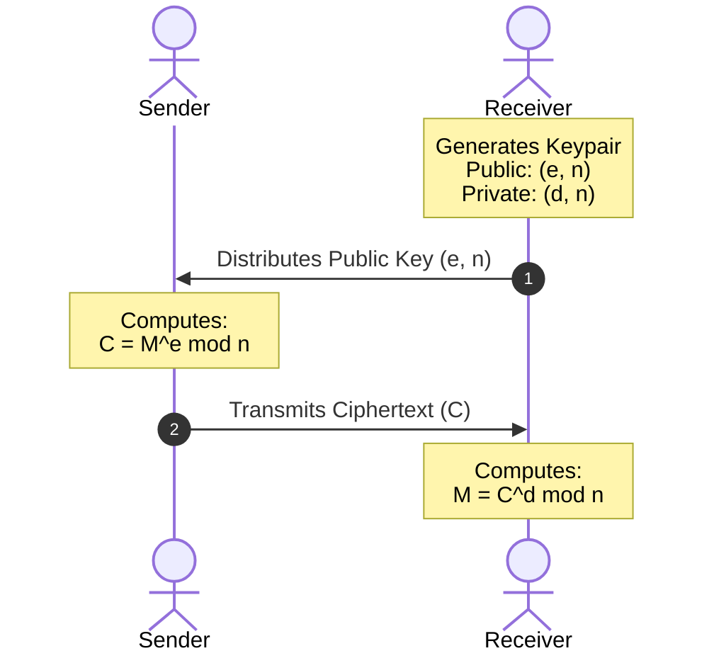
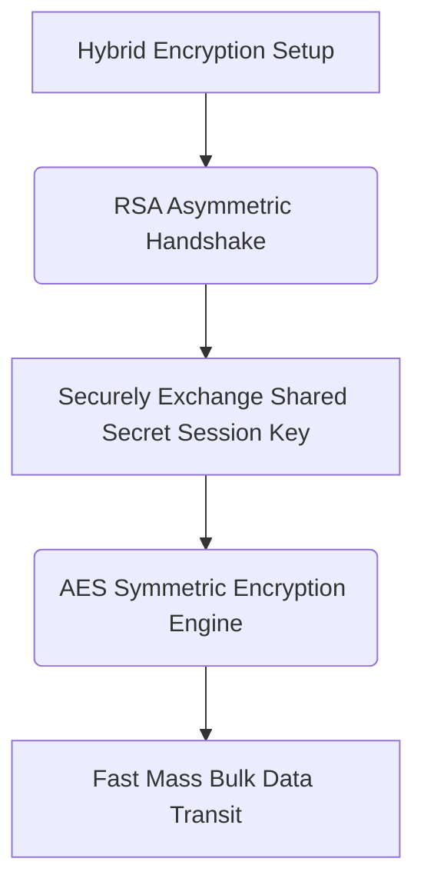

Here is your complete, comprehensive masterclass note on the **RSA Algorithm**, covering its concept, real-world deployment, full mathematical foundations (including modular arithmetic and multiplicative inverse), security analysis, and a practical step-by-step math workbook.

---

# Question 2: RSA Algorithm Evaluation & Foundational Math

## 1. The Core "Why" & "When"

* **Why:** In conventional symmetric cryptography, two communicating parties must share a single secret key before they can communicate securely. If an attacker intercepts this key during distribution, the entire system collapses. RSA (Rivest-Shamir-Adleman) solves this by separating the encryption capability from the decryption capability using an asymmetric key pair.
* **When:** RSA is deployed during the initial connection handshake phase of protocols like TLS (HTTPS), SSH, and PGP email security. Its primary role is to authenticate the remote party and securely exchange a temporary symmetric session key (like AES), which is then used to handle bulk data transit.

---

## 2. Foundational Mathematical Pillars

Before running the algorithm, you must master the two underlying mathematical operations that make asymmetric cryptography possible: **Modular Arithmetic** and the **Modular Multiplicative Inverse**.

### Pillar A: Modular Arithmetic ($\text{mod}$)

Modular arithmetic operates on integers within a cyclic, closed loop. The expression $A \pmod N$ reads as "$A$ modulo $N$" and calculates the **remainder** left over after dividing $A$ by $N$.

* **Visualizing with Clock Math:** Think of a 12-hour clock. If it is 9 o'clock and you add 5 hours, you get 2 o'clock, not 14. Mathematically: $(9 + 5) \pmod{12} = 14 \pmod{12} = 2$.
* **The Manual Calculation Trick:** To compute $A \pmod N$ quickly without a specialized calculator:
1. Divide $A$ by $N$ ($A / N$) to get a decimal value.
2. Drop the decimal part; keep only the whole integer quotient.
3. Multiply that whole integer by $N$, and subtract the product from your original value $A$.

* **Example:** Compute $25 \pmod 7$
1. $25 / 7 = 3.5714$
2. Keep the whole number: $3$
3. Calculate remainder: $25 - (3 \times 7) = 25 - 21 = \mathbf{4}$.

### Pillar B: Modular Multiplicative Inverse

In normal algebra, to undo multiplying a number by $e$, you multiply by its reciprocal fraction $\frac{1}{e}$ because $e \times \frac{1}{e} = 1$. In cryptography, fractions destroy precision and break discrete math equations. Instead, we use a **Modular Inverse**: a whole integer $d$ that acts exactly like a fraction inside a specific modulus loop ($\phi$).

The mathematical goal is to find an integer $d$ that satisfies:

$$(d \times e) \pmod{\phi} = 1$$

* **Exam Method (The Multiples Formula):** Rearrange the equation to isolate $d$:

$$d = \frac{(\phi \times k) + 1}{e}$$

Substitute increasing integers for $k$ ($1, 2, 3, 4, \dots$) until the numerator becomes perfectly divisible by $e$ yielding a clean whole number.
* **Example:** Find $d$ given $e = 7$ and $\phi = 20$.
* Set up equation: $d = \frac{20k + 1}{7}$
* Try $k = 1 \rightarrow \frac{20(1) + 1}{7} = \frac{21}{7} = \mathbf{3}$.
* Therefore, the modular inverse $d = 3$.

---

## 3. The RSA Algorithm Pipeline

The complete execution of RSA is divided into three distinct phases: **Key Generation**, **Encryption**, and **Decryption**.

### Phase 1: Key Generation

1. Select two large, distinct prime numbers, $p$ and $q$.
2. Compute the product modulus: $n = p \times q$.
3. Compute Euler's Totient function: $\phi(n) = (p - 1) \times (q - 1)$.
4. Select a public exponent $e$ that is coprime to $\phi(n)$. This means $1 < e < \phi(n)$ and $\gcd(e, \phi(n)) = 1$.
5. Calculate the private exponent $d$ as the modular multiplicative inverse of $e$ modulo $\phi(n)$, meaning $(d \times e) \pmod{\phi(n)} = 1$.

* **The Public Key:** Composed of the pair $(e, n)$.
* **The Private Key:** Composed of the pair $(d, n)$ (The primes $p$, $q$, and $\phi(n)$ must be securely destroyed or hidden).

### Phase 2: Encryption

A sender converts a plaintext message into an integer representation $M$ (where $0 \le M < n$) and encrypts it using the recipient's public key $(e, n)$:

$$C = M^e \pmod n$$

### Phase 3: Decryption

The authorized recipient takes the ciphertext $C$ and reconstructs the original plaintext message $M$ using their private key $(d, n)$:

$$M = C^d \pmod n$$

---

## 4. Critical Assessment: Security & Efficiency

### Security Analysis

* **The Factoring Problem:** The fundamental security of RSA relies on the asymmetry of multiplication vs. factorization. Multiplying two massive prime numbers to find $n$ is computationally trivial. However, reversing that process—taking a public modulus $n$ and factoring it back into its component primes $p$ and $q$—is an incredibly difficult problem for standard computers when $n$ is large.
* **Modern Key Size Vulnerability:** If an attacker factors $n$, they instantly discover $p$ and $q$, allowing them to reconstruct $\phi(n)$ and recalculate the secret private key $d$. Keys sized at 512 bits and 1024 bits have been broken by distributed computing systems. For secure production enterprise architectures, **RSA-2048** or **RSA-4096** key lengths are mandatory.
* **Mathematical Attacks:** If an identical message is encrypted using small exponents ($e=3$) to multiple targets, attackers can exploit Chinese Remainder Theorem properties to decrypt traffic without factoring. Modern implementations protect against this using standardized padding systems like **OAEP (Optimal Asymmetric Encryption Padding)**, which adds random data bits to plaintext before encryption.

### Performance & Operational Efficiency

* **Computational Overhead:** Asymmetric operations involve heavy modular exponentiation over extremely large integers. This demands significant CPU cycle overhead compared to symmetric options like AES, which rely on simple, hardware-accelerated bit-shifting steps.
* **Asymmetric Speed Deficit:** Because RSA is roughly 1,000 times slower than AES, it is never used to encrypt entire bulk databases, file attachments, or media streams. It is used exclusively as a hybrid framework mechanism—securing the transport of a small, lightweight symmetric key which handles the actual high-speed data encryption pipeline.

---

## 5. Step-by-Step Math Worksheets

Problem Sandbox 1: Encrypt and Decrypt given $p=3, q=11, e=7, M=5$ 

1. 
**Modulus:** $n = p \times q = 3 \times 11 = 33$ 

2. **Totient:** $\phi(n) = (3-1) \times (11-1) = 2 \times 10 = 20$
3. **Private Key ($d$):** $(d \times 7) \pmod{20} = 1 \rightarrow d = \frac{20k + 1}{7}$.
* Set $k=1 \rightarrow d = \frac{21}{7} = 3$. Thus, **$d = 3$**.

4. 
**Encryption:** $C = M^e \pmod n = 5^7 \pmod{33}$ 

* Break down the power: $5^7 = (5^4) \times (5^2) \times (5^1)$
* $5^1 = 5 \pmod{33}$
* $5^2 = 25 \pmod{33}$
* $5^4 = 25^2 = 625 \pmod{33} \rightarrow 625 - (18 \times 33) = 31$
* Combine parameters: $C = (31 \times 25 \times 5) \pmod{33} = 3875 \pmod{33}$
* Reduce: $3875 - (117 \times 33) = 3875 - 3861 = \mathbf{14}$.
* **Ciphertext $C = 14$**.

5. **Decryption:** $M = C^d \pmod n = 14^3 \pmod{33}$
* $14^3 = 2744$
* Reduce: $2744 - (83 \times 33) = 2744 - 2739 = \mathbf{5}$.
* **Plaintext Message $M = 5$** (Verified successfully).

Problem Sandbox 2: Find Plaintext given Ciphertext $C=10, e=5, n=35$ 

1. **Factor Modulus:** Find primes where $p \times q = 35$. The component primes are **$p = 5$** and **$q = 7$**.
2. **Totient:** $\phi(n) = (5-1) \times (7-1) = 4 \times 6 = 24$
3. **Private Key ($d$):** $(d \times 5) \pmod{24} = 1 \rightarrow d = \frac{24k + 1}{5}$.
* Set $k=1 \rightarrow d = \frac{25}{5} = 5$. Thus, **$d = 5$**.

4. 
**Decryption:** $M = C^d \pmod n = 10^5 \pmod{35}$ 

* $10^5 = 100000$
* Reduce: $100000 - (2857 \times 35) = 100000 - 99995 = \mathbf{5}$.
* **Plaintext Message $M = 5$**.

---

Here is your complete note architecture fully formatted for your Obsidian environment, wrapped clean inside your requested structural tags.

# Library Note: Cryptographic Foundations of RSA

## 1. Fast Reference Matrix
* **Public Key:** `(e, n)`
* **Private Key:** `(d, n)`
* **Encryption Pipe:** $C = M^e \pmod n$
* **Decryption Pipe:** $M = C^d \pmod n$

---

## 2. Mathematical Proof Sanity Checkers

### Case Validation Alpha (p=3, q=11, e=7)
* **Modulus ($n$):** $33$
* **Totient ($\phi(n)$):** $20$
* **Key Inverses:** $e = 7 \iff d = 3$
* **Verification Routine:**
    * Input Message: `5`
    * Ciphertext Output: $5^7 \pmod{33} \longrightarrow \mathbf{14}$
    * Recovered Plaintext: $14^3 \pmod{33} \longrightarrow \mathbf{5}$

### Case Validation Beta (Factorization Challenge)
* **Given Inputs:** $C = 10, e = 5, n = 35$
* **Factored Primes:** $p = 5, q = 7 \implies \phi(n) = 24$
* **Calculated Inverse ($d$):** $(d \times 5) \pmod{24} = 1 \implies d = 5$
* **Verification Routine:**
    * Decryption Formula: $10^5 \pmod{35}$
    * Final Result String: $\mathbf{5}$

### Case Validation Gamma (p=17, q=11, e=7)
* **Modulus ($n$):** $187$
* **Totient ($\phi(n)$):** $160$
* **Key Inverses:** $e = 7 \iff d = 23$
* **Verification Routine:**
    * Input Message: `88`
    * Ciphertext Output: $88^7 \pmod{187} \longrightarrow \mathbf{11}$
    * Recovered Plaintext: $11^{23} \pmod{187} \longrightarrow \mathbf{88}$

---

## 3. Operational Implementation Guidelines

* **Production Constraint 1:** Never use low raw prime limits in practical infrastructure deployment; enforce `n >= 2048 bits`.
* **Production Constraint 2:** Always chain modular computations with **OAEP Padding** structures to defend against mathematical traffic analysis models.

---

Say **"Next"** whenever you are ready to proceed to the next comprehensive long-answer question in your question bank sequence: **Kerberos Authentication Architecture & Protocols**.