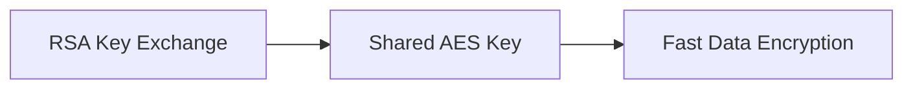
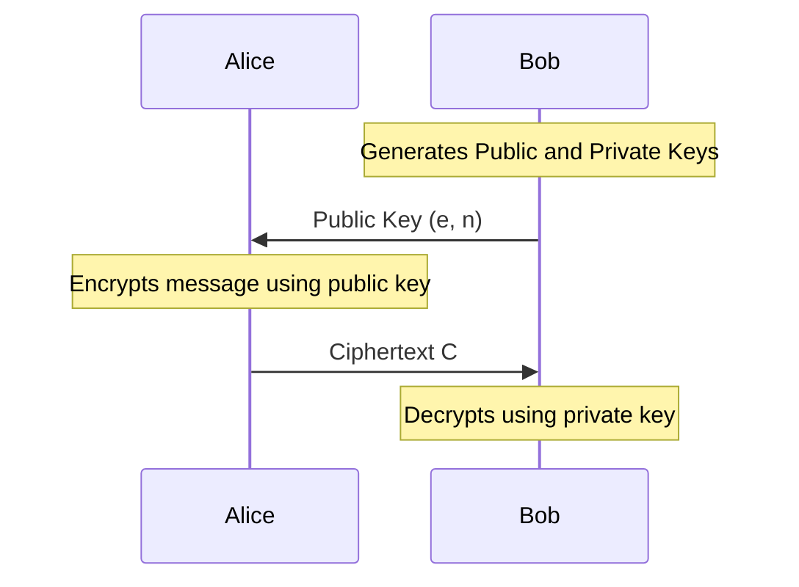

---

## topic: RSA

# RSA Algorithm

## Why Does RSA Exist?

Suppose Alice wants to send a secret message to Bob over the internet.

Using symmetric encryption creates a problem:

* Alice and Bob must share the same secret key.
* How do they exchange that key securely?

If an attacker steals the key during transmission, the entire system is compromised.

RSA solves this problem using **two different keys**:

* A **public key** that everyone can know
* A **private key** that only the owner knows

Anyone can encrypt a message using the public key.

Only the owner can decrypt it using the private key.

> [!important]
> RSA is an **asymmetric encryption algorithm**.

---

## The Big Idea Behind RSA

RSA relies on one mathematical fact:

> Multiplying large prime numbers is easy, but factoring their product is extremely difficult.

Example:

```text
3 × 11 = 33
```

Easy.

Now imagine:

```text
p × q = 617-digit number
```

Finding the original values of `p` and `q` becomes computationally difficult.

RSA security depends on this difficulty.

---

## Where RSA Is Used

RSA is rarely used to encrypt large files directly.

Instead, it is used to securely exchange symmetric keys.

Common applications:

* HTTPS
* SSH
* VPNs
* PGP Email



> [!note]
> RSA establishes trust. AES handles the actual data transfer.

---

## Important Terms

| Symbol | Meaning                  |
| ------ | ------------------------ |
| `p`    | First prime number       |
| `q`    | Second prime number      |
| `n`    | Product of primes        |
| `φ(n)` | Euler's Totient Function |
| `e`    | Public exponent          |
| `d`    | Private exponent         |
| `M`    | Plaintext message        |
| `C`    | Ciphertext               |

---

## Mathematical Foundations

### Modular Arithmetic

The expression:

```text
A mod N
```

means:

> Divide `A` by `N` and keep only the remainder.

Example:

```text
25 mod 7 = 4
```

Because:

```text
25 = (3 × 7) + 4
```

### Clock Analogy

A clock works using modular arithmetic.

```text
9 + 5 = 14

14 mod 12 = 2
```

So:

```text
9 o'clock + 5 hours = 2 o'clock
```

---

## Modular Multiplicative Inverse

RSA requires finding a number `d` such that:

```text
(e × d) mod φ(n) = 1
```

Think of `d` as the value that "undoes" the effect of `e`.

### Exam Shortcut

Use:

```text
d = (φ(n) × k + 1) / e
```

Try values of `k = 1, 2, 3...`

Choose the first value that produces a whole number.

Example:

```text
e = 7
φ(n) = 20
```

Try:

```text
k = 1

d = (20 × 1 + 1) / 7
d = 21 / 7
d = 3
```

Therefore:

```text
d = 3
```

---

## RSA Workflow

```mermaid
flowchart TD
    A[Choose primes p and q] --> B[Calculate n = p × q]
    B --> C[Calculate φ(n)]
    C --> D[Choose e]
    D --> E[Calculate d]

    E --> F[Public Key: e,n]
    E --> G[Private Key: d,n]

    F --> H[Encrypt Message]
    G --> I[Decrypt Message]
```

---

## Step 1: Key Generation

Choose two prime numbers:

```text
p = 3
q = 11
```

Calculate:

```text
n = p × q
n = 3 × 11
n = 33
```

Calculate:

```text
φ(n) = (p − 1)(q − 1)

φ(n) = (3 − 1)(11 − 1)
φ(n) = 20
```

Choose `e` such that:

```text
1 < e < φ(n)

gcd(e, φ(n)) = 1
```

Choose:

```text
e = 7
```

Find `d`:

```text
(e × d) mod φ(n) = 1

7d mod 20 = 1
```

Using the shortcut:

```text
d = 3
```

---

## Generated Keys

### Public Key

```text
(e, n) = (7, 33)
```

### Private Key

```text
(d, n) = (3, 33)
```

> [!warning]
> Never share the private key.

---

## Encryption

Encryption formula:

```text
C = M^e mod n
```

Suppose:

```text
M = 5
```

Substitute:

```text
C = 5^7 mod 33
```

Compute:

```text
5² = 25

5⁴ = 25² = 625 mod 33 = 31

5⁷ = 5⁴ × 5² × 5
```

```text
= 31 × 25 × 5

= 3875
```

Reduce modulo 33:

```text
3875 mod 33 = 14
```

Therefore:

```text
C = 14
```

---

## Decryption

Decryption formula:

```text
M = C^d mod n
```

Substitute:

```text
M = 14^3 mod 33
```

Compute:

```text
14² = 196 mod 33 = 31

14³ = 14 × 31

= 434
```

Reduce modulo 33:

```text
434 mod 33 = 5
```

Recovered message:

```text
M = 5
```

The original plaintext is restored.

---

## Complete Communication Process



---

## Why RSA Is Secure

An attacker knows:

```text
(e, n)
```

To compute the private key `d`, the attacker must know:

```text
φ(n)
```

To calculate `φ(n)`, they need:

```text
p and q
```

But finding `p` and `q` from `n` requires factorization.

For sufficiently large values of `n`, factorization is computationally infeasible.

---

## Limitations of RSA

* Slower than symmetric algorithms
* Requires large key sizes
* Inefficient for encrypting large files
* Vulnerable to poor padding schemes

Modern systems use:

* RSA-2048 or RSA-4096
* OAEP padding
* Hybrid encryption with AES

---

## Advantages

* Secure key exchange
* No need to share private keys
* Supports digital signatures
* Widely supported

---

## Disadvantages

* Computationally expensive
* Large ciphertext size
* Slower than AES
* Depends on the hardness of factorization

---

## Memory Shortcuts

```text
p, q → n → φ(n) → e → d
```

```text
Public Key = (e, n)

Private Key = (d, n)
```

```text
Encryption: M^e mod n

Decryption: C^d mod n
```

Remember:

```text
e = encrypt

d = decrypt
```

---

## Exam Template

For any RSA problem:

```text
1. Find n = p × q
2. Find φ(n)
3. Choose e
4. Calculate d
5. Generate keys
6. Encrypt message
7. Decrypt ciphertext
8. Verify answer
```

---

## One-Line Summary

> RSA is an asymmetric cryptographic algorithm that uses a public key for encryption and a private key for decryption, with security based on the difficulty of factoring large prime numbers.
