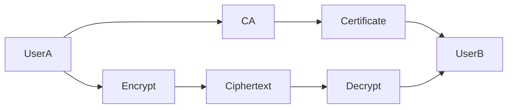

# Secure Public-Key Cryptosystem Design

## Goal of a Public-Key Cryptosystem

A secure public-key cryptosystem should provide:

* Confidentiality
* Authentication
* Integrity
* Non-repudiation
* Scalability

---

## Core Components

1. Key Generation
2. Public Key Distribution
3. Certificate Management
4. Encryption and Decryption
5. Digital Signatures
6. Revocation Mechanisms

---

## System Architecture



---

## 1. Key Generation

Each user generates:

* Public key
* Private key

Requirements:

* Strong random numbers
* Adequate key length
* Secure private key storage

Examples:

* RSA-2048
* ECC-256

---

## 2. Certificate Authority Integration

A trusted Certificate Authority binds:

```text
Identity ↔ Public Key
```

using digital certificates.

Certificates contain:

* Subject name
* Public key
* Validity period
* CA signature

---

## 3. Encryption Process

Sender:

1. Obtains recipient certificate.
2. Verifies certificate.
3. Extracts public key.
4. Encrypts session key.
5. Sends ciphertext.

---

## 4. Decryption Process

Receiver:

1. Uses private key.
2. Recovers session key.
3. Decrypts data.

---

## Hybrid Encryption

Modern systems use:

```text
Public Key → Encrypt Session Key

Symmetric Key → Encrypt Data
```

Examples:

* TLS
* PGP

---

## 5. Digital Signatures

Sender:

1. Hashes the message.
2. Encrypts hash using private key.

Receiver:

1. Decrypts signature using public key.
2. Computes local hash.
3. Compares values.

Provides:

* Integrity
* Authentication
* Non-repudiation

---

## 6. Certificate Revocation

Certificates may become invalid before expiration.

Reasons:

* Key compromise
* Employee departure
* Incorrect issuance

Methods:

* CRL
* OCSP

---

## Attack Resistance

| Threat        | Countermeasure         |
| ------------- | ---------------------- |
| MITM          | Certificate Validation |
| Replay Attack | Nonces, Timestamps     |
| Key Theft     | HSM, Secure Storage    |
| Brute Force   | Strong Key Sizes       |
| Spoofing      | Digital Signatures     |

---

## Certificate Validation Process

```mermaid
flowchart TD

    A[Receive Certificate]

    A --> B{Valid Date?}

    B -->|No| X[Reject]

    B -->|Yes| C{Revoked?}

    C -->|Yes| X

    C -->|No| D{CA Signature Valid?}

    D -->|No| X

    D -->|Yes| E[Trust]
```



---

## Best Practices

* Use strong algorithms.
* Protect private keys.
* Rotate keys regularly.
* Enable revocation checking.
* Use hardware security modules.
* Apply least privilege.

---

## Design Principles

```text
Confidentiality + Integrity + Authentication + Availability
```

Combined with:

```text
Defense in Depth
```

---

## Exam Points

* Public and private keys are generated together.
* Certificates bind identities to public keys.
* Hybrid encryption improves performance.
* Digital signatures provide non-repudiation.
* CRL and OCSP support revocation.
* Strong key management is critical.

---

## One-Line Summary

> A secure public-key cryptosystem integrates robust key generation, certificate management, hybrid encryption, digital signatures, revocation mechanisms, and attack-resistant design principles to provide end-to-end security.
