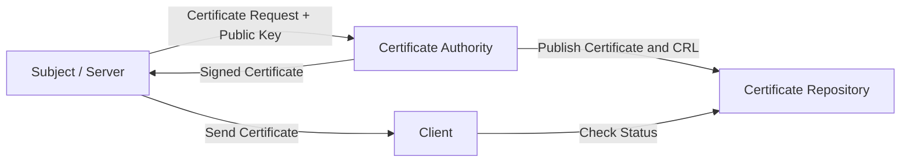
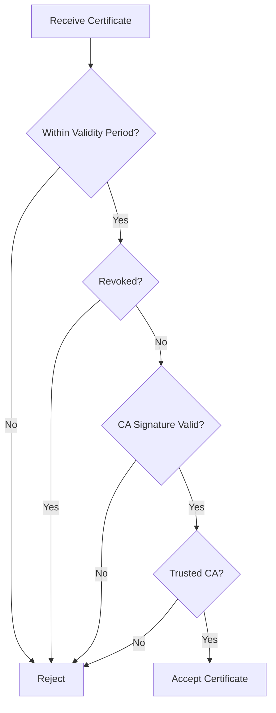
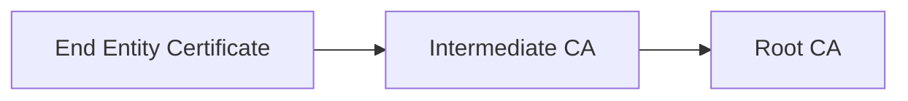
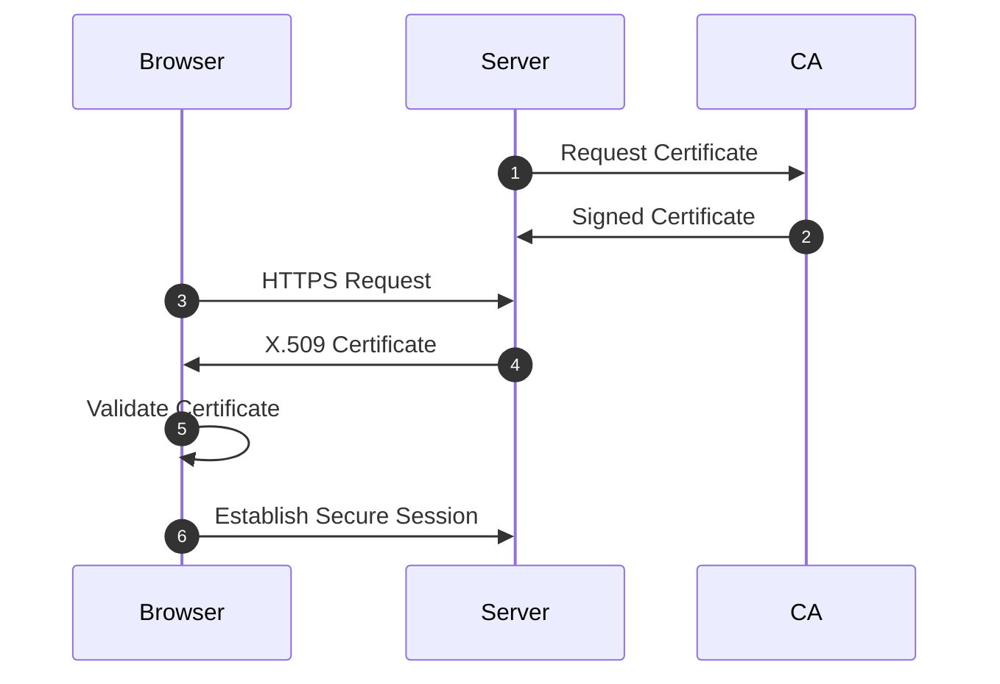

# X.509 Authentication Service

## Why Does X.509 Exist?

Suppose you visit:

```text id="gjlwm7"
https://mybank.com
```

The website sends you its public key.

How do you know the key actually belongs to your bank?

An attacker could create a fake website and send their own public key.

If you trust the wrong key, encryption becomes useless.

X.509 solves this problem.

It binds:

```text id="nfegh4"
Identity ↔ Public Key
```

using a trusted third party called a **Certificate Authority (CA).**

---

## Real-World Analogy

Think of a passport.

A passport contains:

* Your identity
* Your photograph
* Your details
* Government signature

People trust the passport because they trust the government.

Similarly:

* Certificate → Passport
* Public key → Photograph
* Certificate Authority → Government office

You trust the public key because you trust the CA.

---

## What Is an X.509 Certificate?

An X.509 certificate is a digital document that binds:

```text id="l8flm3"
Owner Identity + Public Key
```

The certificate is digitally signed by a Certificate Authority.

> [!important]
> The CA does not encrypt your data.
>
> The CA verifies identities and signs certificates.

---

## Main Components

### Subject

The entity that owns the certificate.

Examples:

* Website
* Person
* Organization
* Server

---

### Certificate Authority (CA)

A trusted third party that:

* Verifies identity
* Issues certificates
* Digitally signs certificates

Examples:

* DigiCert
* Let's Encrypt
* GlobalSign

---

### Repository

Stores:

* Certificates
* Certificate Revocation Lists (CRLs)

Clients access repositories to verify certificate status.

---

### Client

The entity validating the certificate.

Examples:

* Browser
* Email client
* VPN client

---

## X.509 Architecture



---

## Certificate Issuance Process

### Step 1: Generate Key Pair

The subject generates:

* Public key
* Private key

The private key never leaves the owner's system.

---

### Step 2: Submit Certificate Request

The subject sends:

* Identity information
* Public key

to the CA.

This request is called a:

```text id="p93p7f"
Certificate Signing Request (CSR)
```

---

### Step 3: Identity Verification

The CA verifies:

* Domain ownership
* Organization details
* User identity

---

### Step 4: Certificate Generation

The CA creates the certificate.

The CA signs it using its private key.

---

### Step 5: Certificate Delivery

The signed certificate is returned to the subject.

The subject installs it on the server.

---

## Certificate Validation Process

When a browser connects to a secure website, it validates the certificate.



---

## Validation Steps

### Step 1: Check Validity Period

Verify:

* Not Before date
* Not After date

If expired:

```text id="b3zznn"
Reject certificate
```

---

### Step 2: Check Revocation Status

A certificate may be revoked before expiration.

Reasons:

* Private key compromise
* Organization changes
* Incorrect issuance

Methods:

* CRL
* OCSP

---

### Step 3: Verify CA Signature

The client uses the CA's public key to verify the signature.

If verification fails:

```text id="wz0m0v"
Certificate has been modified or forged
```

---

### Step 4: Verify Trust Chain

The browser verifies the certificate chain.



The Root CA certificate already exists in the browser's trusted store.

If the chain reaches a trusted root:

```text id="79u8uv"
Trust established
```

---

## Certificate Revocation Methods

### Certificate Revocation List (CRL)

A downloadable list of revoked certificates.

The client checks whether the certificate serial number exists in the list.

### Online Certificate Status Protocol (OCSP)

The client sends a live query to the CA.

The CA responds:

```text id="cdm6f6"
Good

Revoked

Unknown
```

> [!note]
> OCSP provides real-time validation and is more efficient than CRLs.

---

## Important Certificate Fields

| Field               | Purpose                    |
| ------------------- | -------------------------- |
| Version             | Certificate format version |
| Serial Number       | Unique identifier          |
| Signature Algorithm | Algorithm used by CA       |
| Issuer              | Certificate Authority      |
| Subject             | Certificate owner          |
| Validity Period     | Expiration dates           |
| Subject Public Key  | Public key information     |
| Key Usage           | Allowed operations         |
| Extensions          | Additional information     |

---

## X.509 in HTTPS



---

## Advantages

* Prevents impersonation
* Enables secure public key distribution
* Supports authentication
* Scalable trust model
* Enables HTTPS and VPNs

---

## Limitations

* Dependence on trusted CAs
* CA compromise affects many users
* Certificate management overhead
* Revocation checking delays

---

## Memory Shortcuts

```text id="5c2vz7"
Identity + Public Key + CA Signature
= X.509 Certificate
```

Remember:

```text id="0yq25x"
CA signs

Client verifies
```

Validation order:

```text id="57m4u5"
Date → Revocation → Signature → Trust Chain
```

---

## Exam Points

* X.509 binds identity to a public key.
* Certificates are issued by Certificate Authorities.
* Clients validate certificate signatures.
* CRL and OCSP check revocation status.
* Trust is established through certificate chains.
* Root CA certificates are pre-installed in browsers.

---

## One-Line Summary

> X.509 is a public key certificate standard that securely binds an entity's identity to its public key using digital signatures from trusted Certificate Authorities.
