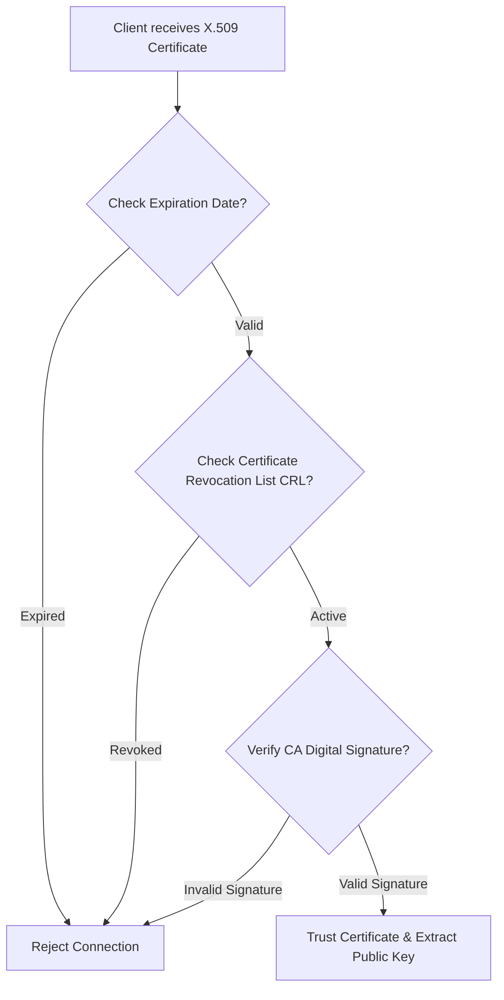
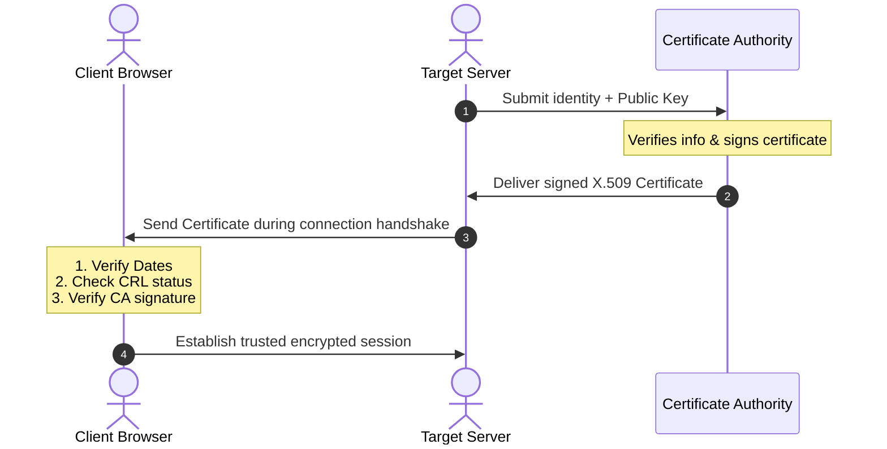

Up next in our consolidated question bank is **Question 5**, the first item under the _Moderately Repeated Part B & C_ list: **X.509 Authentication Service**.

# Question 5: X.509 Authentication Service (15-Mark Master Blueprint)

## 1. Core Concept & Purpose

The X.509 standard defines a standardized framework for public-key certificates to secure network communications. In an open network, anyone can publish a public key and claim to be a trusted entity (like a bank or a major website).

The purpose of an X.509 certificate is to bind a user's or organization's public key to their real-world identity. This binding is mathematically bound and signed by a trusted third party called a **Certificate Authority (CA)**. This ensures that clients can verify who they are communicating with before establishing an encrypted channel.

## 2. Architectural Components & Diagram

The X.509 ecosystem relies on three foundational components working together:

1. **Subject (User/Server):** The entity that owns the public key and requests the certificate (e.g., an enterprise web server).
    
2. **Issuer (Certificate Authority - CA):** The trusted authority that verifies the Subject's real identity, generates the certificate, and signs it using its own master Private Key.
    
3. **Directory / Repository:** A publicly accessible server or registry where active certificates and revocation lists are published for clients to read.
    

## 3. Step-by-Step Certificate Validation Pathway

When a client application (like a web browser) establishes a secure connection with a server, it uses the following protocol pathway to validate the server's X.509 certificate:

Code snippet

1. **Step 1: Check Temporal Validity:** The browser reads the `Validity Period` field (Start Date and Expiration Date) inside the certificate. If the current system time is outside this window, the certificate is rejected immediately.
    
2. **Step 2: Check Revocation Status:** Even if a certificate hasn't expired, it may have been cancelled early (e.g., if the server's private key was stolen). The browser contacts the CA's directory to check the **Certificate Revocation List (CRL)** or uses the **Online Certificate Status Protocol (OCSP)**. If the certificate's serial number is listed there, it is blocked.
    
3. **Step 3: Verify the CA Signature:** The browser extracts the CA's digital signature from the certificate header. It then locates the CA's known public key (which comes pre-installed in the browser's trusted root store), decrypts the signature, and hashes the certificate data locally. If the decrypted signature hash matches the locally calculated hash perfectly, it proves the certificate is authentic and has not been altered since its creation.
    

## 4. Key Fields Inside an X.509 Certificate

To prove to an examiner that you understand the data structure of a certificate, list these core structural components:

- **Version:** Identifies which standard format is used (typically Version 3).
    
- **Serial Number:** A unique integer assigned by the CA to distinguish this certificate from all others.
    
- **Signature Algorithm:** The exact mathematical formula (e.g., SHA-256 with RSA) used by the CA to sign the document.
    
- **Issuer Name:** The identity of the CA that created and signed the certificate.
    
- **Validity Period:** The explicit "Not Before" and "Not After" date boundaries.
    
- **Subject Name:** The real-world identity of the certificate owner (e.g., the website domain name).
    
- **Subject's Public Key Info:** The actual public key being certified, along with its algorithm type.
    

Here is the clean, consolidated markdown configuration ready for your Obsidian ecosystem.

Code snippet
# Exam Note: X.509 Authentication Service Blueprint

## 1. Key Component Mapping
* **The Certificate Authority (CA):** The trusted root of the system that vouches for identities.
* **The Digital Signature:** Created using the CA's private key; verified using the CA's public key.
* **Revocation Repositories:** CRL (static list) or OCSP (live query protocol) used to check for compromised keys.

## 2. Structural Certificate Fields
* `Serial Number`: Unique tracking identifier.
* `Subject`: Name of the verified owner.
* `Public Key`: Cryptographic key used for encryption setup.
* `Validity`: Enforces absolute lifecycle limits to reduce exposure to long-term key breaking.

Say **"Next"** whenever you are ready to move to the next long-answer question in the question bank sequence: **Authenticated Key Agreement Protocols (Diffie-Hellman + RSA)**.