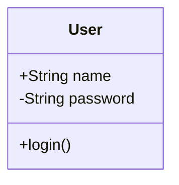
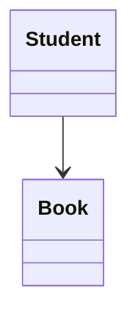
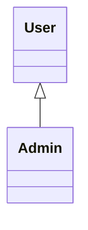
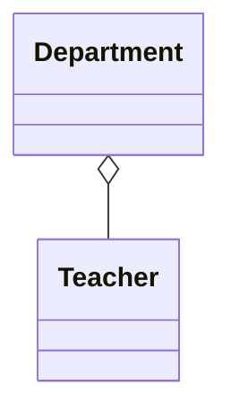
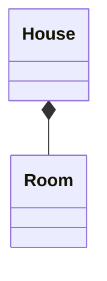
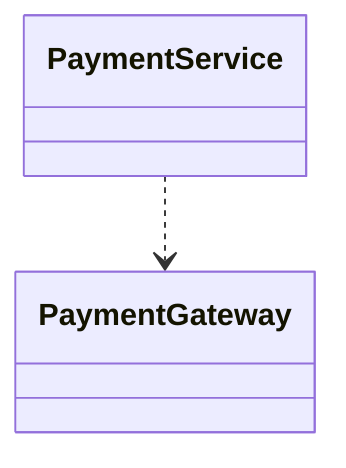
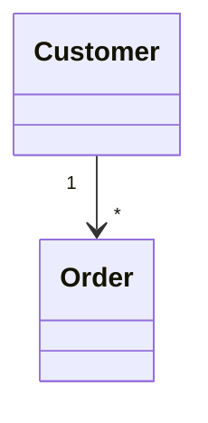
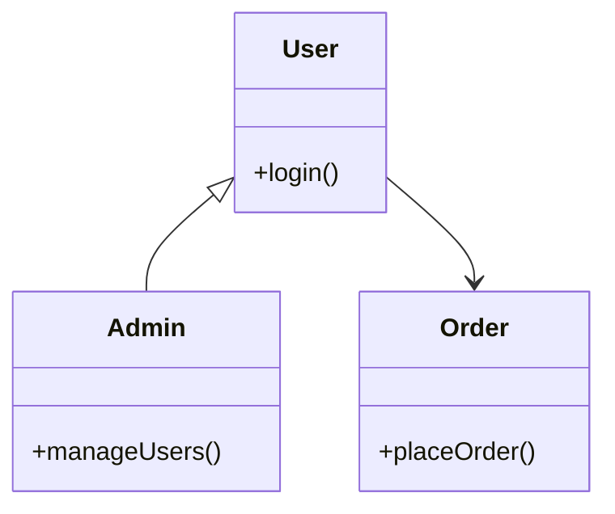

# 5.3 — Class Diagram

Class Diagram:
> structural blueprint of the system.

Shows:
- classes
- attributes
- methods
- relationships

Focus:
> what objects/classes exist internally.

---

# Basic Structure



---

# Explanation

| Part | Meaning |
|---|---|
| User | Class |
| name, password | Attributes |
| login() | Method |
| + | Public |
| - | Private |

---

# Main Relationships

---

# Association

Simple interaction relationship.



Student interacts with Book.

---

# Inheritance (Generalization)



Admin:
> IS-A User

Equivalent Java:
```java
class Admin extends User
```

---

# Aggregation

Weak ownership.



Teacher can exist independently.

---

# Composition

Strong ownership.



Room depends on House.

---

# Aggregation vs Composition

| Aggregation | Composition |
|---|---|
| Weak ownership | Strong ownership |
| Child independent | Child dependent |
| o-- | *-- |

---

# Dependency

Temporary usage relationship.



---

# Multiplicity

Shows object count relationship.



One customer can have many orders.

---

# Common Multiplicity

| Symbol | Meaning |
|---|---|
| 1 | Exactly one |
| * | Many |
| 0..1 | Optional |
| 1..* | One or more |

---

# Full Example



---

# Important Insight

Class Diagram models:
> internal structure of the system.

Unlike Use Case Diagram,
it focuses on:
- architecture
- OOP relationships
- system design

Not:
- workflows
- runtime execution
- algorithms