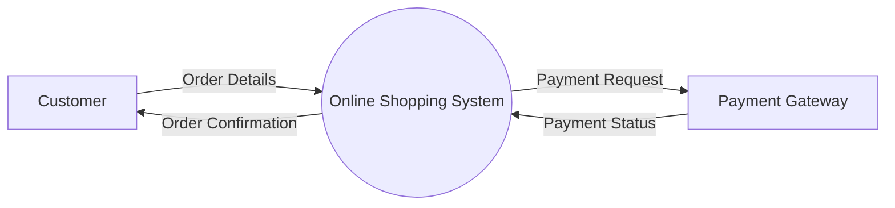
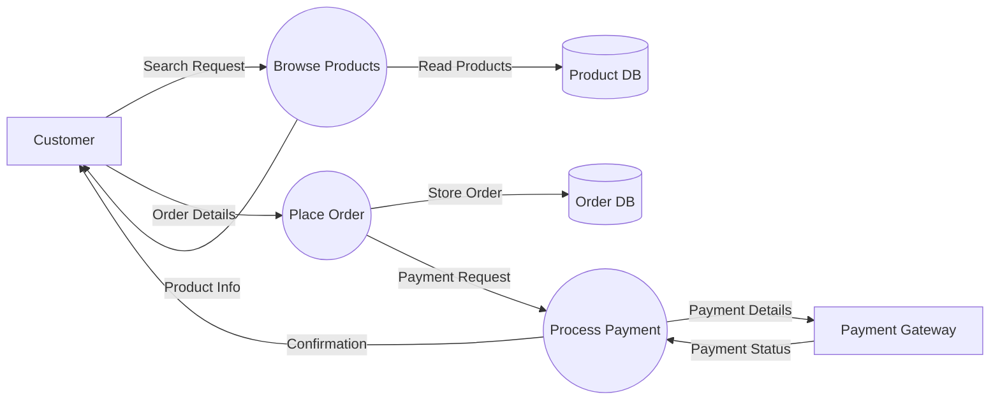
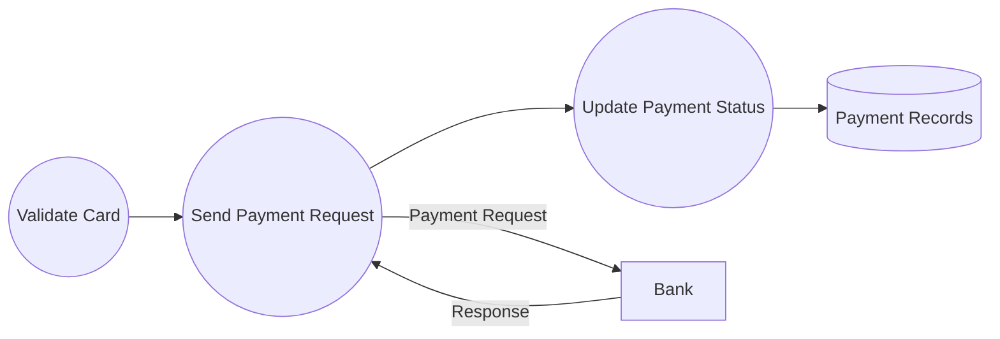

# 5.4 — Data Flow Diagrams (DFD)

DFD:
> graphical representation of how data moves through a system.

Focus:
- movement of data
- transformation of data
- where data is stored
- external entities interacting with system

DFD comes from:
> Structured Analysis

It is:
> NOT UML

But still heavily used in exams and system analysis.

---

# Main Purpose of DFD

DFD helps visualize:
- system inputs
- outputs
- processing steps
- data storage
- data movement

It focuses on:
> WHAT data flows

not:
> HOW logic is implemented

---

# Yourdon-DeMarco Symbols

| Symbol | Meaning |
|---|---|
| Circle/Bubble | Process |
| Rectangle | External Entity |
| Open Rectangle | Data Store |
| Arrow | Data Flow |

---

# 1. Process

Represents:
> transformation of data.

Notation:

```text
 ( Process )
```

Examples:
- Validate User
- Process Payment
- Generate Report

---

# 2. External Entity

Represents:
> outside actor/system interacting with system.

Notation:

```text
[ Customer ]
```

Examples:
- User
- Admin
- Payment Gateway
- Bank

---

# 3. Data Store

Represents:
> stored persistent data.

Notation:

```text
|| Orders DB ||
```

Examples:
- User Database
- Order Records
- Inventory Data

---

# 4. Data Flow

Represents:
> movement of data.

Notation:

```text
------→
```

Examples:
- Login Credentials
- Payment Details
- Order Information

---

# DFD Levels

DFDs are created hierarchically.

Levels:
- Level 0 (Context Diagram)
- Level 1
- Level 2

---

# Level 0 — Context Diagram

Entire system shown as:
> one single process bubble.

Only shows:
- external entities
- input/output data flows

No internal processes shown.

---

# Example — Online Shopping System (Level 0)



---

# Important Characteristics of Level 0

- single system bubble only
- no internal modules/processes
- high-level system overview

---

# Level 1 DFD

Expand Level 0 system into:
> major sub-processes.

Now internal processes become visible.

---

# Example — Online Shopping System (Level 1)



---

# What Changed From Level 0?

Level 0:
- one system bubble.

Level 1:
- internal processes visible,
- data stores visible.

---

# Level 2 DFD

Expand one Level 1 process further.

Example:
- expand "Process Payment".

---

# Example — Level 2 Expansion of Process Payment



---

# Balancing Rule (VERY IMPORTANT)

Rule:

> data entering/leaving a process at Level N
must also appear when expanded at Level N+1.

This is called:
> balancing

---

# Example

If Level 1 process has:

```text
Input: Payment Details
Output: Payment Status
```

Then Level 2 expansion:
- MUST also contain those same external flows.

Otherwise:
> DFD is unbalanced.

---

# DFD Rules

---

# Rule 1 — Process Must Have Input and Output

Wrong:

```text
Input only
```

or

```text
Output only
```

A process must transform data.

---

# Rule 2 — No Direct Data Flow Between External Entities

Wrong:

```text
Customer → Bank
```

Must pass through system process.

---

# Rule 3 — No Direct Data Flow Between Data Stores

Wrong:

```text
Orders DB → Inventory DB
```

Must go through a process.

---

# Rule 4 — Data Store Cannot Directly Interact With External Entity

Wrong:

```text
Customer → Orders DB
```

Must pass through process.

---

# DFD vs Flowchart

| DFD | Flowchart |
|---|---|
| Focus on data movement | Focus on control logic |
| System-level view | Algorithm/program-level view |
| No decision logic | Contains decisions/loops |

---

# DFD vs UML

| DFD | UML |
|---|---|
| Structured Analysis | Object-Oriented Modelling |
| Data movement focus | Structure + behaviour focus |
| Older methodology | Modern standard |

---

# Common Beginner Mistakes

## 1. Treating DFD Like Flowchart

DFD shows:
> data movement

not:
> program control flow.

---

## 2. Forgetting Balancing

Most common exam mistake.

---

## 3. Missing Data Labels

Arrows should represent:
> meaningful data.

Bad:

```text
Arrow without label
```

Good:

```text
Order Details
Payment Info
```

---

# Exam-Oriented Drawing Strategy

For Level 0:
- identify external entities,
- identify system,
- identify major data flows.

For Level 1:
- split system into major processes,
- add data stores,
- maintain balancing.

---

# Important Insight

DFD models:
> how data moves through a system and gets transformed at different processing stages.