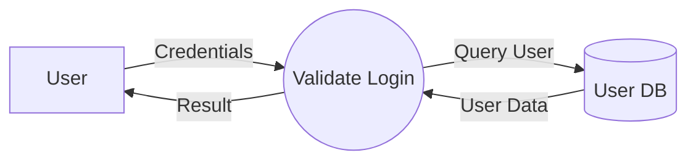
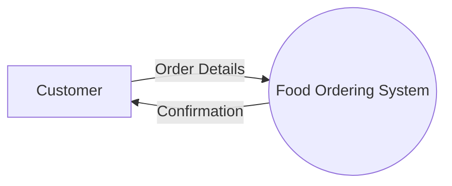
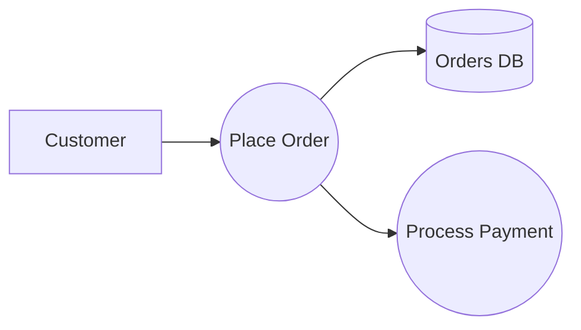

# 5.4 — Data Flow Diagram (DFD)

DFD:
> models how data moves through a system.

Focus:
- data movement
- data transformation
- data storage

Not focused on:
- objects/classes
- algorithms
- implementation

---

# Main Components

| Component | Meaning |
|---|---|
| External Entity | Source/destination of data |
| Process | Transforms data |
| Data Store | Stores data |
| Data Flow | Movement of data |

---

# Basic Example



---

# Explanation

| Part | Meaning |
|---|---|
| User | External entity |
| Validate Login | Process |
| User DB | Data store |
| Arrows | Data flow |

---

# Level 0 DFD (Context Diagram)

Entire system shown as one process.



Purpose:
- show system boundary
- show external interactions

---

# Level 1 DFD

Breaks system into subprocesses.



---

# Important Rules

## Process Must Transform Data
Every process needs:
- input
- output

---

## External Entity Cannot Directly Access Data Store

Wrong:
```text
User --> Database
```

Correct:
```text
User --> Process --> Database
```

---

# DFD vs Flowchart

| DFD | Flowchart |
|---|---|
| Data movement | Control flow |
| System-level | Algorithm-level |

---

# Important Insight

DFD answers:
> "How does information move through the system?"