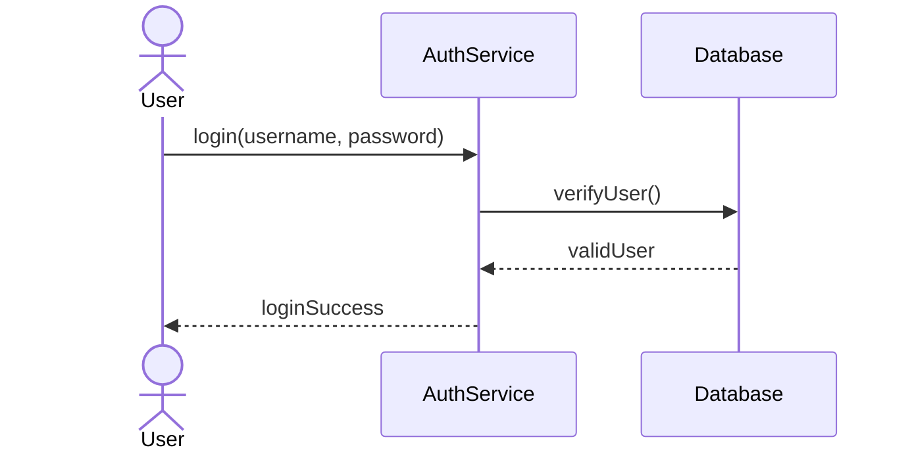
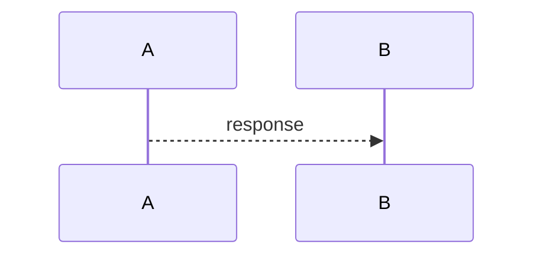
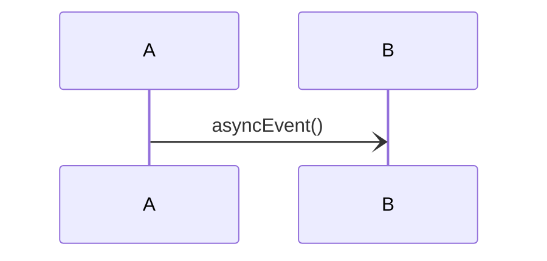
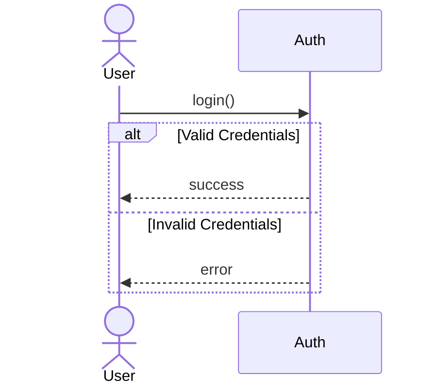
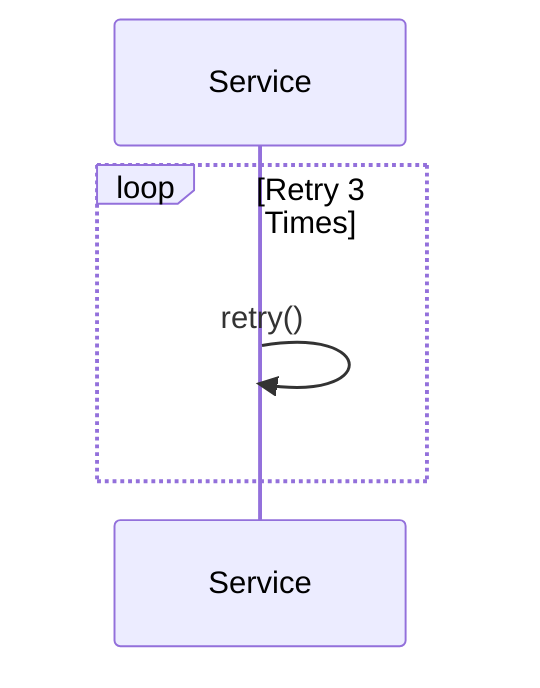

# 5.5 — Sequence Diagram

Sequence Diagram:
> models how objects interact over time.

Focus:
- message flow
- interaction order
- runtime communication

Time flows:
> top → bottom

---

# Main Components

| Component | Meaning |
|---|---|
| Actor/Object | Participant |
| Lifeline | Existence over time |
| Message | Communication |
| Activation | Object currently executing |

---

# Basic Example

---

# Explanation

| Part | Meaning |
|---|---|
| User | Initiates interaction |
| AuthService | Handles login |
| Database | Verifies user |
| Arrows | Messages |

---

# Message Types

## Synchronous Message
Sender waits for response.

---

## Return Message

---

## Asynchronous Message
Sender does not wait.

---

# Conditional Flow (alt)

---

# Loop Example

---

# Sequence vs Class Diagram

| Class Diagram | Sequence Diagram |
|---|---|
| Static structure | Runtime interaction |
| Classes | Messages |
| What exists | What happens over time |

---

# Important Insight

Sequence Diagram answers:
> "Who communicates with whom, and in what order?"