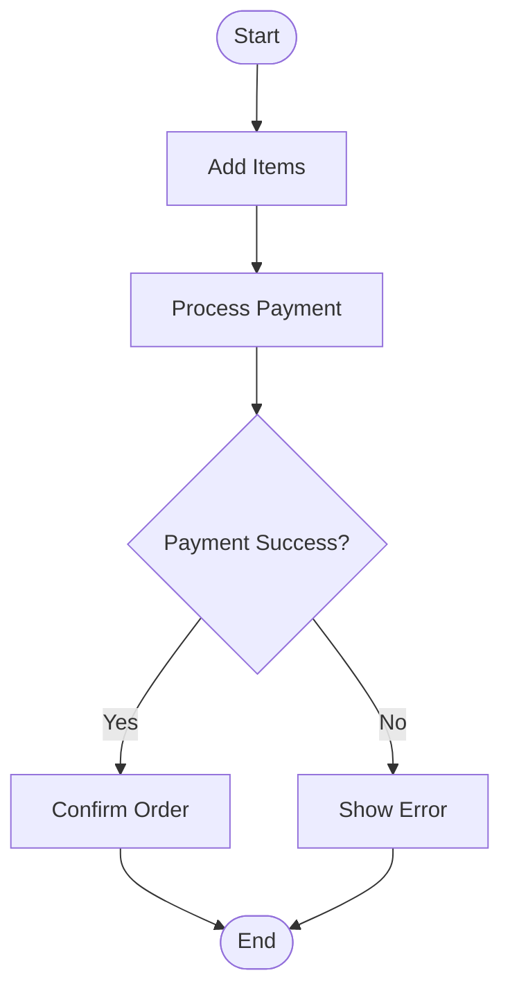
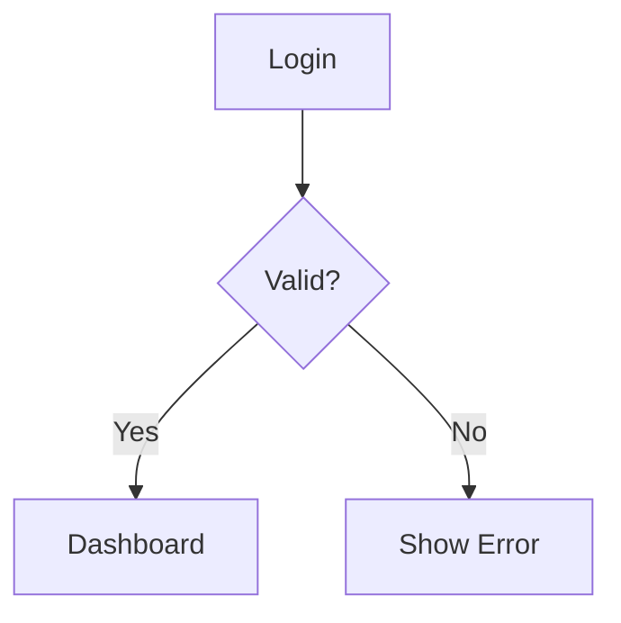
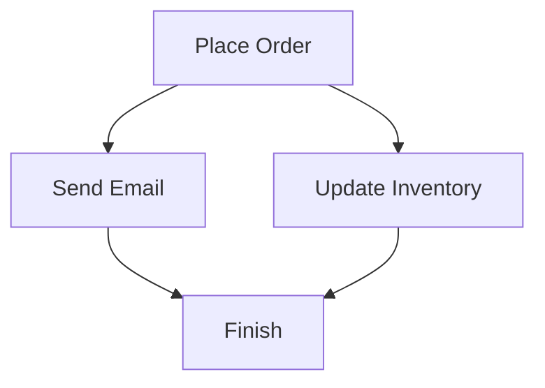

# 5.7 — Activity Diagram

Activity Diagram:
> models workflow/control flow of a process.

Focus:
- actions
- decisions
- branching
- parallel flow

Similar to:
> flowcharts

---

# Main Components

| Component | Meaning |
|---|---|
| Initial Node | Start |
| Activity | Task/action |
| Decision Node | Conditional branching |
| Control Flow | Direction of flow |
| Final Node | End |

---

# Basic Example

---

# Explanation

Focus is on:
> process/workflow steps.

Not:
- object interaction
- class structure

---

# Decision Example

Diamond:
> branching condition

---

# Parallel Flow Example

Both tasks can happen simultaneously.

---

# Swimlanes

Used to separate responsibilities.

Example:
- Customer lane
- System lane
- Admin lane

---

# Activity vs Sequence Diagram

| Activity Diagram | Sequence Diagram |
|---|---|
| Workflow/process focus | Object interaction focus |
| "What happens next?" | "Who communicates?" |

---

# Activity vs Communication Diagram

| Activity Diagram | Communication Diagram |
|---|---|
| Control flow | Object relationships |
| Process logic | Message interaction |

---

# Important Insight

Activity Diagram answers:
> "How does the workflow proceed step-by-step?"
