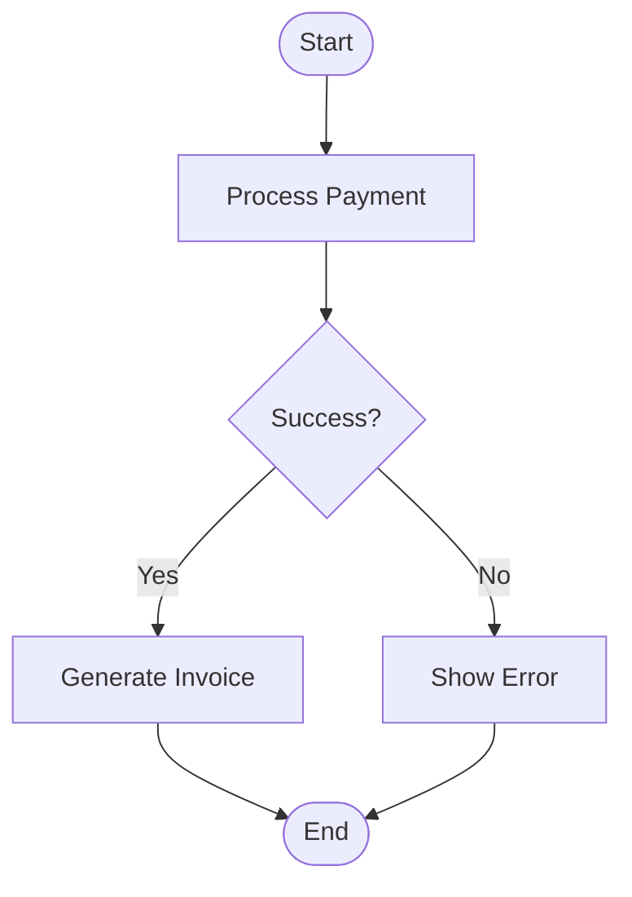
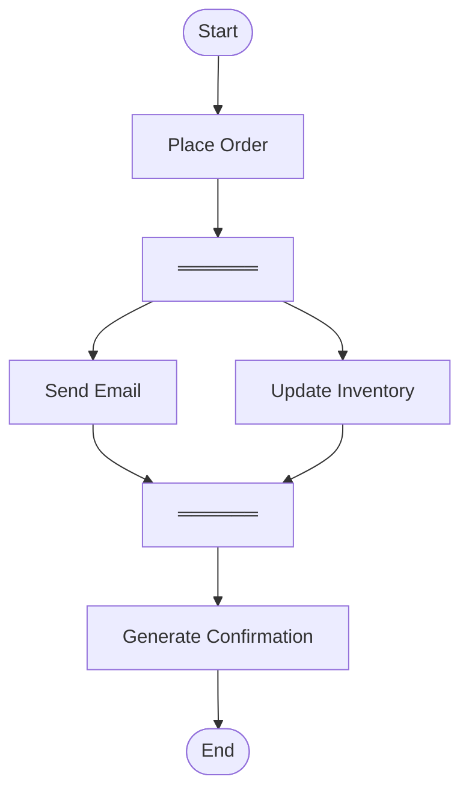
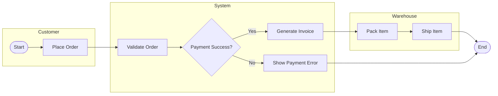

# 5.7 — Activity Diagrams

Activity Diagram:
> behavioural UML diagram used to model workflow/process flow.

Focus:
- actions
- decisions
- parallel execution
- responsibility flow

Similar to:
> an advanced flowchart.

---

# Main Purpose

Shows:
> how activities proceed from start to finish.

Useful for:
- business workflows
- system processes
- user interaction flows

---

# Main Elements

| Element | Meaning |
|---|---|
| Initial Node | Start of workflow |
| Final Node | End of workflow |
| Action | Task/activity |
| Decision | Conditional branching |
| Control Flow | Flow direction |
| Fork Bar | Split into parallel flows |
| Join Bar | Merge parallel flows |
| Swimlane | Responsibility partition |

---

# 1. Initial Node

Represents:
> start of process.

Notation:

```text
●
```

---

# 2. Final Node

Represents:
> end of workflow.

Notation:

```text
◉
```

---

# 3. Action

Represents:
> task/activity.

Notation:
- rounded rectangle

Example:

```text
[ Process Payment ]
```

---

# 4. Decision Node

Represents:
> conditional branching.

Notation:
- diamond

Example:

```text
Payment Success?
```

---

# Decision Example



---

# 5. Fork Bar

Represents:
> parallel execution.

Notation:
- thick horizontal/vertical bar

Both paths execute simultaneously.

---

# 6. Join Bar

Represents:
> synchronization of parallel flows.

Waits until:
- all parallel paths complete.

---

# Fork vs Decision (VERY IMPORTANT)

| Fork | Decision |
|---|---|
| Parallel execution | Conditional branching |
| All paths run | Only one path runs |
| Uses thick bar | Uses diamond |

---

# Parallel Flow Example



---

# Swimlanes

Swimlanes partition activities by:
> actor/component responsibility.

Each lane represents:
- one actor,
- department,
- system component.

---

# Example — Order Processing Workflow



---

# What Swimlanes Show

Clearly identifies:
> who is responsible for each activity.

Example:
- Customer places order,
- System validates payment,
- Warehouse ships item.

---

# Activity Diagram Characteristics

| Characteristic | Meaning |
|---|---|
| Behavioural UML | Models behaviour/workflow |
| Flow-oriented | Step-by-step process |
| Supports concurrency | Parallel execution possible |
| Responsibility-aware | Swimlanes supported |

---

# Activity Diagram vs Flowchart

| Activity Diagram | Flowchart |
|---|---|
| UML standard | Generic diagram |
| Supports concurrency | Mostly sequential |
| Supports swimlanes | Usually absent |

---

# Activity Diagram vs Sequence Diagram

| Activity Diagram | Sequence Diagram |
|---|---|
| Workflow/process focus | Object interaction focus |
| Shows control flow | Shows message exchange |
| Good for business logic | Good for runtime communication |

---

# Common Beginner Mistakes

## 1. Confusing Fork With Decision

Fork:
> all paths execute.

Decision:
> only one branch chosen.

---

## 2. Missing Join After Fork

Parallel flows should usually synchronize later.

---

## 3. Using Swimlanes Incorrectly

Each lane should represent:
> one responsibility owner only.

---

# Exam-Oriented Drawing Strategy

1. identify workflow steps,
2. identify decisions,
3. identify parallel tasks,
4. separate responsibilities using swimlanes,
5. connect using proper control flow.

---

# Important Insight

Activity Diagrams model:
> how workflows proceed, branch, synchronize, and distribute responsibilities across actors/components.