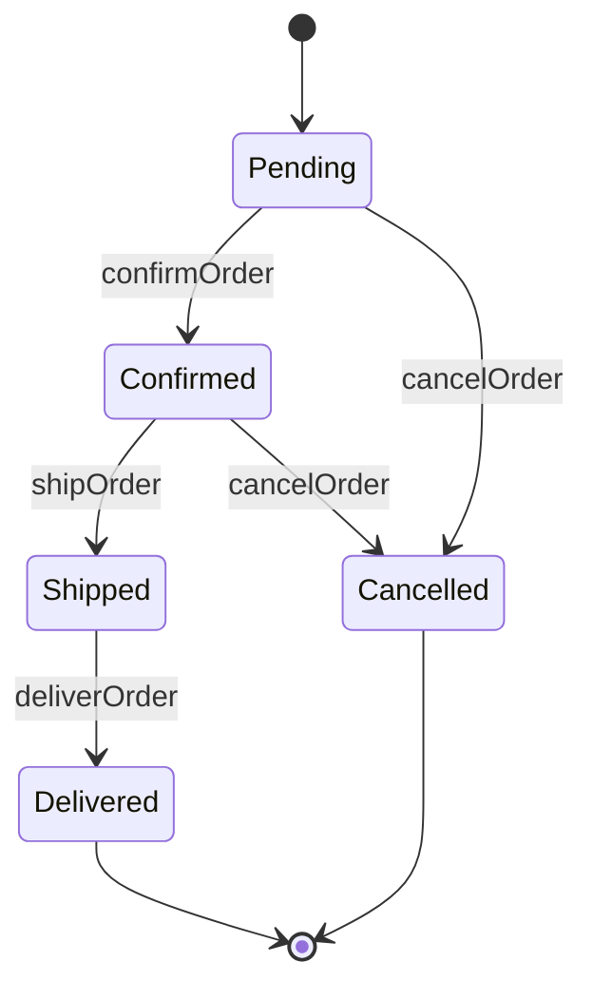
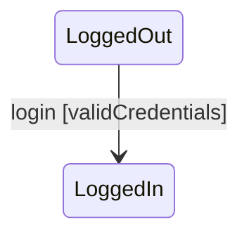
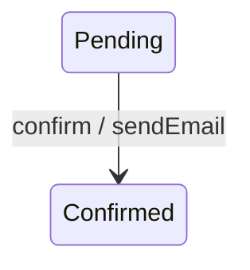
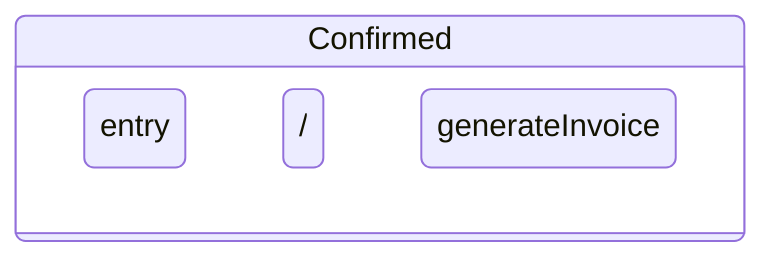
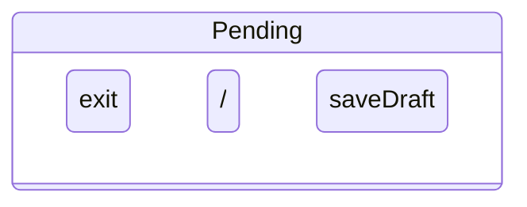
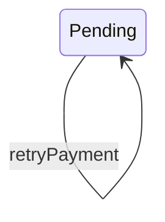

# 5.8 — State Chart Diagrams

State Chart Diagram:
> behavioural UML diagram used to model the lifecycle of a single object.

Focus:
- states
- transitions
- triggering events
- lifecycle changes

---

# Main Purpose

Shows:
> what states an object can be in
and what causes movement between states.

---

# Main Elements

| Element | Meaning |
|---|---|
| State | Current condition/status |
| Transition | Movement between states |
| Event | Trigger causing transition |
| Initial Pseudostate | Starting point |
| Final State | End of lifecycle |

---

# 1. State

Represents:
> condition/status of object.

Notation:
- rounded rectangle

Examples:
- Pending
- Shipped
- Delivered

---

# 2. Initial Pseudostate

Represents:
> start of lifecycle.

Notation:

```text
●
```

---

# 3. Final State

Represents:
> end of lifecycle.

Notation:

```text
◉
```

---

# 4. Transition

Represents:
> movement between states.

Notation:
- arrow

---

# Basic Example — Order Lifecycle



---

# Understanding the Diagram

| State | Meaning |
|---|---|
| Pending | Order created |
| Confirmed | Order approved |
| Shipped | Order dispatched |
| Delivered | Order completed |
| Cancelled | Order terminated |

---

# Transition Syntax (VERY IMPORTANT)

Syntax:

```text
event [guard] / action
```

Meaning:

| Part | Purpose |
|---|---|
| event | triggers transition |
| guard | condition that must be true |
| action | operation executed during transition |

---

# Example

```text
payOrder [paymentValid] / generateInvoice
```

Meaning:
- `payOrder` → event
- `[paymentValid]` → condition
- `generateInvoice` → action

---

# Guard Condition

Transition occurs only if:
> guard condition is true.

Example:



---

# Action During Transition

Action executes:
> while transition occurs.

Example:



---

# Entry and Exit Actions

Actions can execute whenever:
- entering a state,
- leaving a state.

---

# Entry Action Example



Whenever object enters:
```text
Confirmed
```

invoice generation runs automatically.

---

# Exit Action Example



Whenever object leaves:
```text
Pending
```

draft is saved.

---

# Self Transition

Object transitions back to same state.

Example:



---

# Statechart vs Activity Diagram (IMPORTANT)

| Statechart Diagram | Activity Diagram |
|---|---|
| Lifecycle of one object | Workflow/process flow |
| Focus on states | Focus on activities/actions |
| "What state is object in?" | "What happens next?" |
| Object-centric | Process-centric |

---

# Example Difference

Statechart:

```text
Order:
Pending → Shipped → Delivered
```

Tracks:
> state changes of one order object.

Activity Diagram:

```text
Place Order → Payment → Packing → Shipping
```

Tracks:
> workflow involving multiple actors/components.

---

# State Diagram Characteristics

| Characteristic | Meaning |
|---|---|
| Behavioural UML | Models dynamic behaviour |
| Object lifecycle focus | Tracks state changes |
| Event-driven | Events trigger transitions |
| State-oriented | Models conditions/statuses |

---

# Common Beginner Mistakes

## 1. Using Activities Instead of States

Wrong:

```text
Processing Payment
```

Better:

```text
PaymentPending
```

States should represent:
> condition/status,
not actions.

---

## 2. Confusing With Activity Diagram

Statechart:
> one object's lifecycle.

Activity:
> complete workflow/process.

---

## 3. Ignoring Events

Transitions should usually have:
> triggering events.

---

# Exam-Oriented Drawing Strategy

1. identify object,
2. identify possible states,
3. identify transition events,
4. connect states logically,
5. add guards/actions where needed.

---

# Important Insight

State Chart Diagrams model:
> how a single object changes state throughout its lifecycle in response to events.