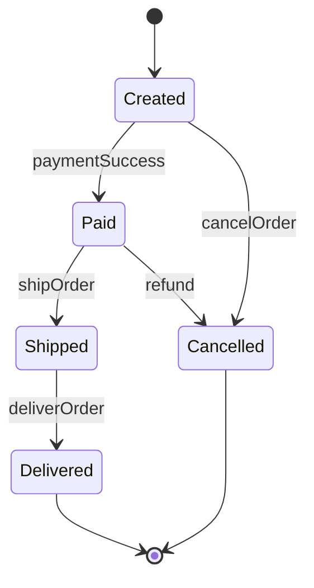
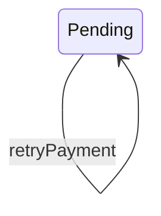
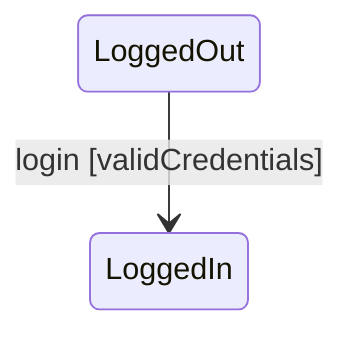

# 5.8 — State Chart Diagram

State Chart Diagram:
> models how an object changes state over time.

Focus:
- states
- transitions
- events
- object lifecycle

---

# Main Components

| Component | Meaning |
|---|---|
| State | Current condition/status |
| Transition | Movement between states |
| Event | Trigger causing transition |
| Initial State | Starting state |
| Final State | Ending state |

---

# Basic Example

---

# Explanation

| Part | Meaning |
|---|---|
| Created, Paid | States |
| Arrows | Transitions |
| paymentSuccess | Event triggering transition |

---

# Self Transition

Object returns to same state.

---

# Guard Condition

Transition occurs only if condition is true.

---

# State vs Activity Diagram

| State Diagram | Activity Diagram |
|---|---|
| Object lifecycle | Workflow/process |
| State changes | Action flow |
| "What state?" | "What happens next?" |

---

# Important Insight

State Diagram models:
> lifecycle of a single object/entity.

Not full system workflow.

States should represent:
- conditions
- statuses

Not activities/processes.
