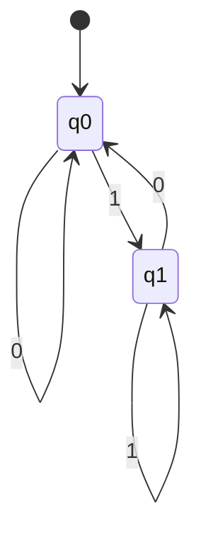
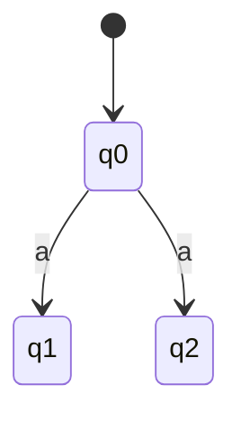

# 5.9 — Finite State Machines (FSMs)

Finite State Machine (FSM):
> formal mathematical model used to represent systems with finite states and transitions.

Used in:
- parsers
- compilers
- protocol design
- lexical analysis
- workflow systems

---

# Main Idea

System:
- stays in a state,
- receives input,
- changes to another state.

---

# Formal Definition

FSM defined as a 5-tuple:

```text
(Q, Σ, δ, q₀, F)
```

| Symbol | Meaning |
|---|---|
| Q | Set of states |
| Σ | Input alphabet |
| δ | Transition function |
| q₀ | Initial state |
| F | Accepting/final states |

---

# Example

```text
Q  = {q0, q1}
Σ  = {0,1}
q₀ = q0
F  = {q1}
```

---

# Transition Function

```text
δ(currentState, input) = nextState
```

Example:

```text
δ(q0,1) = q1
```

Meaning:
- current state = q0
- input = 1
- next state = q1

---

# DFA (Deterministic Finite Automata)

Rule:
> for every (state,input) pair,
exactly one next state exists.

---

# DFA Example



---

# DFA Characteristics

| Property | Meaning |
|---|---|
| Deterministic | One unique next state |
| Predictable | No ambiguity |
| Easier implementation | Simple lookup |

---

# NFA (Non-Deterministic Finite Automata)

Rule:
> for a (state,input) pair,
multiple next states may exist.

Can have:
- zero transitions
- one transition
- multiple transitions

---

# NFA Example



Input:
```text
a
```

can move to:
- q1
- q2

---

# DFA vs NFA

| DFA | NFA |
|---|---|
| One next state | Multiple possible next states |
| Easier implementation | More flexible design |
| Direct execution | Often converted to DFA |

---

# Why DFA Easier To Implement

DFA execution:

```text
currentState + input
→ direct table lookup
→ nextState
```

Very efficient in code.

NFA requires:
> subset construction
to convert into DFA for implementation.

---

# State Transition Table

Represents transitions in tabular form.

Rows:
> states

Columns:
> inputs

Cells:
> next states

---

# Example Transition Table

| State | 0 | 1 |
|---|---|---|
| q0 | q0 | q1 |
| q1 | q0 | q1 |

---

# Equivalent State Diagram


---

# Drawing FSM From Problem Description

Typical process:

1. identify states,
2. identify inputs,
3. identify transitions,
4. mark initial state,
5. mark accepting states.

---

# Example Problem

```text
Accept binary strings ending with 1
```

States:

| State | Meaning |
|---|---|
| q0 | Ends with 0 |
| q1 | Ends with 1 |

Accepting state:
```text
q1
```

---

# Regular Expression to FSM

Regular expressions can be converted into:
- NFA,
- then DFA.

Important in:
- compiler design,
- lexical analyzers.

---

# Numerical/Exam-Type Question

Question:

```text
Draw FSM and transition table
for strings ending with 1
```

---

# FSM Diagram


---

# Transition Table

| State | 0 | 1 |
|---|---|---|
| q0 | q0 | q1 |
| q1 | q0 | q1 |

---

# FSM Characteristics

| Characteristic | Meaning |
|---|---|
| Finite states | Limited number of states |
| Input-driven | Inputs trigger transitions |
| Formal model | Mathematical representation |
| Sequential behaviour | One transition at a time |

---

# FSM vs State Chart Diagram

| FSM | State Chart |
|---|---|
| Formal mathematical model | UML behavioural model |
| Simpler | More expressive |
| Mainly theoretical/computation | Software modelling |

---

# Common Beginner Mistakes

## 1. Missing Transitions

In DFA:
> every state-input pair must have exactly one transition.

---

## 2. Forgetting Accepting States

Important for:
- language recognition problems.

---

## 3. Confusing DFA and NFA

DFA:
> exactly one next state.

NFA:
> multiple possible next states.

---

# Important Insight

FSMs model:
> systems that change state based on inputs using formally defined transitions.