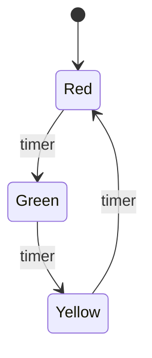
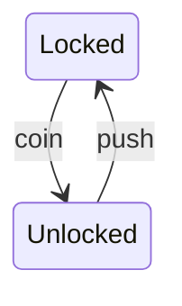

# 5.9 — Finite State Machine (FSM)

FSM:
> a model based on states and transitions.

System exists in:
> one state at a time.

Events/input trigger:
> movement to another state.

---

# Main Components

| Component | Meaning |
|---|---|
| State | Current condition |
| Transition | State change |
| Event/Input | Trigger |
| Initial State | Starting state |
| Final State | End/accept state |

---

# Basic Example

---

# Explanation

| Part | Meaning |
|---|---|
| Red/Green/Yellow | States |
| timer | Trigger event |
| Arrows | Transitions |

---

# Deterministic FSM

For same:
- state
- input

there should be:
> one predictable transition.

---

# Turnstile Example

---

# FSM vs State Diagram

| FSM | State Diagram |
|---|---|
| Theoretical/formal | Practical UML modelling |
| Simpler | Richer features |
| Automata/system theory | Software lifecycle modelling |

---

# FSM vs Activity Diagram

| FSM | Activity Diagram |
|---|---|
| State-focused | Workflow-focused |
| Event transitions | Process flow |

---

# Common Uses

- traffic lights
- vending machines
- authentication states
- networking protocols
- game AI
- embedded systems

---

# Important Insight

FSM models:
> predictable state transitions caused by events.

States should represent:
- conditions
- statuses

Not activities/processes.