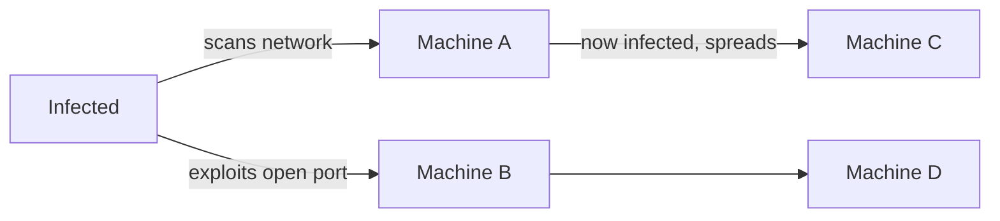
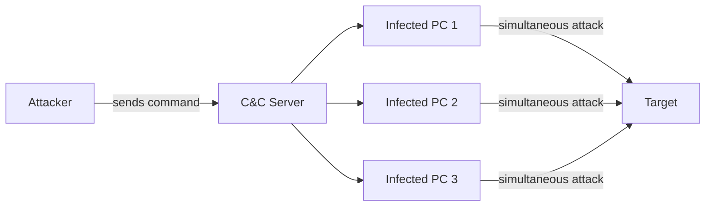
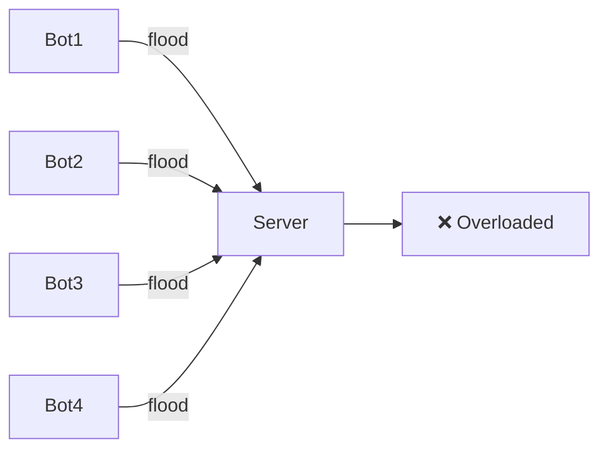

# Malware & Threats

> **Series:** [[01 - Protecting Accounts]] · [[02 - Protecting Data]] · [[03 - Cryptography]] · [[04 - Securing Systems]] · [[05 - Malware & Threats]]

---

## Navigation
- [[#What is Malware]]
- [[#Types of Malware]]
- [[#Denial of Service]]
- [[#Defenses]]

---

## What is Malware

> **Malware** — malicious software designed to damage, disrupt, or gain unauthorized access to systems.

---

## Types of Malware

### Virus
- Requires **human action** to execute — you click or run it
- Spreads by attaching itself to legitimate files or programs
- Entry point: downloading from untrusted sources, opening malicious attachments

> More sandboxed environments (mobile, containers) = fewer opportunities for viruses to spread.

---

### Worm
- **Self-propagating** — spreads without human intervention
- Listens on open network ports and exploits vulnerabilities to jump from machine to machine
- One unpatched machine on a network can infect others automatically

---

### Botnet
- Malware installs a background agent on the victim's machine
- Agent runs silently, listening for commands from the attacker's **command & control server**
- Attacker builds a network of thousands of compromised machines

Used to launch: [[#Distributed Denial of Service (DDoS)]], spam campaigns, credential stuffing

---

## Denial of Service

### DoS — Denial of Service
- Attacker **floods a server** with requests until it's overwhelmed and can't serve real users
- Relatively easy to block — just block the attacking IP

### DDoS — Distributed Denial of Service
- Same idea, but requests come from **thousands of botnet machines**
- Requests look like normal traffic from many different IPs
- Can't just block one IP — traffic comes from everywhere

> Defending against DDoS requires rate limiting, traffic analysis, CDN-level filtering, and sometimes upstream ISP intervention.

---

## Defenses

### Antivirus
- Continuously or periodically scans the device for known malicious code
- Maintains a database of **malware signatures** — patterns that identify known threats
- Detects behavior anomalies too (heuristic detection)

### Keep Software Updated

| Benefit                     | Detail                                      |
| --------------------------- | ------------------------------------------- |
| Patch known vulnerabilities | Older versions have known exploits          |
| Latest malware definitions  | AV and OS know about newer threats          |
| Bug fixes                   | General stability and security improvements |

> **Trade-off:** Automatic updates are generally safer, but major updates can occasionally break things. For critical systems, test updates before deploying.

### Trust & Sandboxing
- Only install software from **trusted, verified sources**
- Sandboxed environments (mobile OS, browser tabs, containers) restrict what software can access
- More sandboxing = smaller blast radius if something malicious runs

## Zero Day Attacks

Worm created and spread so fast that the world has not caught up with it and not able to defend
