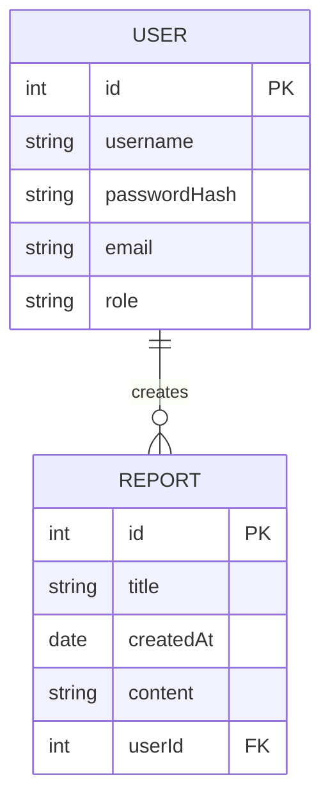

# Executive Summary  
A Software Requirements Specification (SRS) is a precise, verifiable document of *what* a system must do (functional) and *how well* (non‑functional), without prescribing *how* to build it【1†L539-L546】【3†L65-L73】.  Well‑written SRSs align developers, testers, and stakeholders, prevent costly rework, and support compliance audits【1†L575-L584】【9†L537-L545】.  Leading standards are **IEEE 29148:2018** (superseding IEEE 830–1998) and related ISO standards, which mandate structured sections, traceability, and clear acceptance criteria【3†L65-L73】【1†L531-L539】.  In practice, an SRS contains: **(1) Introduction** (purpose, scope, audience, definitions, references), **(2) Overall Description** (product context, user profiles, constraints, assumptions), **(3) Specific Requirements** (detailed functional and non‑functional requirements, external interfaces, design constraints, quality attributes), and **(4) Appendices** (glossary, data models, diagrams, change history)【1†L539-L546】【16†L51-L59】.  Each requirement is uniquely identified, measurable, and linked to higher‑level needs and downstream tests (traceability)【1†L635-L643】【3†L116-L125】.  Good SRS practice includes iterative authoring with stakeholder reviews, version control, and use of checklists to avoid ambiguity【28†L733-L741】【23†L141-L149】.

This report analyzes authoritative guidance (IEEE/ISO), best practices, and pitfalls.  It presents recommended SRS structures (with templates), writing guidelines (good vs bad examples), review and change‑control processes, and tooling.  We include tables summarizing SRS sections (template), standards/tools comparison, and sample requirements (good/bad), plus mermaid diagrams of SRS structure and a sample ER diagram.  A concise one‑page SRS template and step‑by‑step authoring workflow are also provided. 

## Standards and Guidance (IEEE/ISO)  
The **primary standard** is *ISO/IEC/IEEE 29148:2018* (“Requirements engineering”), which **replaces IEEE 830–1998** as the reference for SRS structure and content【3†L65-L73】.  IEEE 830 (now obsolete) had first defined the classic SRS format; 29148 carries this forward and ties it to the full requirements lifecycle【1†L531-L539】【3†L65-L73】.  (Other relevant standards include *IEEE 1233/1362* or *ISO/IEC 12207/15288* for system-level requirements.)  These standards mandate that each requirement be **uniquely numbered**, verifiable, and traceable【3†L116-L125】【1†L635-L643】.  Requirements must avoid design or implementation details and focus on user needs and system behavior【1†L547-L555】.

Key IEEE/ISO guidance includes:  
- **Introduction**: Identify the system (name/version) and readers, state its purpose, scope, and objectives【16†L53-L62】.  Define all technical terms, acronyms, and references to external documents【16†L53-L62】.  
- **Overall Description**: Describe system context (relation to other systems or processes), major capabilities (bulleted functions), user classes and characteristics, and high‑level assumptions or constraints (e.g. hardware limits, standards compliance)【16†L69-L78】.  Explicitly list any assumptions or dependencies (e.g. “assume Internet connectivity, third‑party API available”)【16†L79-L87】.  
- **Specific Requirements**: This is the core of the SRS. Separate into sub‑sections for:  
  - **Functional Requirements** – detailed behaviors and features (each requirement in “shall” sentences, testable conditions)【1†L539-L546】【16†L91-L94】. For example: “When a registered user submits valid credentials, the system shall create a session and display the user’s dashboard”【16†L91-L94】. Use structured language (e.g. *EARS*, *Gherkin* or “Given/When/Then” style) to eliminate ambiguity【28†L625-L633】【23†L129-L136】.  
  - **External Interface Requirements** – specify all user, hardware, software, and communication interfaces. Include input/output formats, protocols, GUIs, APIs, and any sample messages or schemas. For instance, define login form fields, REST API endpoints, and error messages【1†L631-L640】.  
  - **Performance Requirements** – measurable targets (response time, throughput, capacity, concurrency). E.g. “The homepage shall load in ≤2 seconds under 1,000 concurrent users”【1†L622-L627】【28†L739-L747】.  
  - **Logical Database Requirements** – a high‑level data model. Describe important entities and relationships; include an ER diagram in an appendix if helpful【16†L100-L104】.  
  - **Design Constraints** – mandatory constraints (e.g. coding language, OS, browsers, regulatory standards). Example: “The application shall use Java 17 and PostgreSQL 14” (a constraint), not “must avoid database locks” (an internal design choice).  
  - **Quality (Nonfunctional) Attributes** – requirements for security, reliability, usability, maintainability, etc. Each must be **quantified**. For example, instead of “be secure,” state “All sensitive data shall be encrypted in transit using TLS 1.2 or higher”【16†L107-L110】. 

Design/implementation details (class diagrams, algorithms) and project management items (schedule, cost) do *not* belong in the SRS【1†L547-L555】【16†L101-L104】.  The focus is *what* the system must achieve, not *how* to achieve it.

```mermaid
graph TD
  SRS["Software Requirements Specification"] 
  SRS --> Intro["1. Introduction"]
  Intro --> Purpose["1.1 Purpose, Scope"]
  Intro --> Definitions["1.2 Terms, Acronyms"]
  Intro --> References["1.3 References"]
  SRS --> Overview["2. Overall Description"]
  Overview --> Context["2.1 Product Perspective"]
  Overview --> Functions["2.2 Product Functions (major)"]
  Overview --> Users["2.3 User Classes & Characteristics"]
  Overview --> Constraints["2.4 Constraints"]
  Overview --> Assumptions["2.5 Assumptions & Dependencies"]
  SRS --> Requirements["3. Specific Requirements"]
  Requirements --> FuncReqs["3.1 Functional Requirements"]
  Requirements --> IntfReqs["3.2 External Interface Requirements"]
  Requirements --> PerfReqs["3.3 Performance Requirements"]
  Requirements --> DBReqs["3.4 Logical Data Requirements"]
  Requirements --> DesignConstr["3.5 Design Constraints"]
  Requirements --> Quality["3.6 Quality Attributes (NFRs)"]
  SRS --> Appendices["4. Appendices (Glossary, Data, Change Log)"]
```

*Mermaid chart: Typical SRS structure, adapted from IEEE/ISO guidance【1†L539-L546】【16†L51-L59】.*

### SRS Template (Section Guidance)  
Table 1 summarizes the SRS sections and suggested content.  Use it as a checklist when writing your document.

| **Section**           | **Content Guidelines**                                                                                                                                                   |
|-----------------------|--------------------------------------------------------------------------------------------------------------------------------------------------------------------------|
| Title Page / Control  | Title, author, organization, version, date, approvals. (Keep revision history and sign-off record here or in an appendix.)                                              |
| **1. Introduction**   | **Purpose/Scope:** What product this is, who will use or read the SRS, and what it covers/does *not* cover.   **Defs/Acronyms:** Glossary of terms.   **References:** Related documents (other specs, standards). |
| **2. Overall Description** | **Product Perspective:** System context (part of larger product? dependencies?).   **Major Functions:** High‑level bullet list of main features.   **User Characteristics:** Describe users (roles, skill levels).   **Constraints:** Regulatory/technical constraints (e.g. “must run on Android”).   **Assumptions & Dependencies:** E.g. third‑party APIs, tech stack, hardware availability. |
| **3. Specific Requirements** | *(All requirements are numbered and labeled: F1, N1, etc.)*   **3.1 Functional Req’ts:** Detailed actions. (E.g. *“F1: The system shall allow an admin to create a new user account by entering name, email, and role.”*).   **3.2 External Interfaces:** UI screens, APIs, hardware I/O (with formats).   **3.3 Performance Req’ts:** E.g. response time, throughput under load.   **3.4 Data Requirements:** Key data entities; attach ER diagram if needed【16†L100-L104】.   **3.5 Design Constraints:** Tools, languages, standards that *must* be used.   **3.6 Quality Attributes:** Security, usability, reliability, etc., each with measurable criteria (e.g. uptime %, encryption standards). |
| **4. Appendices**        | **Acronyms/Glossary** (if large); **Data Definitions/Diagrams** (ER, state or sequence diagrams); **Change Log/Revision History**; **Supporting Info** (e.g. calculation details, example scenarios). |

**Table 1:** Concise SRS template: major sections and what to include (adapted from IEEE 830/ISO standards【16†L51-L59】【16†L100-L104】).

## Writing Quality Requirements  

### Functional vs Nonfunctional  
Functional requirements describe *what* the system does (features, behaviors, business rules), whereas nonfunctional requirements (NFRs or “quality attributes”) describe *how well* the system performs (performance, security, usability, etc.)【16†L91-L100】【16†L107-L110】.  Both must be clear, specific, and testable.  For instance, a good functional requirement might be: 

> *“The system shall allow registered users to reset their password via email verification.”*【16†L91-L94】. 

Notice the precise “shall allow users to reset…” and the conditional trigger (“via email verification”) makes it verifiable.  Compare *good vs bad* examples:  

| **Type**   | **Bad Requirement (anti-pattern)**                                                  | **Good Requirement (clear, testable)**                                                                        |
|------------|------------------------------------------------------------------------------------|---------------------------------------------------------------------------------------------------------------|
| Functional | *“The system should allow user login.”* (vague, “should”, omits details)          | *“The system shall allow a registered user to log in with valid credentials (username/password). Upon success, redirect to the user’s dashboard within 2 seconds.”*【16†L91-L94】【1†L622-L627】. |
| Functional | *“Users can reset their password.”* (incomplete: how and conditions unclear)      | *“The system shall allow users to reset their password via email. When a user requests a password reset with a registered email, the system shall email a reset link that expires in 1 hour.”*【16†L91-L94】.  |
| Nonfunctional (performance) | *“The application should be fast.”* (ambiguous, unmeasurable)      | *“The home page shall load in ≤3 seconds for up to 5,000 simultaneous users.”*【1†L622-L627】.                             |
| Nonfunctional (security)    | *“The system shall be secure.”* (vague, subjective)              | *“All data in transit shall be encrypted using TLS 1.2 or higher; all sensitive user data at rest shall use AES-256 encryption.”*【16†L107-L110】. |
| Constraint / Assumption    | *“Should use Java.”* (imperative, no context)                       | *“The system shall be implemented in Java 17 and deploy on Docker containers running Linux.”* (specific constraint). |

**Table 3:** Examples of *bad vs good* requirements (illustrative). Good requirements use *shall*, avoid ambiguous words (“fast”, “user-friendly”, “etc.”), and include exact conditions or metrics【1†L622-L627】【16†L107-L110】.  

A common trap is *requirements with open-ended terms* (e.g. *“user-friendly”*, *“as appropriate”*, *“etc.”*).  For example, *“The system shall be user-friendly”* has no measurable success criterion. Instead, tie quality requirements to metrics (e.g. usability score or task completion rates) or acceptance tests. Each requirement **must be verifiable**: if you can’t write a test or demonstration for it, it’s not a proper requirement. Jama warns that “a poor requirement is any specification that is unclear, incomplete, or untestable,” and lists ambiguity (undefined terms), missing information (unstated assumptions), and inconsistency as top causes of confusion【9†L545-L554】【9†L564-L572】.  

### Clarity and Consistency – Best Practices  
To avoid ambiguity, use precise language and a consistent style guide. *Avoid* subjective or relative terms (like *“fast”*, *“intuitive”*, *“prominently displayed”*, *“similar”*). Refrain from slashes (user/admin), double negatives, or adjectives that mean different things to different people【23†L141-L149】.  Spell out all acronyms and use a glossary. Every requirement sentence should contain only **one** idea (avoid combined “and/or” clauses). For example, instead of *“The report shall be available on time and accurate,”* split into *“The system shall generate the daily report no later than 6:00 AM”* and *“Each report shall correctly reflect the previous day’s transactions”*. 

Peer reviews and inspections are crucial for catching ambiguity【23†L141-L149】【28†L749-L752】. A good practice is to hold a requirements walkthrough with stakeholders and domain experts after the draft is written. Check each item: is it **atomic**? is it **necessary and verifiable**? Tables of requirements should include attributes like ID, title, source, priority, rationale, and **verification method** (test, demo, analysis, or inspection)【3†L116-L125】【1†L635-L643】. For regulated projects, ISO/IEEE standards mandate *bidirectional traceability*: link each SRS requirement back to stakeholder needs and forward to design and test artifacts【1†L635-L643】【3†L116-L125】.  

### Writing Style Tips  
- **Active voice and “shall”:** IEEE style uses “shall” for mandatory requirements. Avoid “will,” “should,” or “can” (they imply options rather than firm requirements).  
- **Imperative phrasing:** Start with the condition, e.g. *“When the user submits…”*, as in EARS/BDD style (Given/When/Then)【28†L625-L633】.  
- **No design or jargon:** Do not embed solutions or low-level details (leave design to design docs). Similarly, if industry standards apply (e.g. *“must comply with GDPR”*), reference them explicitly rather than paraphrasing legal text.  
- **Context statements:** If a requirement is conditional, specify *when* it applies: e.g. *“If Feature X is enabled, then…”*.  
- **Example use:** Where helpful, include examples or sample data in appendices (not in the requirement text itself). But ensure examples do not become requirements themselves.  

By following these guidelines—ensuring each requirement is **complete, clear, consistent, and testable**—you minimize risk of rework and ambiguity【9†L545-L554】【28†L733-L741】.

## Acceptance Criteria and Verification  
Each requirement should be paired with **acceptance criteria**: objective, measurable conditions for success【28†L739-L747】. For instance, a login feature’s acceptance criteria could be “with valid credentials, the user is logged in and receives a session token; with invalid credentials, an error message is shown.” These criteria form the basis for test plans. Perforce recommends explicitly defining acceptance criteria for every requirement【28†L739-L747】. 

Likewise, note *verification methods* (e.g. Test, Demo, Analysis, Inspection) in the SRS or a traceability matrix【3†L116-L125】. For example, a safety requirement might require analysis, while a performance requirement is verified via load testing. A **requirements traceability matrix (RTM)** is a table (often in an appendix or separate document) linking each requirement ID to design elements, code modules, and test cases【1†L635-L643】【28†L699-L708】.  This ensures full coverage and helps assess impact of changes: if a requirement changes, the RTM shows what design and tests must be updated. 

SRS documents themselves should follow strict **version control and change control**. Maintain a revision history (who changed what and why) and require formal review/approval of updates【28†L749-L752】. Many teams use a versioned repository (e.g. Git) or document management system so that every change is tracked【28†L749-L752】. Baseline the SRS after major reviews and again before key milestones. Regularly schedule walkthroughs to validate that requirements remain correct as the project evolves【28†L749-L752】.

## SRS vs. User Stories (Agile)  
Traditional SRS documents capture requirements in a single, formal artifact; Agile methodologies instead favor **user stories** or backlog items to define requirements iteratively. In Agile, each user story (often written “As a [role], I want [feature] so that [benefit]”) is accompanied by acceptance tests. While Agile proponents might say “we don’t write an SRS,” in practice it is wise to maintain traceability. One can map user stories to SRS-level requirements or summary features. For example, Perforce recommends *linking user stories to high-level requirements* for traceability【28†L699-L708】. Similarly, Atlassian encourages using Confluence for initial requirement docs (with templates) and Jira for tracking user stories as “requirements”【26†L54-L61】【26†L75-L77】. 

**Hybrid approach:** In many teams, the SRS exists as a lightweight Confluence page or shared doc outlining the overall scope (the “definition of done”), while detailed day‑to‑day work uses user stories. Either way, each story should be linked to a higher-level requirement or epic so that all code and tests can be traced back to stakeholder needs. (Note: IEEE/ISO guidance predates Agile, but the core principles of clarity and traceability still apply. When using Agile, treat each story’s acceptance criteria as its micro‑SRS.)  

## Visual Models and Diagrams  
A picture is worth a thousand words in requirements. The SRS should include or reference **diagrams** that clarify complex information【23†L129-L136】. Common diagrams in an SRS include: 
- **Use case or activity diagrams** (illustrating user interactions or workflows).  
- **Flowcharts or sequence diagrams** (showing key process flows or interactions between components).  
- **Entity‑Relationship diagrams** for data models【16†L100-L104】.  For instance, if your system has a user and a dashboard of reports, an ER diagram would show the User entity (id, name, email, role) and a Report entity with a foreign key to User. Including an ER model (even a simple one) is recommended when data requirements are important【16†L100-L104】. Below is a sample ER diagram for a simple web app with user authentication and a dashboard (which has reports or items created by users):

*Mermaid ER diagram: Example data model for a web app where each User can create multiple Reports (e.g. items shown on their dashboard). This illustrates database requirements【16†L100-L104】.*

Use diagrams *only to supplement text* (not as a substitute for a written requirement). Caption each figure clearly and reference it from the relevant requirement.  

## Common Pitfalls and Checklists  
Experienced writers and reviewers use checklists to catch errors. Below are some **do’s and don’ts** drawn from industry best practices【9†L545-L554】【28†L733-L742】：  

- **Clarity:** ✅ Use concise, precise language. Avoid jargon or undefined terms. 【28†L733-L741】【23†L141-L149】.  
- **Completeness:** ✅ Make sure every requirement is fully specified (who, what, when). Don’t leave out critical details.【9†L564-L572】.  
- **Testability:** ✅ Each requirement must be verifiable. If you can’t define an acceptance test or metric, it’s likely too vague.（See Table 3 examples）【9†L545-L554】【28†L739-L747】.  
- **Atomic:** ✅ One requirement = one idea. Don’t bundle multiple features or conditions into one sentence.  
- **Consistent terminology:** ✅ Use the same term for the same concept throughout (e.g. “customer” vs. “user”). Maintain a glossary for special terms.  
- **Avoid negations:** ⚠ “The system shall not…” can be confusing—prefer positive statements of what it *shall* do.  
- **Review and inspection:** ✅ Perform peer reviews or walkthroughs with stakeholders. Formal inspections are highly recommended to catch ambiguities and conflicts【28†L749-L752】.  
- **Prioritization:** ✅ Label or number requirements by priority (e.g. M: mandatory, D: desirable). So the team knows which to implement first【28†L741-L747】.  
- **Baseline & Control:** ✅ Once reviewed, baseline the SRS and freeze it. Any change should go through a change-control process, with impact analysis on traceability links. Use version control to track revisions【28†L749-L752】.  
- **Format consistency:** ✅ Use a template (Table 1) or style guide for headings, numbering, fonts, etc. Consistent formatting helps reviewers navigate the document.  
- **Single source of truth:** ✅ Store the SRS in a central, versioned location (e.g. wiki, document repository, or a requirements tool) to avoid multiple conflicting copies.  

By checking off these items, you catch most pitfalls (like undefined acronyms, missing stakeholders, or contradictory requirements) before they cause rework.

## Traceability Matrix and Change Control  
In safety-critical and regulated domains, a **Requirements Traceability Matrix (RTM)** is mandatory【1†L635-L643】.  An RTM is a table (or tool view) that links each requirement to its origin (source stakeholder needs) and to its destination (design modules, code classes, and test cases)【1†L635-L643】【28†L699-L708】.  For example:

| Req ID | Requirement (summary)                    | Source  | Design Module  | Test Case ID | Verified By    |
|--------|------------------------------------------|---------|----------------|--------------|----------------|
| F1     | User can log in with valid credentials.  | Stakeholder User Story #12 | AuthController  | TC-Login-01    | Testing         |
| N1     | Pages load within 3 seconds (≤100 users).| Performance Team | WebServer Layer | TC-Perf-01    | Performance Test|
| F2     | Admin can create new user accounts.      | GDPR Regulation   | AdminService   | TC-UserCreate | Demo           |

This matrix ensures that *every* requirement gets implemented and tested, and that no extra features slip in without trace to a requirement.

Regarding change control, treat the SRS like code: any change must be reviewed, recorded, and approved. If a requirement changes mid‑project, update its ID, revise all impacted sections, rerun the traceability analysis, and communicate changes to all stakeholders. Record the date, author, and reason for each change in a **Revision History** appendix (Table 1 suggests a place). Many teams schedule periodic SRS reviews (e.g. after design or before each release) to keep it current【28†L749-L752】.

## Tools and Collaboration Platforms  
There are many ways to author an SRS; the choice depends on your team’s size, domain, and culture. No matter the format, the focus should be on clarity and versioning. Common approaches:

- **Word/Google Docs:** Traditional choice; everyone has a word processor. Pros: easy formatting, rich text. Cons: merging conflicts, less structure, collaboration can be clunky. If using Word, keep revision control on (track changes) and consider storing in a SharePoint or versioned drive.  
- **Markdown (Git/etc):** A lightweight text approach (e.g. Markdown or AsciiDoc). Pros: easily version-controlled (Git), diff-friendly, can be rendered nicely. Cons: requires comfort with markup, less WYSIWYG. Many open-source SRS templates exist in Markdown (see e.g. GitHub’s `srs-template`【0†L1-L4】).  
- **Wiki/Confluence:** Popular for teams using Atlassian or wiki systems. Pros: collaborative editing, built-in templates. Confluence, for example, has a *Product Requirements Blueprint*【26†L75-L77】 that provides sections (similar to Table 1). It integrates with Jira, so you can link requirements pages to issues. Cons: less control over formatting (though macros help), and sometimes messy if over‑edited. (Atlassian’s support docs note they use Confluence pages to draft requirements and link to Jira tasks, keeping developers “in line” with the live doc【26†L54-L61】.)  
- **Requirements Management Tools:** Commercial tools like IBM DOORS, Jama, Polarion, etc., provide specialized features (formal attributes, trace links, approval workflows). These are heavy-weight but support ReqIF (XML exchange format) for interoperability【3†L27-L35】. If your project is large or regulated, one of these may be justified.  
- **Issue Trackers (Jira/ Azure DevOps):** Some teams track requirements as special issue types or epics. This is agile-friendly, but ensure the issue fields capture requirement details. Jira itself isn’t structured for long narratives, but it can link to Confluence or use addons (e.g. R4J)【26†L75-L77】.  

**Table 2** below compares some of these standards and tools:

| **Item**                 | **Type**           | **Key Features / Notes**                                                                                                                                          |
|--------------------------|--------------------|------------------------------------------------------------------------------------------------------------------------------------------------------------------|
| **IEEE 29148:2018**      | Standard           | Current international standard for requirements engineering (covers SRS content and process). Replaced IEEE 830【3†L65-L73】【1†L531-L539】. Mandates traceability. |
| **ISO/IEC/IEEE 12207**   | Standard           | Systems/software life-cycle processes (includes req engineering); IEEE 29148 draws on it. (Higher level.)                                                         |
| **Microsoft Word / Google Docs** | Document tool    | Universal and familiar. Good for rich formatting and diagrams. Version control via track changes or drive. Risk: merge conflicts, hard diffing.                 |
| **Markdown (e.g. Git)**  | Text format        | Lightweight, text-based (e.g. GitHub, GitLab wikis). Easy diff/version. Multiple Markdown SRS templates available (e.g. aligned to IEEE 830【0†L1-L4】). Requires markdown editor or viewer. |
| **Confluence / Wiki**    | Collaboration wiki | Collaborative editing, hyperlinking, templates. Atlassian Confluence has built-in PRD blueprint for requirements【26†L75-L77】. Integrates with Jira (links/stories). Real-time editing. |
| **ReqIF (XML)**          | Data exchange format | Standard XML schema for exchanging requirements between tools【3†L27-L35】. Useful if multiple companies or tools involved. Not a writing tool itself.           |
| **JIRA (with apps)**     | Issue tracker      | Agile-friendly. Can create “Requirement” issue type and link related tasks. Use plugins (e.g. R4J, Requirements Yogi) for traceability. Integrates with Confluence. |
| **IBM DOORS, Jama, etc.**| RM tools           | Full-featured requirements management. Formal attributes, baselining, reviews, traceability matrices built-in. Often support ReqIF export. Require licensing. |

**Table 2:** Comparison of SRS standards and authoring tools. Choose a format that balances rigor (traceability, versioning) with team agility (collaboration, ease of use). For example, Confluence+Jira is common in Agile teams【26†L75-L77】, whereas safety-critical projects often use DOORS/Jama. 

## Sample SRS Workflow (Authoring Checklist)  
Writing an SRS is iterative. A recommended workflow (aligned with IEEE 830/ISO 29148) is:  

1. **Define Scope & Stakeholders:** Clarify *what* the product is, *who* needs it, and *why*. Draft the **Purpose** and **Scope** sections【1†L595-L600】. Identify key stakeholders (users, clients, regulators) who will provide requirements.  
2. **Gather High-level Requirements:** Conduct workshops/interviews. Create user personas or use cases. (If using Agile, formulate initial user stories.) Determine assumptions and system boundaries【1†L603-L610】【28†L699-L708】.  
3. **Outline SRS Structure:** Use Table 1 as a blueprint. Set up the document (or wiki pages) with headings: Introduction, Overall Description, etc. Decide on numbering scheme.  
4. **Write Overall Description:** Document product context, major features (in bullets), user classes, constraints, and assumptions【1†L603-L610】. At this point, many items are still tentative and may be refined later.  
5. **Detail Functional Requirements:** For each feature, write clear “shall” statements. Use the structured phrasing (When/Then). Organize by sub-function (e.g. login, CRUD operations) or by use case【1†L611-L619】. Each requirement gets an ID.  
6. **Add Non-Functional Requirements:** Specify performance targets, security standards, usability goals, reliability metrics, etc.【1†L620-L627】. Quantify everything (numbers, percentages) so they are testable.  
7. **Specify Interfaces and Data:** Describe all external interfaces: user screens, external systems, hardware connections. Sketch key diagrams (UI mockups, sequence diagrams). Define data entities (ER diagram) as needed【16†L100-L104】.  
8. **Define Acceptance Criteria & Trace Links:** For each requirement, note how it will be verified (test/demo). Populate the traceability matrix (see earlier). Add these as columns in a table or as attributes.  
9. **Review & Revise:** Circulate drafts among developers, testers, and stakeholders. Use a review checklist (see “Common Pitfalls” above) to ensure clarity and completeness. Update the SRS accordingly【28†L749-L752】.  
10. **Baseline the SRS:** After approval, lock the current version. Store it in a shared repository with version control. From now on, treat changes through a formal process.  

This process should be repeated whenever requirements change. The SRS is a “living document” during development【28†L749-L752】. Regularly review it against the implemented product – if a requirement is unclear or missed in development, that issue becomes apparent. Performing this authoring workflow diligently results in an SRS that is both comprehensive and actionable.

## Review and Validation  
Before finalizing the SRS, conduct thorough **validation** with all stakeholders. This may include walkthroughs, inspections, or prototyping demonstrations. Check that every requirement still aligns with business needs and that any regulatory or contractual requirements are satisfied. Involve testers early: they can verify that acceptance criteria are clear enough for test case design【28†L739-L747】. 

Use version control or a document management system for review cycles. For example, Atlassian teams often draft requirements in Confluence and then solicit “comments” or require formal approvals in the page’s history. Label the final, approved version (e.g. “Baseline v1.0”). Record any open issues or “deferred” requirements and a plan for addressing them. In short, **validate** that “the requirements make sense and are testable” before committing to them. 

# Tables and Checklists  

**Table 1 (above)**: SRS Template with Sections.  
**Table 2**: Standards and Tools comparison.  
**Table 3**: Good vs Bad requirement examples.  

Additionally, here is a concise **Review Checklist** for SRS authors and reviewers:  

- [ ] **Section Coverage:** All sections (Intro, Description, Requirements, etc.) present as per Table 1.  
- [ ] **Clarity:** No vague language or unexplained acronyms. Each sentence is understandable by its target audience.  
- [ ] **Completeness:** All customer/user needs have a matching requirement (using RTM). No missing features.  
- [ ] **Testability:** Each requirement has acceptance criteria or tests defined. Goals are measurable.  
- [ ] **Consistency:** Terminology and formatting are uniform. IDs are unique. Units and data formats consistent.  
- [ ] **Traceability:** Backward links to stakeholder requests and forward links to design/test exist for each requirement.  
- [ ] **Dependencies/Critical Path:** Any dependency on other projects or components is noted. Critical requirements are highlighted.  
- [ ] **Regulatory/Standards Compliance:** Applicable regulations or standards are identified and linked to requirements.  
- [ ] **Sign-offs:** Responsible owners (e.g. product manager, engineering lead) have reviewed and approved the requirements.  

This ensures a final SRS that is robust and aligned with project objectives.

# Sample Application SRS (Illustration)  

As an illustrative example, consider an SRS for a **small web application** with user authentication and a personalized dashboard. The dashboard shows *Reports* created by users. Below is a snippet of requirements (functional and nonfunctional) and how to articulate them clearly:

| **ID** | **Requirement (Type)** | **Notes / Acceptance** |
|-------|------------------------|------------------------|
| F1    | *User Login:*  “The system shall authenticate users via username/password. Upon successful login, the user’s dashboard shall be displayed.” | Acceptance: Valid credentials → session cookie set and /dashboard shown; Invalid credentials → error message. |
| F2    | *Dashboard Content:*  “The dashboard shall display a list of Reports created by the logged-in user, sorted by creation date.” | Acceptance: Creating a new report appears at top of dashboard list. |
| N1    | *Performance:*  “Homepage shall load within 2 seconds under up to 200 concurrent users.” | Verified by load test. |
| N2    | *Security:*  “All communication between client and server shall use HTTPS/TLS; session tokens must expire after 15 minutes of inactivity.” | Verified by security test. |
| C1    | *Technology Stack (Constraint):*  “Frontend shall be built with React v17; backend API in Node.js v14.” | Developer guideline. |
| A1    | *Assumption:*  “It is assumed that all users have a valid email address on file for account management.” | Context for password reset flow. |

A full SRS would flesh out such items under appropriate section headings and include the ER diagram shown above (User–Report). It would also have external interface specs (e.g. API endpoints for login), data schemas, and additional quality requirements (e.g. *“99.9% uptime”*). 

This sample demonstrates aligning requirements with acceptance and context. In practice, the SRS for even a small app might be 10–20 pages, but the principles (clear phrasing, tests, trace links) remain the same.

# Conclusion  
A good SRS is the foundation for successful development and testing. By adhering to recognized standards (IEEE/ISO), using a clear structure, writing unambiguous and verifiable requirements, and maintaining traceability, teams dramatically reduce risk of misunderstandings and costly fixes later【1†L575-L584】【9†L545-L554】. Use the tables and checklists above as guides and ensure thorough review. Remember: the goal is **communication** – the SRS must leave *no doubt* about what the software must do.  

**Mermaid diagrams** and **appendices** enhance understanding, but the core of the SRS is its text of requirements. With this approach, even those new to writing SRS can confidently produce a specification that stands up to engineering scrutiny and accelerates development.

