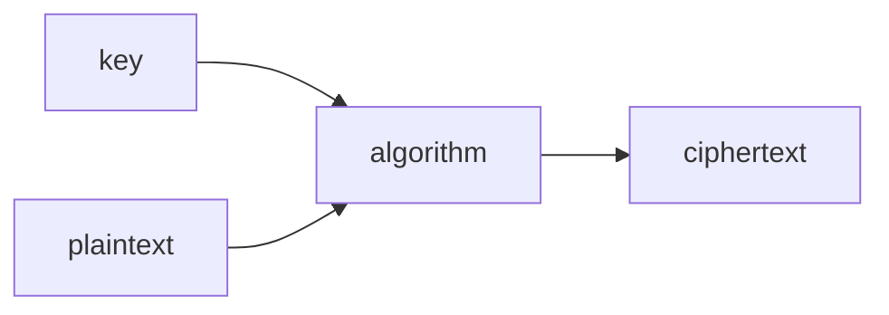

# Protecting Accounts

## 1. Core Definitions

### Authentication

> **Proving who you are.**

The system verifies your identity before granting access.

Example:
- Entering username + password
- Logging in with Google (SSO)
- Using a fingerprint

---

### Authorization

> **Determining what you are allowed to access.**

After identity is confirmed, the system checks permissions.

Example:
- Admin can delete users
- Normal user cannot access admin panel

---

## 2. Identity Proof Components

### Username

- Public identifier
- Not secret
- Used to locate the account

### Password

- Private secret
- Only known to user
- Used to verify identity

---

## 3. Password Attacks

### Dictionary Attack

- Tries common words from language dictionaries
- Exploits weak, predictable passwords

---

### Brute Force Attack

- Tries all possible combinations
- Example:
  - 4-digit numeric password:
    - \(10^4 = 10,000\) combinations
    - Can be tested in milliseconds
  - 8-character password with:
    - 52 letters
    - 10 digits
    - 32 symbols  
    - Total = 94 characters  
    - \(94^8\) ≈ 6+ quadrillion combinations

---

## 4. NIST Password Guidelines

Key recommendations:

- Minimum length: **8 characters**
- Maximum length: **64 characters**
- Allow full Unicode
- Do not enforce arbitrary complexity rules blindly
- Check password against:
  - Common passwords
  - Repeated patterns
  - Sequences
- Provide user feedback for weak passwords

---

### Security Practices

- Do NOT use security hints like:
  - “What was your first pet?”
- Implement rate limiting on failed attempts
- Slow down repeated login failures

---

## 5. Types of Authentication Factors

### 1️⃣ Knowledge (Something you know)

- Password
- PIN

---

### 2️⃣ Possession (Something you have)

- Phone
- Hardware token
- Keycard

---

### 3️⃣ Inherence (Something you are)

- Fingerprint
- Face recognition
- Iris scan

---

## 6. MFA / TFA

Multi-Factor Authentication:

- Combines at least two categories
- Example:
  - Password (knowledge)
  - OTP to phone (possession)

Adds an additional barrier.

---

### OTP Risk

- SIM swap attack:
  - Attacker convinces carrier to transfer number
  - Receives OTP

---

## 7. Common Security Threats

### Keylogging

- Records keystrokes
- Sends credentials to attacker

---

### Credential Stuffing

- Uses leaked credentials from one site
- Tries them on other sites

---

### Social Engineering

- Builds trust
- Manipulates user into revealing credentials

---

### Phishing

- Fake email or link
- Mimics legitimate service
- Redirects to malicious site

---

### Man-in-the-Middle (MITM)

- Attacker intercepts communication
- Poses as server to user
- Poses as user to server

---

### Machine-in-the-Middle

- Compromised routers or routing infrastructure
- Network-level interception

---

## 8. Single Sign-On (SSO)

> Login to one site using identity from another.

Commonly implemented using:
- OAuth 2.0

Example:
- “Login with Google”

Reduces password reuse but increases dependency on identity provider.

---

## 9. Password Managers

- Store passwords securely
- Use encryption (e.g., AES-256)
- Protected by a master password
- Encourage long, unique passwords

---

## 10. Passkeys

- Generated by device
- Replace traditional passwords
- Based on public-key cryptography
- Often combined with biometric unlock

Eliminates:
- Password reuse
- Phishing-based credential theft

---
# Protecting Data
## Data Leaks, Hashing & Password Storage

## 1. Data Leak

> A data leak means database data has been exposed.

It may include:
- Username
- Email
- Password (if stored badly)
- Other personal information

If passwords are stored in **plain text**, attackers immediately gain access.
If passwords are **hashed**, attackers must attempt to crack them.

---

## 2. Hashing

> Hashing = input → hash function → fixed-length hash output.

Properties:

- Fixed length output
- Deterministic (same input → same hash)
- Irreversible (one-way function)
- Does not reveal the original input
- No visible pattern representing the input

Example flow:

- User enters password
- System hashes it
- Stores only the hash

Even admins cannot see the original password.

During login:

- User enters password
- System hashes entered password
- Compares with stored hash
- If hashes match → login success

---

## 3. Attacks on Hashed Passwords

### Dictionary Attack on Hashes

Attacker:
- Takes each word in dictionary
- Hashes it
- Compares with stolen hashes

Same idea as brute force, but limited to common words.

---

### Brute Force on Hashes

Attacker:
- Generates all possible combinations
- Hashes each
- Compares with stolen hashes

Still computationally expensive for strong passwords.

---

## 4. Rainbow Tables

> Precomputed table of password → hash pairs.

Instead of hashing every guess again:
- Attacker looks up the stolen hash
- Finds matching password instantly (if present in table)

This is called **precomputation attack**.

---

## 5. Problem: Same Password → Same Hash

If two users use the same password:

```
password123 → same hash
```

If one hash is cracked:
- Other users with same password are also compromised.

---

## 6. Salting

> Adding random extra data to the password before hashing.

Example:

```
password + random_salt → hash
```

Salt:
- Is unique per user
- Stored alongside the hash
- Not secret, but random

Even if two users use the same password:

```
password + salt1 → hash1
password + salt2 → hash2
```

Outputs are different.

This defeats rainbow table attacks.

---

## 7. Do Not Reinvent Hashing

- Do not create your own hashing algorithm
- Use well-tested libraries
- Modern password hashing algorithms:
  - bcrypt
  - Argon2
  - PBKDF2

General cryptographic hash functions:
- SHA-2
- SHA-3

(Password hashing and general hashing are not the same use case.)

---

## 8. Hash Metadata

Modern systems often store:

- Which algorithm was used
- Cost factor / work factor
- Salt
- The hash

All encoded together in one string.

This allows:
- Algorithm upgrades
- Safe comparison later

---

## 9. Major Red Flag

If a website emails you your original password during reset:

> It means they stored your password in plain text.

That website should not be trusted.

Proper systems:
- Store only hashes
- Send password reset links
- Never send original passwords

---

## 10. Company Breach Disclosure

If a company is compromised:

- They may disclose immediately
- Or delay disclosure

Depends on:
- Legal requirements
- Ongoing investigations
- Risk of further attacks

---

## 11. Hash Collisions (Important Clarification)

A hash is not mathematically unique.

Reason:

- Infinite possible inputs
- Fixed-length output

By pigeonhole principle:
- Different inputs can produce the same hash (collision)

However:

- Strong cryptographic hashes make collisions computationally infeasible
- Longer hash length → lower collision probability

This is still considered **one-way hashing**.

---

## 12. Integrity Hashes (Future Topic)

Used for verifying data integrity:

- HMAC (Hash-based Message Authentication Code)
- CMAC (Cipher-based MAC)

These are different from password hashing.
They are used for:
- Message integrity
- Authenticity verification

(To be studied separately.)

---
# Cryptography

This refers to the reversible secret code method called encryption and decryption. we need not only the secret code but also the manual for that to decrypt. they are called keys.
Encode plaintext -> codetext
Decode codetext -> plaintext
Ciphers - the manuals but uses math or computational way which considers and changes each chars and not entire words 
encypher - plain to ciphertext 
decypher - cipher to plain but digitally
keys - the value used to encrypt then decrypt. shared between sender and receiver
secret key crytpography - relies on secrecy of a key. both A and B has the same key.


Ceaser cypher - rotational sypher. rotate the chars in alphabets
cryptanalusis - finding what a crypttext could be
Algorithms:
AES , Triple DES
sender and receiver have same and shared key
The symmetric key cryptography or the same key ones require you to share a key which is a secret so we need a secure way to share the key itself which needs another encryption and so on. this deadlock is soved using assymmetric key cryptography. such as Diffie- Hellman, MQV, RSA. also calles public key cryptography.
public key cryptography - sender encrypts the data in receiver's public key and receiver can only read the message by decrypting with his private key. this is the relationship between public key and private key.
RSA - famous and used in all or most browsers. relies on very big prime number. $n = p \times q$

