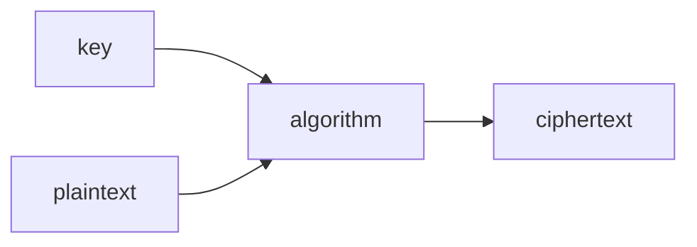
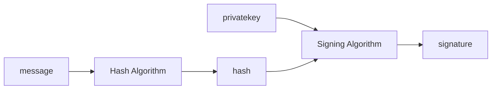
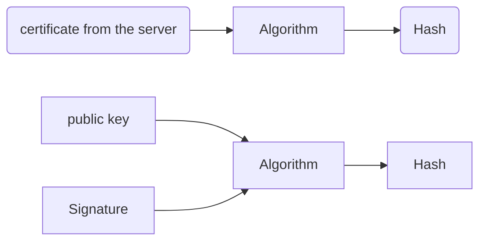

# Protecting Accounts

## 1. Core Definitions

### Authentication

> **Proving who you are.**

The system verifies your identity before granting access.

Example:
- Entering username + password
- Logging in with Google (SSO)
- Using a fingerprint

---

### Authorization

> **Determining what you are allowed to access.**

After identity is confirmed, the system checks permissions.

Example:
- Admin can delete users
- Normal user cannot access admin panel

---

## 2. Identity Proof Components

### Username

- Public identifier
- Not secret
- Used to locate the account

### Password

- Private secret
- Only known to user
- Used to verify identity

---

## 3. Password Attacks

### Dictionary Attack

- Tries common words from language dictionaries
- Exploits weak, predictable passwords

---

### Brute Force Attack

- Tries all possible combinations
- Example:
  - 4-digit numeric password:
    - \(10^4 = 10,000\) combinations
    - Can be tested in milliseconds
  - 8-character password with:
    - 52 letters
    - 10 digits
    - 32 symbols  
    - Total = 94 characters  
    - \(94^8\) ≈ 6+ quadrillion combinations

---

## 4. NIST Password Guidelines

Key recommendations:

- Minimum length: **8 characters**
- Maximum length: **64 characters**
- Allow full Unicode
- Do not enforce arbitrary complexity rules blindly
- Check password against:
  - Common passwords
  - Repeated patterns
  - Sequences
- Provide user feedback for weak passwords

---

### Security Practices

- Do NOT use security hints like:
  - “What was your first pet?”
- Implement rate limiting on failed attempts
- Slow down repeated login failures

---

## 5. Types of Authentication Factors

### 1️⃣ Knowledge (Something you know)

- Password
- PIN

---

### 2️⃣ Possession (Something you have)

- Phone
- Hardware token
- Keycard

---

### 3️⃣ Inherence (Something you are)

- Fingerprint
- Face recognition
- Iris scan

---

## 6. MFA / TFA

Multi-Factor Authentication:

- Combines at least two categories
- Example:
  - Password (knowledge)
  - OTP to phone (possession)

Adds an additional barrier.

---

### OTP Risk

- SIM swap attack:
  - Attacker convinces carrier to transfer number
  - Receives OTP

---

## 7. Common Security Threats

### Keylogging

- Records keystrokes
- Sends credentials to attacker

---

### Credential Stuffing

- Uses leaked credentials from one site
- Tries them on other sites

---

### Social Engineering

- Builds trust
- Manipulates user into revealing credentials

---

### Phishing

- Fake email or link
- Mimics legitimate service
- Redirects to malicious site

---

### Man-in-the-Middle (MITM)

- Attacker intercepts communication
- Poses as server to user
- Poses as user to server

---

### Machine-in-the-Middle

- Compromised routers or routing infrastructure
- Network-level interception

---

## 8. Single Sign-On (SSO)

> Login to one site using identity from another.

Commonly implemented using:
- OAuth 2.0

Example:
- “Login with Google”

Reduces password reuse but increases dependency on identity provider.

---

## 9. Password Managers

- Store passwords securely
- Use encryption (e.g., AES-256)
- Protected by a master password
- Encourage long, unique passwords

---

## 10. Passkeys

- Generated by device
- Replace traditional passwords
- Based on public-key cryptography
- Often combined with biometric unlock

Eliminates:
- Password reuse
- Phishing-based credential theft

---
# Protecting Data
## Data Leaks, Hashing & Password Storage

## 1. Data Leak

> A data leak means database data has been exposed.

It may include:
- Username
- Email
- Password (if stored badly)
- Other personal information

If passwords are stored in **plain text**, attackers immediately gain access.
If passwords are **hashed**, attackers must attempt to crack them.

---

## 2. Hashing

> Hashing = input → hash function → fixed-length hash output.

Properties:

- Fixed length output
- Deterministic (same input → same hash)
- Irreversible (one-way function)
- Does not reveal the original input
- No visible pattern representing the input

Example flow:

- User enters password
- System hashes it
- Stores only the hash

Even admins cannot see the original password.

During login:

- User enters password
- System hashes entered password
- Compares with stored hash
- If hashes match → login success

---

## 3. Attacks on Hashed Passwords

### Dictionary Attack on Hashes

Attacker:
- Takes each word in dictionary
- Hashes it
- Compares with stolen hashes

Same idea as brute force, but limited to common words.

---

### Brute Force on Hashes

Attacker:
- Generates all possible combinations
- Hashes each
- Compares with stolen hashes

Still computationally expensive for strong passwords.

---

## 4. Rainbow Tables

> Precomputed table of password → hash pairs.

Instead of hashing every guess again:
- Attacker looks up the stolen hash
- Finds matching password instantly (if present in table)

This is called **precomputation attack**.

---

## 5. Problem: Same Password → Same Hash

If two users use the same password:

```
password123 → same hash
```

If one hash is cracked:
- Other users with same password are also compromised.

---

## 6. Salting

> Adding random extra data to the password before hashing.

Example:

```
password + random_salt → hash
```

Salt:
- Is unique per user
- Stored alongside the hash
- Not secret, but random

Even if two users use the same password:

```
password + salt1 → hash1
password + salt2 → hash2
```

Outputs are different.

This defeats rainbow table attacks.

---

## 7. Do Not Reinvent Hashing

- Do not create your own hashing algorithm
- Use well-tested libraries
- Modern password hashing algorithms:
  - bcrypt
  - Argon2
  - PBKDF2

General cryptographic hash functions:
- SHA-2
- SHA-3

(Password hashing and general hashing are not the same use case.)

---

## 8. Hash Metadata

Modern systems often store:

- Which algorithm was used
- Cost factor / work factor
- Salt
- The hash

All encoded together in one string.

This allows:
- Algorithm upgrades
- Safe comparison later

---

## 9. Major Red Flag

If a website emails you your original password during reset:

> It means they stored your password in plain text.

That website should not be trusted.

Proper systems:
- Store only hashes
- Send password reset links
- Never send original passwords

---

## 10. Company Breach Disclosure

If a company is compromised:

- They may disclose immediately
- Or delay disclosure

Depends on:
- Legal requirements
- Ongoing investigations
- Risk of further attacks

---

## 11. Hash Collisions (Important Clarification)

A hash is not mathematically unique.

Reason:

- Infinite possible inputs
- Fixed-length output

By pigeonhole principle:
- Different inputs can produce the same hash (collision)

However:

- Strong cryptographic hashes make collisions computationally infeasible
- Longer hash length → lower collision probability

This is still considered **one-way hashing**.

---

## 12. Integrity Hashes (Future Topic)

Used for verifying data integrity:

- HMAC (Hash-based Message Authentication Code)
- CMAC (Cipher-based MAC)

These are different from password hashing.
They are used for:
- Message integrity
- Authenticity verification

(To be studied separately.)

---
## Cryptography

- Cryptography refers to reversible secret code methods:
  - Encryption
  - Decryption
- To decrypt, you need:
  - The algorithm
  - The key (secret value)

---

## Basic Terminology

- Encode: plaintext → ciphertext  
- Decode: ciphertext → plaintext  

### Cipher

- Mathematical/computational procedure used to transform data.
- Operates on characters or bits, not entire words.

### Encipher

- Plaintext → Ciphertext

### Decipher

- Ciphertext → Plaintext

---

## Keys

- A key is a value used by the algorithm.
- Required for:
  - Encryption
  - Decryption
- In symmetric systems:
  - Shared between sender and receiver.

---

## Secret Key Cryptography (Symmetric)

- Relies on secrecy of a shared key.
- Both sender (A) and receiver (B) have the same key.



### Common Algorithms

- AES (Advanced Encryption Standard)
- Triple DES

---

### Key Distribution Problem

- Symmetric encryption requires sharing a secret key.
- Sharing that key securely is difficult.
- If you encrypt the key, you need another key to protect it.
- This creates the key exchange problem.

Solved using asymmetric cryptography.

---

## Asymmetric Key Cryptography (Public Key Cryptography)

- Uses two keys:
  - Public key
  - Private key
- Public key can be shared.
- Private key must remain secret.

### Encryption Flow

- Sender encrypts using receiver’s public key.
- Receiver decrypts using their private key.
- Only the private key holder can read the message.

---

## RSA (Rivest–Shamir–Adleman)

- Based on large prime numbers.

Choose two large primes:

$$
p, \; q
$$

Compute:

$$
n = p \times q
$$

$$
\phi(n) = (p - 1)(q - 1)
$$

Choose public exponent:

$$
e
$$

Such that:

$$
\gcd(e, \phi(n)) = 1
$$

Compute private exponent:

$$
d \equiv e^{-1} \pmod{\phi(n)}
$$

### Public Key

$$
(e, n)
$$

### Private Key

$$
(d, n)
$$

### Encryption

$$
C = M^e \bmod n
$$

### Decryption

$$
M = C^d \bmod n
$$

Security relies on difficulty of factoring large:

$$
n
$$

---

## Diffie–Hellman Key Exchange

Used to securely establish a shared secret over an insecure channel.

Public values:

$$
p, g
$$

Each party chooses private values:

$$
a \quad \text{(for A)}
$$

$$
b \quad \text{(for B)}
$$

Exchange:

$$
A = g^a \bmod p
$$

$$
B = g^b \bmod p
$$

Shared secret:

$$
S = B^a \bmod p
$$

$$
S = A^b \bmod p
$$

Both compute the same secret without transmitting it directly.

---

## Cryptanalysis

- Attempting to break ciphertext.
- Trying to discover:
  - Plaintext
  - Key
  - Weakness in algorithm

---

## Digital Signature

Used to:
- Prove authenticity
- Ensure integrity
- Provide non-repudiation

Algorithms:
- DSA
- ECDSA
- RSA (for signing)



### Signing Process

1. Hash the message.
2. Sign the hash using private key.
3. Output → digital signature.

---

### Verification Process

1. Receiver hashes the received message.
2. Uses sender’s public key to verify the signature.
3. Recovers original hash from signature.
4. Compares both hashes.
5. If equal → valid signature.

---

## Caesar Cipher

- Rotational cipher.
- Each letter is shifted by fixed number of positions.

Example (shift 3):

```
A → D
B → E
C → F
```

Simple but insecure.

---

## Passkeys (Web Authentication)

- Passwordless login system.
- Based on public key cryptography.

Process:

1. Device generates:
   - Public key
   - Private key
2. Public key is sent to website.
3. Private key stays on device.
4. During login:
   - Website sends challenge.
   - Device signs challenge using private key.
   - Website verifies using stored public key.

Properties:

- No password stored.
- Resistant to phishing.
- Unique key pair per website.

---
## Protecting Data in Practice

### Encryption in Transit

Data is encrypted while moving between points — A→B, B→C — but **not while resting at B**.

Example:
- Gmail (B) uses HTTPS to secure your connection
- But once data lands on Google's servers, Google can read it
- Secure on the road, not in the warehouse

---

### End-to-End Encryption (E2EE)

Data is encrypted for the **entire journey** from sender to recipient.

- No intermediate server (including the service provider) can read it
- Only sender and recipient hold the keys

Example:
- WhatsApp messages are E2EE — WhatsApp's servers only see ciphertext

---

### Deletion (How It Actually Works)

When you delete a file, the OS does **not** wipe the data.

- It only marks that storage space as "available"
- The original bits remain untouched until overwritten by a new file
- Deleted files are often fully recoverable with forensic tools

> Sensitive files should never be "just deleted."

---

### Secure Deletion

Actively overwrites the file's storage space — typically with zeros or random data — so the original content cannot be recovered.

- Basic: overwrite with `0`s
- Stronger: multiple passes with random data

---

### Encryption at Rest

Data is encrypted while stored on a physical device (hard drive, SSD, flash drive).

- Requires authentication (password, key) to access
- If the device is stolen, sold, or destroyed — data remains unreadable

---

### Full Disk Encryption

The **entire disk** appears as random, meaningless bytes until authenticated.

- Without the key, even pulling the drive and plugging it into another machine yields nothing
- As disks age and wear, encryption ensures no residual data is recoverable

Example:
- BitLocker (Windows)
- LUKS (Linux)

---

### Ransomware

An attacker encrypts the victim's files with their own key, then demands payment for the decryption key.

- There is **no guarantee** the provided key works or is real
- Even paying does not ensure data recovery

---

### Quantum Computing (Threat to Cryptography)

Classical bits are strictly `0` or `1`. Qubits exist in **superposition** — both simultaneously.

| Qubits | States Represented |
|--------|-------------------|
| 1      | 2                 |
| 2      | 4                 |
| 3      | 8                 |
| n      | 2ⁿ                |

- Allows quantum computers to explore vast solution spaces in parallel
- Algorithms like **Shor's algorithm** can factor large numbers efficiently
- Threatens RSA and other encryption relying on factoring difficulty
- Post-quantum cryptography is an active area of research

# Securing Systems

Everything will be built upon encryption
## Wifi
Wifi protected access the data is scrambled from point A to B. the router needs to have this feature

Http : Hypertext Transfer Protocol, Not secure, the way that the world wide web communicates.
the data is not ecrypted in transit and can be evesdropped by a person in the middle if intercepted
Machine in the middle attacks : Communicating between server and client is essentially just pass the html files. if the data is not encrypted then the machine in the middle can see, and modify the files like adding an "ad.js" script to enfore ads.
Packet sniffing is same that if the packets are not encrypted then they can see and modify before passing them
Example : GET /search?q=cats HTTP/3
Host : example.com
or POST /checkout HTTP/3
Host : example.com
number = 329834722987
here the credit card number is also just plain text and thisis a security threat. if it contains a password then thats even bigger risk.
IP address unique internet address. : hacker dont need to know IP to sniff packets but these packets have ip of seender and receiver too.

Cookie : like the identity memory or like a context
HTTP/3 200
Set-Cookie:session = 1234abcd
cookies can be like a pass you get so that you can show that to confirm identity instead of re auth
A request might look like GET / HTTP/3 Cookie : session= 1234abcd
Session Hijacking : stealing session id and using that to pose as the user and essentially getting control of the account
HTTPS : Secure, data is encrypted althought the packet sender and receiver detailes are not so the router can route. but the data, header, cookie are safe.

TLS Secure the request and use public key policy like certificate. 
SSL its an older method and TLS is the newer method
Certificate is signed. like X.509 
it might have name etc
Certificate Authority (CA) collection of company that signs, and each browser manufaturer trust certain companies in these to sign tehir reequest


I dont know what else happens in browser making the secure connection etc

SSL Striping 
when type example.com it tries http then https so when the first http connection is enough to help the adversary to make you connect to a third party making you think that you are in a secure connection but not.
if i send GET / HTTP/3 HOST : example.com
then the server says to redirect to https like
HTTP/3 307(redirect) Location: https://example.com

this message is not encrypted cuz we are still in the http so they may change the location to another fishy site maybe or the redirect is from the hacker in teh first place