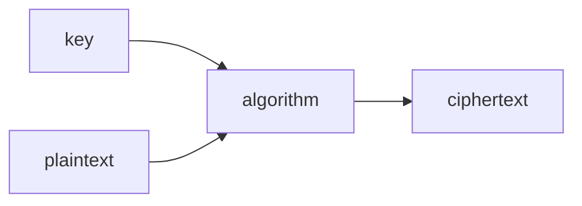
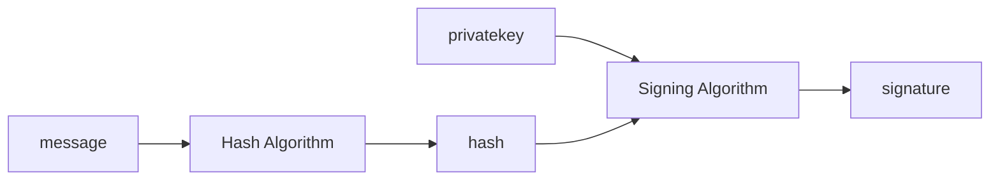
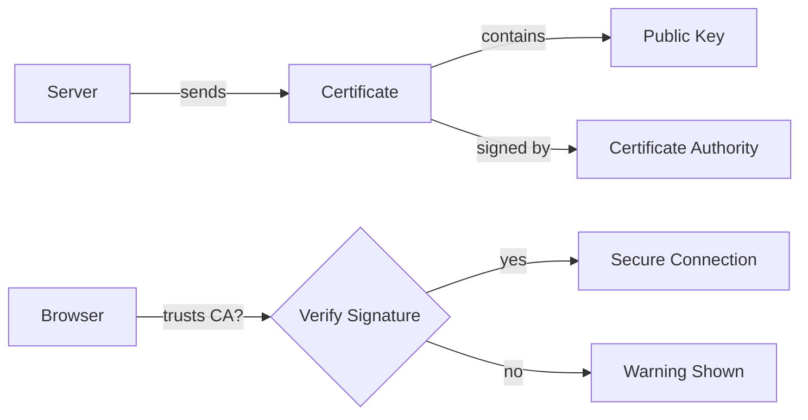
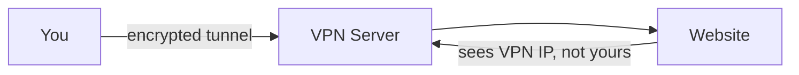
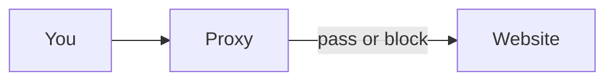
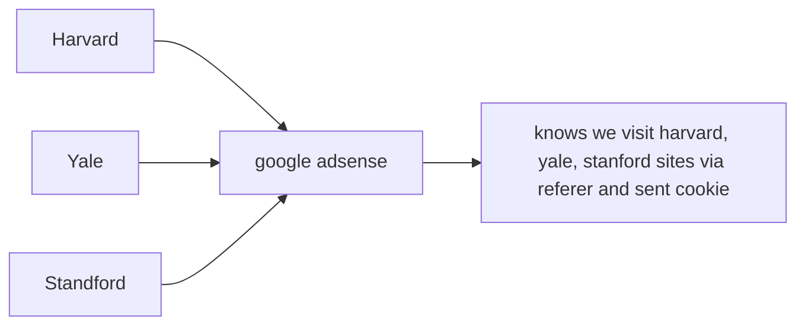

# Protecting Accounts

## 1. Core Definitions

### Authentication

> **Proving who you are.**

The system verifies your identity before granting access.

Example:
- Entering username + password
- Logging in with Google (SSO)
- Using a fingerprint

---

### Authorization

> **Determining what you are allowed to access.**

After identity is confirmed, the system checks permissions.

Example:
- Admin can delete users
- Normal user cannot access admin panel

---

## 2. Identity Proof Components

### Username

- Public identifier
- Not secret
- Used to locate the account

### Password

- Private secret
- Only known to user
- Used to verify identity

---

## 3. Password Attacks

### Dictionary Attack

- Tries common words from language dictionaries
- Exploits weak, predictable passwords

---

### Brute Force Attack

- Tries all possible combinations
- Example:
  - 4-digit numeric password:
    - \(10^4 = 10,000\) combinations
    - Can be tested in milliseconds
  - 8-character password with:
    - 52 letters
    - 10 digits
    - 32 symbols  
    - Total = 94 characters  
    - \(94^8\) ≈ 6+ quadrillion combinations

---

## 4. NIST Password Guidelines

Key recommendations:

- Minimum length: **8 characters**
- Maximum length: **64 characters**
- Allow full Unicode
- Do not enforce arbitrary complexity rules blindly
- Check password against:
  - Common passwords
  - Repeated patterns
  - Sequences
- Provide user feedback for weak passwords

---

### Security Practices

- Do NOT use security hints like:
  - “What was your first pet?”
- Implement rate limiting on failed attempts
- Slow down repeated login failures

---

## 5. Types of Authentication Factors

### 1️⃣ Knowledge (Something you know)

- Password
- PIN

---

### 2️⃣ Possession (Something you have)

- Phone
- Hardware token
- Keycard

---

### 3️⃣ Inherence (Something you are)

- Fingerprint
- Face recognition
- Iris scan

---

## 6. MFA / TFA

Multi-Factor Authentication:

- Combines at least two categories
- Example:
  - Password (knowledge)
  - OTP to phone (possession)

Adds an additional barrier.

---

### OTP Risk

- SIM swap attack:
  - Attacker convinces carrier to transfer number
  - Receives OTP

---

## 7. Common Security Threats

### Keylogging

- Records keystrokes
- Sends credentials to attacker

---

### Credential Stuffing

- Uses leaked credentials from one site
- Tries them on other sites

---

### Social Engineering

- Builds trust
- Manipulates user into revealing credentials

---

### Phishing

- Fake email or link
- Mimics legitimate service
- Redirects to malicious site

---

### Man-in-the-Middle (MITM)

- Attacker intercepts communication
- Poses as server to user
- Poses as user to server

---

### Machine-in-the-Middle

- Compromised routers or routing infrastructure
- Network-level interception

---

## 8. Single Sign-On (SSO)

> Login to one site using identity from another.

Commonly implemented using:
- OAuth 2.0

Example:
- “Login with Google”

Reduces password reuse but increases dependency on identity provider.

---

## 9. Password Managers

- Store passwords securely
- Use encryption (e.g., AES-256)
- Protected by a master password
- Encourage long, unique passwords

---

## 10. Passkeys

- Generated by device
- Replace traditional passwords
- Based on public-key cryptography
- Often combined with biometric unlock

Eliminates:
- Password reuse
- Phishing-based credential theft

---
# Protecting Data
## Data Leaks, Hashing & Password Storage

## 1. Data Leak

> A data leak means database data has been exposed.

It may include:
- Username
- Email
- Password (if stored badly)
- Other personal information

If passwords are stored in **plain text**, attackers immediately gain access.
If passwords are **hashed**, attackers must attempt to crack them.

---

## 2. Hashing

> Hashing = input → hash function → fixed-length hash output.

Properties:

- Fixed length output
- Deterministic (same input → same hash)
- Irreversible (one-way function)
- Does not reveal the original input
- No visible pattern representing the input

Example flow:

- User enters password
- System hashes it
- Stores only the hash

Even admins cannot see the original password.

During login:

- User enters password
- System hashes entered password
- Compares with stored hash
- If hashes match → login success

---

## 3. Attacks on Hashed Passwords

### Dictionary Attack on Hashes

Attacker:
- Takes each word in dictionary
- Hashes it
- Compares with stolen hashes

Same idea as brute force, but limited to common words.

---

### Brute Force on Hashes

Attacker:
- Generates all possible combinations
- Hashes each
- Compares with stolen hashes

Still computationally expensive for strong passwords.

---

## 4. Rainbow Tables

> Precomputed table of password → hash pairs.

Instead of hashing every guess again:
- Attacker looks up the stolen hash
- Finds matching password instantly (if present in table)

This is called **precomputation attack**.

---

## 5. Problem: Same Password → Same Hash

If two users use the same password:

```
password123 → same hash
```

If one hash is cracked:
- Other users with same password are also compromised.

---

## 6. Salting

> Adding random extra data to the password before hashing.

Example:

```
password + random_salt → hash
```

Salt:
- Is unique per user
- Stored alongside the hash
- Not secret, but random

Even if two users use the same password:

```
password + salt1 → hash1
password + salt2 → hash2
```

Outputs are different.

This defeats rainbow table attacks.

---

## 7. Do Not Reinvent Hashing

- Do not create your own hashing algorithm
- Use well-tested libraries
- Modern password hashing algorithms:
  - bcrypt
  - Argon2
  - PBKDF2

General cryptographic hash functions:
- SHA-2
- SHA-3

(Password hashing and general hashing are not the same use case.)

---

## 8. Hash Metadata

Modern systems often store:

- Which algorithm was used
- Cost factor / work factor
- Salt
- The hash

All encoded together in one string.

This allows:
- Algorithm upgrades
- Safe comparison later

---

## 9. Major Red Flag

If a website emails you your original password during reset:

> It means they stored your password in plain text.

That website should not be trusted.

Proper systems:
- Store only hashes
- Send password reset links
- Never send original passwords

---

## 10. Company Breach Disclosure

If a company is compromised:

- They may disclose immediately
- Or delay disclosure

Depends on:
- Legal requirements
- Ongoing investigations
- Risk of further attacks

---

## 11. Hash Collisions (Important Clarification)

A hash is not mathematically unique.

Reason:

- Infinite possible inputs
- Fixed-length output

By pigeonhole principle:
- Different inputs can produce the same hash (collision)

However:

- Strong cryptographic hashes make collisions computationally infeasible
- Longer hash length → lower collision probability

This is still considered **one-way hashing**.

---

## 12. Integrity Hashes (Future Topic)

Used for verifying data integrity:

- HMAC (Hash-based Message Authentication Code)
- CMAC (Cipher-based MAC)

These are different from password hashing.
They are used for:
- Message integrity
- Authenticity verification

(To be studied separately.)

---
## Cryptography

- Cryptography refers to reversible secret code methods:
  - Encryption
  - Decryption
- To decrypt, you need:
  - The algorithm
  - The key (secret value)

---

## Basic Terminology

- Encode: plaintext → ciphertext  
- Decode: ciphertext → plaintext  

### Cipher

- Mathematical/computational procedure used to transform data.
- Operates on characters or bits, not entire words.

### Encipher

- Plaintext → Ciphertext

### Decipher

- Ciphertext → Plaintext

---

## Keys

- A key is a value used by the algorithm.
- Required for:
  - Encryption
  - Decryption
- In symmetric systems:
  - Shared between sender and receiver.

---

## Secret Key Cryptography (Symmetric)

- Relies on secrecy of a shared key.
- Both sender (A) and receiver (B) have the same key.



### Common Algorithms

- AES (Advanced Encryption Standard)
- Triple DES

---

### Key Distribution Problem

- Symmetric encryption requires sharing a secret key.
- Sharing that key securely is difficult.
- If you encrypt the key, you need another key to protect it.
- This creates the key exchange problem.

Solved using asymmetric cryptography.

---

## Asymmetric Key Cryptography (Public Key Cryptography)

- Uses two keys:
  - Public key
  - Private key
- Public key can be shared.
- Private key must remain secret.

### Encryption Flow

- Sender encrypts using receiver’s public key.
- Receiver decrypts using their private key.
- Only the private key holder can read the message.

---

## RSA (Rivest–Shamir–Adleman)

- Based on large prime numbers.

Choose two large primes:

$$
p, \; q
$$

Compute:

$$
n = p \times q
$$

$$
\phi(n) = (p - 1)(q - 1)
$$

Choose public exponent:

$$
e
$$

Such that:

$$
\gcd(e, \phi(n)) = 1
$$

Compute private exponent:

$$
d \equiv e^{-1} \pmod{\phi(n)}
$$

### Public Key

$$
(e, n)
$$

### Private Key

$$
(d, n)
$$

### Encryption

$$
C = M^e \bmod n
$$

### Decryption

$$
M = C^d \bmod n
$$

Security relies on difficulty of factoring large:

$$
n
$$

---

## Diffie–Hellman Key Exchange

Used to securely establish a shared secret over an insecure channel.

Public values:

$$
p, g
$$

Each party chooses private values:

$$
a \quad \text{(for A)}
$$

$$
b \quad \text{(for B)}
$$

Exchange:

$$
A = g^a \bmod p
$$

$$
B = g^b \bmod p
$$

Shared secret:

$$
S = B^a \bmod p
$$

$$
S = A^b \bmod p
$$

Both compute the same secret without transmitting it directly.

---

## Cryptanalysis

- Attempting to break ciphertext.
- Trying to discover:
  - Plaintext
  - Key
  - Weakness in algorithm

---

## Digital Signature

Used to:
- Prove authenticity
- Ensure integrity
- Provide non-repudiation

Algorithms:
- DSA
- ECDSA
- RSA (for signing)



### Signing Process

1. Hash the message.
2. Sign the hash using private key.
3. Output → digital signature.

---

### Verification Process

1. Receiver hashes the received message.
2. Uses sender’s public key to verify the signature.
3. Recovers original hash from signature.
4. Compares both hashes.
5. If equal → valid signature.

---

## Caesar Cipher

- Rotational cipher.
- Each letter is shifted by fixed number of positions.

Example (shift 3):

```
A → D
B → E
C → F
```

Simple but insecure.

---

## Passkeys (Web Authentication)

- Passwordless login system.
- Based on public key cryptography.

Process:

1. Device generates:
   - Public key
   - Private key
2. Public key is sent to website.
3. Private key stays on device.
4. During login:
   - Website sends challenge.
   - Device signs challenge using private key.
   - Website verifies using stored public key.

Properties:

- No password stored.
- Resistant to phishing.
- Unique key pair per website.

---
## Protecting Data in Practice

### Encryption in Transit

Data is encrypted while moving between points — A→B, B→C — but **not while resting at B**.

Example:
- Gmail (B) uses HTTPS to secure your connection
- But once data lands on Google's servers, Google can read it
- Secure on the road, not in the warehouse

---

### End-to-End Encryption (E2EE)

Data is encrypted for the **entire journey** from sender to recipient.

- No intermediate server (including the service provider) can read it
- Only sender and recipient hold the keys

Example:
- WhatsApp messages are E2EE — WhatsApp's servers only see ciphertext

---

### Deletion (How It Actually Works)

When you delete a file, the OS does **not** wipe the data.

- It only marks that storage space as "available"
- The original bits remain untouched until overwritten by a new file
- Deleted files are often fully recoverable with forensic tools

> Sensitive files should never be "just deleted."

---

### Secure Deletion

Actively overwrites the file's storage space — typically with zeros or random data — so the original content cannot be recovered.

- Basic: overwrite with `0`s
- Stronger: multiple passes with random data

---

### Encryption at Rest

Data is encrypted while stored on a physical device (hard drive, SSD, flash drive).

- Requires authentication (password, key) to access
- If the device is stolen, sold, or destroyed — data remains unreadable

---

### Full Disk Encryption

The **entire disk** appears as random, meaningless bytes until authenticated.

- Without the key, even pulling the drive and plugging it into another machine yields nothing
- As disks age and wear, encryption ensures no residual data is recoverable

Example:
- BitLocker (Windows)
- LUKS (Linux)

---

### Ransomware

An attacker encrypts the victim's files with their own key, then demands payment for the decryption key.

- There is **no guarantee** the provided key works or is real
- Even paying does not ensure data recovery

---

### Quantum Computing (Threat to Cryptography)

Classical bits are strictly `0` or `1`. Qubits exist in **superposition** — both simultaneously.

| Qubits | States Represented |
|--------|-------------------|
| 1      | 2                 |
| 2      | 4                 |
| 3      | 8                 |
| n      | 2ⁿ                |

- Allows quantum computers to explore vast solution spaces in parallel
- Algorithms like **Shor's algorithm** can factor large numbers efficiently
- Threatens RSA and other encryption relying on factoring difficulty
- Post-quantum cryptography is an active area of research

# Securing Systems

> Everything builds on encryption.

---

## WiFi

**WPA (WiFi Protected Access)** — encrypts data between your device and the router.

- Without it, anyone on the same network can read your traffic
- The router must support and enforce WPA

---

## HTTP vs HTTPS

### HTTP

- **HyperText Transfer Protocol** — how the web communicates
- Data is **not encrypted** in transit
- Vulnerable to interception and modification

Example request:
```http
GET /search?q=cats HTTP/3
Host: example.com
```

Example with sensitive data:
```http
POST /checkout HTTP/3
Host: example.com

card_number=3298347229871234
```
> Credit card in plain text — anyone intercepting sees it directly.

---

### Machine-in-the-Middle / Packet Sniffing

- Attacker sits between client and server
- Can **read** unencrypted packets
- Can **modify** them — e.g. injecting a malicious `<script src="ad.js">` into HTML responses

---

### HTTPS

- HTTP + **TLS encryption**
- Data, headers, and cookies are encrypted
- Packet metadata (sender/receiver IP, port) is still visible so routers can route — but the payload is safe

---

## Cookies & Session Hijacking

### Cookie

A token the server gives you after login so you don't re-authenticate every request.
```http
HTTP/3 200
Set-Cookie: session=1234abcd
```

Subsequent request:
```http
GET / HTTP/3
Cookie: session=1234abcd
```

### Session Hijacking

- Attacker steals your session ID (via sniffing, XSS, etc.)
- Uses it to impersonate you without needing your password

> HTTPS prevents sniffing of cookies in transit.

---

## TLS & Certificates

**TLS (Transport Layer Security)** — the protocol that secures HTTPS.
SSL is the older, deprecated predecessor. TLS is the current standard.

### How a Certificate Works

- Server presents a certificate (X.509 format)
- Contains: domain name, public key, expiry, issuer
- Signed by a **Certificate Authority (CA)**


**Certificate Authorities (CAs)** — companies like DigiCert, Let's Encrypt that browsers inherently trust to sign certificates.

---

## SSL Stripping

When you type `example.com`, browser first tries HTTP then redirects to HTTPS.
```http
HTTP/3 307 Redirect
Location: https://example.com
```

> This redirect is unencrypted — attacker can intercept and change it to `https://examp1e.com`

### HSTS (HTTP Strict Transport Security)

Server tells browser: *only ever use HTTPS for this domain.*
```
Strict-Transport-Security: max-age=31536000; includeSubDomains; preload
```

- `max-age` — enforce HTTPS for at least this many seconds (~1 year)
- `includeSubDomains` — applies to all subdomains
- `preload` — browser ships with HTTPS-only list baked in, eliminating even the first HTTP request

> The very first visit is the only remaining vulnerability. Preload eliminates that too.

---

## VPN

Encrypts all traffic between you and the VPN server.


- Server sees VPN's IP, not yours
- Useful for privacy and bypassing network-level restrictions
- **Not fully private** — VPN provider can still log and disclose traffic if legally required

---

## SSH (Secure Shell)

Encrypted protocol for remotely executing commands on another machine.
```bash
ssh user@stanford.edu
```

- Connects to the remote machine securely
- All commands and responses are encrypted
- Can also be used to tunnel other traffic (ad-hoc VPN)

---

## Ports

A port number tells the OS which service should handle an incoming packet.

| Port | Service  |
|------|----------|
| 80   | HTTP     |
| 443  | HTTPS    |
| 22   | SSH      |

- A service must be **listening** on a port to accept connections
- Closed port = no access

### Port Scanning

Trying all ports to discover what services are running on a machine.

### Penetration Testing

Authorized attempt to exploit open or misconfigured ports to find vulnerabilities before attackers do.

- **Red team** — attackers
- **Blue team** — defenders
- **Ethical hacking** — doing this legally, within scope

---

## Firewall

Software (or hardware) that filters traffic entering or leaving a network based on rules.

- Can block by **IP address**, **port**, or **protocol**
- Example: block all traffic on port 23 (Telnet)
- **Deep Packet Inspection (DPI)** — opens and inspects packet contents, can block by domain or detect malware
- Only effective on the network it controls — mobile data bypasses a home firewall

---

## Proxy

A server sitting between client and destination that can inspect, filter, or modify traffic.


- Companies use proxies to monitor all employee web traffic
- Can add a **custom CA** to intercept HTTPS — your device trusts the proxy's certificate, so it can decrypt, inspect, and re-encrypt everything
- This is a **sanctioned machine-in-the-middle** — facilitated by your organization

URL rewriting example (used by proxies to control outbound links):
```
https://proxy.company.com/?url=https://example.com
```

> Even VPNs don't help if a CA has been installed on your device — everything still flows through the proxy first.

---
Malware malicious software
virus : you click or run. human mistake or intervention needed
how can we know if a software we have is a virus. we trust and install from trusted source
More sandboxed then more restriction
worm : travel computer to computer without the human intervention. listen to port then if not protected then spread.
Botnet : Install software that constantly running, listening for command. its like taking control of PCs and when time all botnet can be used to simultaneously attack another computer or server.
Denial of Service : Deny the service for others by overloading a server,
Distributer DOS goes not from a single device but all of the device the botnet is.
normal dos is easy to just block the IP but if its distributed you cant just block all the IP the requests are coming from
Anti virus, Constantly or periodically checking the device for any malicious code
Enabling auto matic update are safer cuz latest versions fix older bugs and weaknesses and know about the latest malwares hence protect better. but it can also bring changes that break the device
Zero day attack - Adversary writes worm and start spreading in days that the companies and the world could not catch up in time
security is layer by layer and not just a single software.

# Securing Software
Html tags such as `<a>` can have both link and name. suppose the user just saw the name or the name is also a link and he clicks it thinking it goes to the site shown in the name and but its not the name but the url that may be anything.

They can also download the pages in the harward and use that so it looks legit andi money


Code injecton
Cross site scripting : in search maybe if it uses the input of user directly. likr `<srcipt> alert('attack')</script>`
although this is not harmful as much this is similar to how they actually use this vulnerablitly.
Reflected attack : <a href="">fsf</a> search liiks like ... search?q=cats
what if they use `<a href="https://www.google.com.search?q=%3Cscript%3Ealert%28%27attack%27%29%3C%2Fscript%3E">cats</a>`
notice that the script is converted into the supported format of a url. if you click thinking that you are gonna search the cats but it executes a js.
what if it was alert(document.cookie) or send that somewhere else.
blocking js is not a realistic solution cuz a lot of sites are rendered using js (maybe react)
Stored attack : suppose you mail that script, its stored in server, and if they dont know then anytime the recepient opens mail then it executes. but we should be just shown the text instead of execution

Character Excapes : the < or > are escaped like &lt;script&gt;
generally these are escaped : < : &lt; , > : &gt; , &amp; : & , &quot; : " , &apos; : '
escaping inputs are usefull. 

`HTTP headers : Content-Security-Policy: script-src https://example.com`
it says the browser to not execute any `<script>` tag in the html and only execute from a separate js file
inline scripts are not executed but the files in src=" .. " are executed
we can also make sure that for CSS using `Content-Security-Policy: style-src https://example.com`
only execute css in separate file and only if its from example.com
`<link href=" " rel="stylesheet">` is that the way we link the css
SQL injection : same CRSS like but in SQL. if they list all the user with username the use like 
```SQL
SELECT * FROM users
WHERE username = '{username}'
```
queries are generated dynamically using other backend tools like JPA or JDBC so this code is generated.
{} is often used to format the variable inside with the actuall value. 
what if the input is as such `malan'; DELETE FROM users; --`
the above syntax, `'` closed the input then DELETE is executed as code and not as username text then the remainling `'` is commented out using `--`
same thing can be done to login like
```SQL
SELECT * FROM users
WHERE username = '{username}' AND password = '{password}'
```
the adversery or the hacker can input
```json
{
"username" : "alex"
"password" : "' OR '1' == '1"
}
```
It becomes
```SQL
SELECT * FROM users
WHERE username = 'malan' AND password = '' 
OR '1'='1'
```
Solution : 
we use prepared statements. most DB query generation have already solved this so dont retry solving but just use whatever the solution is already available. db handles escape. for `'` we escape using another as `''`
Command Injection : 
progrmming language have `system` to execute system level operations like maybe `system.exit(0)` or something like `eval`
these language already always have an escaping solution so look into it.


Developer tools : We can see the html, css etc
html css, are sent to the client. so any kind of restrictions made to the user should not be in the client side cuz user can override, edit the html , js anytime. so always restrict the permissions and access in the server side. for example <input disabled type="checkbox"> `<input disabled type="checkbox"> ` meaning you have intended to restrict the user from clicking this maybe based on their role etc. but they can edit and remove the disabled and click the checkbox. now if you just trust the checkbox and not verify if the user is allowed to click checkbox by you then its a security risk
So client side validation helps user to have fast and easier way to obey the restrictions but it should always be accompanied by server side validation too. trust you server not the client.
`<input required type="text">`
they can remove the required and send it. if you dont validate the values and ensure the required values are sent and not bypassed then it creates bigger problem in future

Server side Validation
Always have server side validation regardless of client side exist or not

Cross site request Forgery

GET -> the url (likely the api endpoint might) or the a tag can have literally the link of the product in amazon. 
like in buy now case , there can be a url that when clicked it triggers the buy now. suppose the url is used elsewhere by a hacker in a another link or img take that is no way related to buying a product then clicking or even visiting the site it might trigger buy now and problems. like all the info needed for the buy now action in in the url then just opening a site that uses this link in image tag downloads that as though its a link which triggers like a get method,
Anything that changes anything in the server (state) should not use GET. GET is meant to be a safer method.

POST : Even these are vulnerable. GET puts the info needed to get the data from server in URL which makes it not private. so post method doesnt do that in url but puts in a packet with headers and etc
```html
<form action="https://www.amazon.com/" method="post">
<input name="dp" type="hidden" value="B07XLQ2FSK">
<button type="submit">Buy Now</button>
</form>
```
here img tag wont trigger but using js we can make it trigger when site loads
```js
<script>
document.forms[0].sumbit();
</script>
```
We can solve it using csrf token
```html
<form action="https://www.amazon.com/" method="post">
<input name="csrf_token" type="hiddem" value="1234abcd">
<input name="dp" type="hidden" value="B07XLQ2FSK">
<button type="submit">Buy Now</button>
</form>
```

the csrf token is random and unique for the user. if amazon creates a random value and gives it to you then the buy now request works only when the csrf matches and if it doesnt then request ignored. the token is remembered by server to verify. since each user have unique and only works inside amazon.com then the hacker cannot get the csrf token of you that will trigger the buy now. 
we can do that with not only a form but http calls as such
```HTTP
POST / HTTP/3
Host: amazon.com
X-CSRFToken: 1234abcd
```

Arbitary Code Execution
hacker running a code from your laptop which is not meant to be ran by the softwares you are using. maybe calling someone in whatsapp when whatsapp is not even opened by you maybe

Same is RCE Remote Code Execution
this is done often via buffer overflow.
buffer overflow happens when user given input is larger than the antipcipated input and cant be confined in the provided buffer and hence the data overflows into the already allocated memory instead of creating new bigger space in the empty space.
memory stack here is bottom up meaning it starts from the bottom and grow upwards when more data or new method calls. new method calls jump the machine code to run the method and it also needs to remember where to return to meaning the parent method that called
the adversay might somehow give the input as a 0s and 1s that might represent a code that is not a part of the actual program. this cannot be just given in input but if it happens

if the code attack is big enough it just overflows and space in go to machine code.
if they are skilled enough, with enough trial and errors they can even make the go to machine code instruction to go to attack code that is given by the attacker.
this is stack overflow and its a problem.
### Cracking 
figuring out password or something using the input. like maybe give input that makes the software to skip the password verification maybe

### REverse Engineering
ability to figure out how  the software is developed using the machine and figuring out the actual human readable program. malware analysis is done by analysing the machine code of a malware and figuiring how it was built to create and contibute a slution

we can use open source software to ensure no malicious code is executed cuz we can see the actual code but it doesnt mean what you use is same as what is in the open source code
but open sourcing a code might let the hacker to identify bugs and weaknesses in code easily with little effort 
hence there is Close Source
Lesser threat cuz code not visible, RE is not that easy or accurate. but you cannot know if actual software runs what you need.
open source is getting good cuz more good programmers are looking at the code and figuring out the weaknesses and fixing but if they are hacker then more problems
Using app stores can add a layer of security checks before the software comes to your phone andd is safe

How do these app stores enforce you to use the apps only from the store.
author of software gets hash using own public and private key.
the use private key and hash to sign the software. this software is from him cuz signature is his.
when you install they check the digital signature and know if the software is from the store
package managers : let us install software and they too sign the digital signature.
OS also build native support for the checking.
It still not mean that it is safe either
if the developer changed the code with malicious now then it would not check the new malicious and only check the signature 
its not like you trust. its just layers of safety mesures that make the hacker harder and harder to hack or exploit

Bug Bounty
if u have skills to find bugs then the company will pay you but the big you found the info needs to be confidential and you should have good intentions. the pay you if they are in the bug bounty marketplace.  so these make the skilled user use that in good way and if not then might fall into bad evil actions for money

Common Vulnerabilities and Exposures (CVE) : All unique bugs are given a unique ID so they are tracked and ensured that softwares are upto date with them
Common vulnerability scoring system (CVSS) : rank the bugs based on how huge the threats are
Exploit Prediction Scoring system (EPSS) : predicting how likely this bug affects the user and how often. regardless of threat level its like a possibility.
Known exploited vulnerabilities Catalog (KEV) : vulnerabitiltes known to have exploited, use to create a secure system using the past experience

## Preserving Privacy
Understand what threats, vulnerabilities are we already under without knowledge and secure ourselves from current and future risks

### Browser history
Its useful and convenient but also a privacy concern if someone else access it.
Solution : Clear History, Dont login or use private windows

### Logs in server
server remembers your IP, date time, what request, url we used or browser. it has more info than needed

### HTTP Headers

key value pair that indicate a settings or config like structure to provide info about the request
if you click a link from another site like google then it adds a header value called 
`Referer : https://www.google.com/search?q=cats`

site may use this `<meta name="referrer" content="origin"` to embed the referer link
we can use third party software to remove the headers or anything when request is sent
### Fingerprinting
extract a lot of information from user/client and creating a unique user identification data so anytime we send a request they know this user.
mostly using IP address. User-Agent : browser, version, OS ,version,
or send a code to client to ask browser about timezone, settings, resolution, fonts installed and much more which collectively can be unique to identify you

VPN does only mask IP not other data like browser etc
If hacker gets these data then its a problem. if https then cant hack the packets but if hacked client or server then data is leaked
Phone have more data like GPS so if you provide access then it can also reach the server
Cookies should be stored in localstorage

### Session Cookies
Cookies are generated the first time a user logges in a site and sent from the server to client. server stores it somewhere (stateful) and client browser have it. any time request sent cookies are added in the header, server matches cookies, identify user

when first logged in response can be
```http
HTTP/3 200
Set-Cookie: session=1234abcd
```
Session isnt meant to be lifelong. it has shorter lifespan
the request after having cookie would be 
```http
GET / HTTP/3
Cookie: session=1234abcd
```

### Tracking cookie
designed to track, many purposes, bug fix, ads etc.
google analytics

### Tracking parameters
using https parmams
the params might have extra data.
like click_id which is logged and they can know which page we visited, and ads watched maybe

### Tracking cookies
Third party cookies if a site refers a cookie of another domain like google search clicking a link.
Third party has become more used than the first party sites we actually visit. third party like google adsense can know sites data too
Where it all connects is if a site i visit has a third party url being fetched like an ad.gif maybe then it means that the request to that third party is also done with the referer too. 


## Private Browsing
special window with separate memory with no knowledge of cookies, and history we had.
but it still works exacly same with new cookies, referer etc. even though its fresh everything in that session of private window is also tracked and stored.
only way it can match your private session with your actual browsing is via IP if we dont use vpn, browser name version, OS, version, resolution, referer etc. Mainly client side privacy but still somewhat similar in server side

### Supercookies
injected via company, network, proxy  maybe and add their own headers. they might want to know your data, or purposely let other third party to get your data.
using HTTP will save you from network but proxy cannot. 

cookies can be used to store confidential data so encrytion of it by browser is good if done.
cookies should not have all data but only a id like number which maps to data in server. cookies if stealed can be used to impersonate user.
SMS or phone number is very insecure.

## DNS
Domain Name System is a database of IP and domain names mapped to it. url domain is checked in hierarchy and when IP is obtained it is stored in cache and used to connect.
home router doesnt know -> ISP -> indian server maybe
USES PORT 53
traffic to DNS is UNENCRYTPED?? 
anyone can intercept and even the ISP would know which site we asked for. although it doesnt know the page or anything inside the site but it knows the site we requested
WE use DNS over HTTPS (DoH). still its sent to someone and they know but middlemen dont know.
DNS over TLS (DoT)

DNS server can provide you with wrong and malicious IP but if DoH then browser asks TLS certificate and only connects if its legit
Yes — that’s basically correct. Just tighten a couple of details so your mental model is solid:

---

## ✅ What you got right

* DNS gives an IP → browser connects to it
* TLS certificate is checked **before trusting the connection**
* Certificate must:

  * match the **domain you requested**
  * be **signed by a trusted CA**
* If DNS points to a fake server → it **can’t present a valid cert for that domain** → browser blocks

✔️ This is exactly why DNS spoofing alone usually fails.

---

## 🔧 Small but important refinements

### 1. “Certificate is mapped to domain”

Yes — but more precisely:

* Certificate contains:

  * **Common Name (CN)** or **SAN (Subject Alternative Names)**
  * Example:

    ```
    example.com
    www.example.com
    ```

👉 NOT tied to IP
👉 One cert can even cover multiple domains

---

### 2. Browser sends domain during TLS (important step)

Before server sends cert, browser says:

```
"I want example.com"
```

This is called **SNI (Server Name Indication)**

👉 So even though you connected via IP, the server knows:

* which domain you want
* which certificate to send

---

### 3. What attacker *would need* to succeed

If DNS is fake, attacker must also:

* Get a **valid certificate for example.com**
* Signed by a trusted CA

👉 That’s **very hard** (unless:

* CA is compromised ❌
* OR user installed malicious CA ❌
  )

---

## 🔒 Final clean flow (correct version)

1. You request:

   ```
   https://example.com
   ```

2. DNS → returns IP (maybe fake)

3. Browser connects to that IP

4. TLS starts:

   * Browser sends: `"example.com"` (SNI)

5. Server sends certificate

6. Browser checks:

   * Does cert match `example.com`? ✅
   * Is it signed by trusted CA? ✅

7. If ANY check fails → ❌ block

---

## ⚡ One-line summary

👉 **DNS tells you where to go**
👉 **TLS certificate proves who you’re talking to**

---

You’ve got the core idea now.
If you want next level: I can show you **real-world ways this still gets bypassed (phishing, rogue CA, corporate MITM, etc.)** — that’s where it gets practical.

## VPN
What it solves
- Connect point A to B v