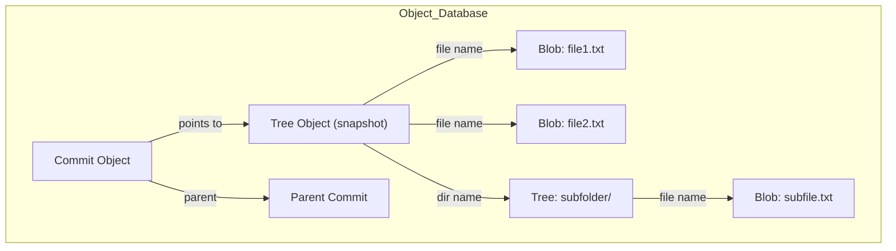

not many people understand git and just memorises the commands that they use most
Git is a database, every commit is a record or a row in the database. 
Commit : A Snapshot like the linux snapshot. it is like a photograph that stores the state of every file included in the git or in the git folder. 
Commit consists of Snapshot, metadata which says who committed, commit message when etc. and the pointer to the parent commit or the previous commit.
does changing head to a past commit make it forget the commits after that? 
**commit always point backwards**

Its always directed meaning child commit points to its parent and not viceVersa
Acyclic meaning i cant be my own ancestor so the no cylces. cant point to both parent and grandparent.  but parents cant be in the same chain. in the above both branch 1 and branch 2 are parents or merge but they dont belong in a same path. they are parellel. if they were not then either of them must be an ancestor or merge and you cant point to ancestor but only to parent
No loops is what i meant 
Each commit is complete snapshot and can just be jumped to to be viewed. all code is just there without any problems. but how?
Dag is your entire project's history
Every branch , decision, merge is there.

## Branch
It is just a *Sticky note* that has only one info. ie a hashcode to a commit. meaning a hash of the commit like an address or the name of the commit. it does not have the code or files or anything
they are just like a pointer which point to a certain commit in the dag. just to locate and use it like head pointerin the linked list. 

either main or other branch, any new commit just created and that points to the parent and the branch label or the pointer to the latest commit of that branch is moved forward
so creating a branch use git checkout or similar is instant because it just creates a label for that commit. just a dedicated name for it to work with.
main branch aint special but agreed to be the master or the best or the **Main** one.

So to the question that if i move a head to a previous commit then do i lost track of the latest is i dont. head is a poniter to pointer *mostly* 
head points to the branched which inturn points to the comiits. when we checkout other bracnh we just move head from the current branch to the checkout branch. the one we worked on is not lost and still stored with the branch name. 
**But when we move head to a Specific commit and not a  branch** essentially head changes from a Ptr to a ptr and becomes a ptr to the commit. when we work on the specific commit and commit the changes it creates an orphan commit because there is no branch pointing to it. so if you move to a branch like main to merge the change you did you the garbage collector will remove the orphan because we dont have its address but its in reflog for a while before its deleted. its like head equals head.next. the orphan points to the commit we worked on but the orphan itself is lost (address) so we the changes are also lost
Head pointing to a commit instead of a branch is called detatched head
i think a solution here could be to create a branch and labelling it to the orphan before moving the head to somewhere else.

so the 30 - 90 days holding feels wrong when realising nothing points to the orphan now. but here comes the reflog. it is a log that stores every movement of head. so if head moved from the orphan to the main then that log stores the orphan commit, and main. so orphan is not lost until log is updated more and old logs are flushed out.

i was right about creating a branch to hold the orphan to not lose it or you want to work from then on

## Code living
Code can live in 3 areas in git.
Working dir : the actual files.
`git add .`
Staging area : its now in a waiting to be stored in next commit
`git commit -m "Message"`
Object database : where commits, trees, and blobs are stored
Repository : “Repository” includes refs, reflog, config, etc.

**Checkout** Only head moves. basically head can point any commit or a branch
The directory now shows the files from that commit. nothing from the repository change or the branch change. just head points somewhere else -> Safe

## Reset
move the branch itself. meaning the branch points to a different commit.
three modes. 
`--soft` : Anychanges and changes in the commits after the new main is still there in the current main. like the work or the staging of the files havent changed.
its like nothing changed because the code is exactly as the same before and after resetting the main, but the code is staged and not pushed yet. like you can have many commits after that to get to those code but every change is now here to stage and push which creates a single commit with all of that. Index is basically the structure of the snapshot. it mirrors the state how the code will look with those staged changes.
soft creates a new branching and connection while the old ones are just orphaned, when orphaned are removed its like they vanished. remove commits from the objects of database, lose the code but does stage the code , history of the movement of the head.

`--mixed` : The same as the soft but the code is unstaged. nothing else is different.
so if we commit the unstaged index it looks like same as the current main.
We can also manually unstage the files from soft so `soft + manual unstage ~ mixed`
why the mixed exist? : although both can be done from soft we can also make them a separete function because they are used commonly. 

`--hard` : basically resets the working dir, index etc. its as though like the changes were never done unless we look in the reflog to get those commit changes. its used to start from scratch from the current main.

## Revert
Revert  does not move the branch to the past commit but create a new commit that undo the changes did in the current commit. its like not orphaning the unwanted changes but have it in the dag while still create a new commit that does now have the changes from the unwanted commit
Revert creates a new commit that applies the inverse of an earlier commit, undoing its effect without changing existing history.

## Rebase

a feature branch may have branched out from main. main moved 2 commits. feature moved 2 commits. we can either merge which create a merge commit with 2 parents which are the previous main and feature branch. Rebase does not merge them to create a parellel dag but puts the changes on top of the current main. its like plucking the branch from the root and planting on the main. the parent of the oldest commit in feature branch is the current main. then each of the feature branches commits are put on top essetially a dupliacate with new hashcode, and the child of the added duplicate feature branch commit is the current main now. Rebase replays feature commits on top of the current main by creating new commits with new hashes, resulting in a linear history.
problem is the hash of the commit when feature commits were separate is different from the copies we inserted on the top of the main. since they are treated different commits if rebase and merge happens together (dont know in which order its harmful) it adds duplicates in line of code
basically if you want linear changes in the local then use rebase

rebasing the commits which other people have creates duplication cuz after rebase you work on the duplicate but the others work on the original then they both will be added in main

## Reflog

Its the history of the commits head moved. we can recover the commits using reflog essentially recovering the code. 
reflog retains reachable commits for 90 days and unreachable for 30 days

## Snapshots
Bundling the changes which corresponds to a commit. most cases each commit have multipe modified files but often are related (or the changes are for a single task).
Snapshot not only has the blobs but also the tree which is discussed below

## Staging Area
Basically an intermediate place the changes go through before storing as commit. like a snapshot booth where changes are put together, taken a snapshot then the snapshot along with metadata is bundled as a commit ans stored in the repository.

## Working Directory
Files that we are currently working at the time is the working directory

## Untracked Files
We have to tell git to track the files explicitly, until then the files are untracked

## Git files Stages
Files in a git initialised folder can be in 3 states
### 1. Commited :
So basically they are tracked and commited atleast once. they are safely store in the repository(at least the snapshots of the files)
### 2. Modified :
Any changes done to a file **after** its being tracked state makes then in the modified state. only happens for the tracked files. changes like edits, deletion makes them modifies. which means the latest commited file is not 1:1 with the current because of changes. it will become **Commited** from modified once we commit the file

### Staged :
File is included to be taken a snapshot and put in the next commit.
basically the index is the staged files. basically selecting them for the next commit.

Selecting a file in file manager ~ staging
storing the copy in a backup folder ~ commit

## Git Tree
It is the DAG which is the commit graph. the git tree here is the linked list like structure where commits point to their parent commits. tree is the object directory

In GIT Sense Tree not equals to DAG

we dont track individual file changes but track individual features and each commit is more or less a feature in development so works exactly as wanted

## Blob
file content, not the file name or anything else. just the content at the specific commit.
## Tree
the dir structure of the blob files. it has both the changed and unchaged files in the structure but the changed has newer blob to point while the unchanged uses the old ones

Git Objects (Core Internals)
Git stores everything as immutable objects:
Blob – file content
Tree – directory structure (names → blobs / trees)
Commit – snapshot pointer (tree) + metadata + parents
Tag – named pointer to a commit (optional)

# Git commands

Git config
`git config --global user.name "<usernamein github or gitlab>"`
`git config --global user.email "<email github or gitlab>"`
the above commands are like configuring and letting git know that this github profile is the owner of this laptop or the commits pushed
This sets up not just for the git directory but the entire system

same can be done but for just the git folder using `--local` insead of `--global`

`git config --list` shows all the configurations i have made so far. like the email etc
you can also set an alias for the git commands using `git config --global alias.i init` where `i` is the alias for `init`

`git init` inside a folder creates the necessary preparations and make it a folder tracked by git. it create a `.git` folder which has the repository, objects etc basically every info related to that specific git folder. its like enabling git features for this folder

`git status` shows the state of the files. tracked, untracked, added, staged, deleted, etc. return nothing to commit if the staging area is empty.

`git add` is used to add the files to the staging area.
`git add .` to add all untracked and modified files or to add a single file we can use `git add <filename>`
git tracks the changes done to the files in staging area. but when we further modify a file then its new changes are not tracked anymore. it only holds the change when we added it.

`git commit -m "Commit message"` commits the files in the staging area with the commit message. `-m` denotes message i think.

`git clone` is used to clone a remote repository it can be from github / gitlab or just another repository (.git folder) all we need is just the path local or global url.
we can even clone a .git folder in our pc

`git checkout -b branch-name` creates a branch named `branch-name` and switch to it. basically the latest commit had a label `main` now another label is added called `branch-name` so any new commits from the branch is different from the main.

`git branch` shows the branches we have for the repo. 
`git switch <branchname>` switch to a branch. similar to checkout i think.

`git push` pushes the commits from the local repo to the remote repo. here as well the remote does not need to be a github repo but can also be another folder in your pc too. these commits will be pushed there in the branch we specify.
`git push origin main` this pushes the commits , to the remote url given which will be automatically added if we clone or manually added, `main` is the remote branch. we can push from whatever branch to whatever branch and no need to have same name. (i mean its not like we need to push the main in local to main in remote). 

`pull request` is initiated to `merge` a branch with another.
pull request megre the remote branches but our local branches have not reflected the changes yet
we use `git pull` from the branch we are in to pull the changes to our local repo

`git show` is used to show the commits we did. its a way to know what we did and how its connected to remote

`git branch -d <branch-name>` to delete a branch locally
`git branch --delete <branch-name>` delete branch in the remote